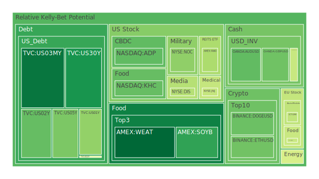
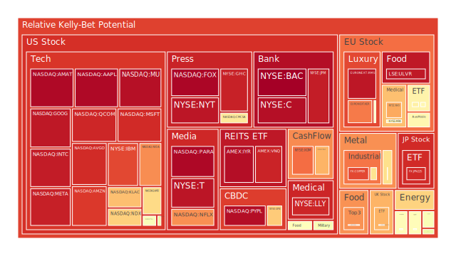
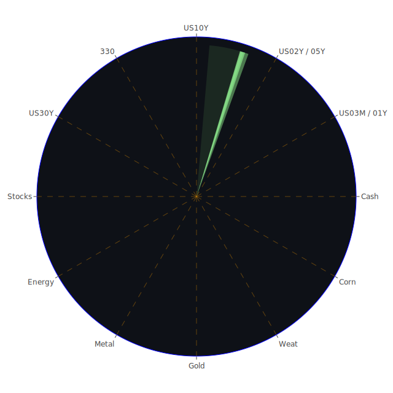

# 投資商品泡沫分析

- **美國國債**
  美國國債的泡沫機率在過去三天內略有波動，但整體趨勢相對穩定，特別是30年期國債的泡沫機率持續在0.2左右徘徊。這反映出市場對長期國債的需求仍然穩定，儘管近期美國國債殖利率有上升趨勢。

- **美國科技股**
  科技股如微軟（MSFT）和谷歌（GOOG）的泡沫機率持續上升，均超過0.9，顯示出市場對科技股的過度樂觀情緒。這可能與近期科技公司財報表現不如預期有關，投資者應謹慎考慮持有或增持這類股票。

- **美國房地產指數**
  房地產相關ETF（如VNQ）的泡沫機率接近0.93，顯示出市場對房地產的信心不足，可能受到高利率環境和房地產市場放緩的影響。投資者應對房地產市場保持警惕。

- **加密貨幣**
  比特幣（BTCUSD）和以太坊（ETHUSD）的泡沫機率分別在0.56和0.31，顯示出市場對加密貨幣的看法分歧。近期的市場波動和監管政策的不確定性可能是影響因素。

- **金/銀/銅**
  銅的泡沫機率高達0.87，顯示出市場對工業金屬的需求可能減少，這可能與全球經濟增長放緩的預期有關。金和銀的泡沫機率相對較低，顯示出避險需求的穩定。

- **黃豆 / 小麥 / 玉米**
  黃豆（SOYB）的泡沫機率下降至0.23，顯示出市場對農產品的需求可能回升，這可能與近期的氣候變化和供應鏈問題有關。

- **石油/ 鈾期貨UX!**
  石油的泡沫機率下降至0.47，顯示出市場對油價的預期較為穩定，儘管地緣政治風險仍然存在。鈾期貨的泡沫機率則較高，顯示出市場對核能需求的擔憂。

- **各國外匯市場**
  日元（USDJPY）的泡沫機率在0.57，顯示出市場對日元的信心不足，這可能與日本經濟政策的不確定性有關。

- **各國大盤指數**
  歐洲指數如FTSE和DAX的泡沫機率較高，顯示出市場對歐洲經濟前景的擔憂，特別是在地緣政治和經濟政策不確定性增加的情況下。

# 投資建議

根據泡沫機率的分析，我們建議投資者對以下商品進行操作：

1. **考慮賣出**：美國科技股如微軟和谷歌，由於泡沫機率高且市場情緒過於樂觀，建議減持。
2. **考慮買入**：黃豆，泡沫機率下降顯示出市場需求回升，適合長期投資者考慮增持。
3. **觀望**：對於泡沫機率在0.45至0.55之間的商品，如某些外匯和房地產ETF，建議保持觀望，等待市場進一步明朗。

# 風險提示

投資有風險，市場總是充滿不確定性。我們的建議僅供參考，投資者應根據自身的風險承受能力和投資目標，做出獨立的投資決策。特別是在當前全球經濟和地緣政治局勢不穩定的背景下，投資者應保持謹慎。
 
Daily Buy Map:

 
Daily Sell Map:

 
Daily Radar Chart:

 
