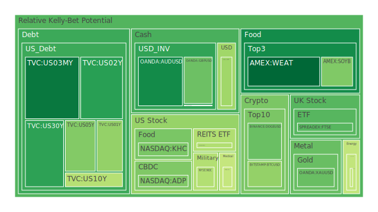
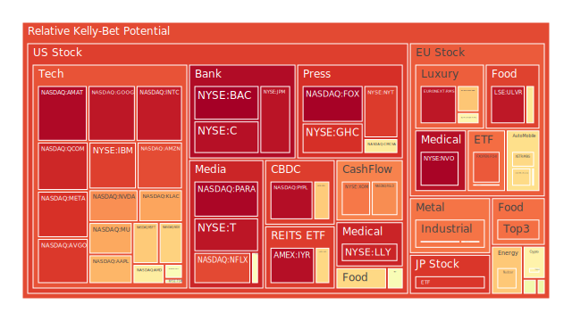
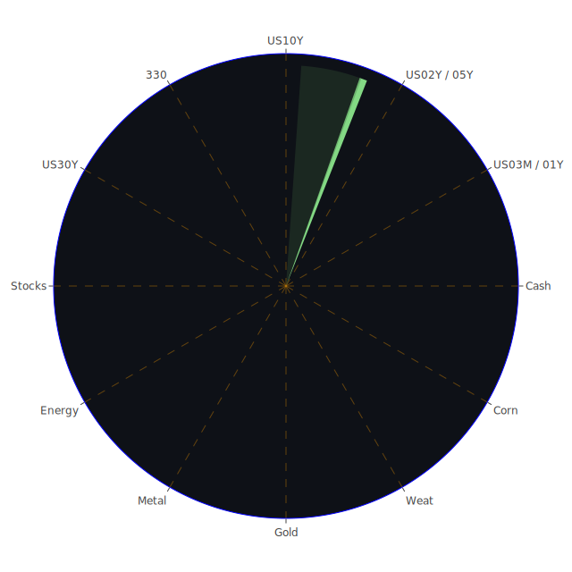

# 投資商品泡沫分析

- **美國國債**
  美國國債的泡沫機率在過去三天內呈現穩定狀態，特別是30年期國債的泡沫機率從0.199630上升到0.226091。這可能與近期的FED政策有關，特別是SOFR的交易量上升，顯示市場對流動性的需求增加。由於美國國債的長期殖利率倒掛，這可能會促使企業提高股價以降低融資成本。

- **美國科技股**
  美國科技股如微軟（NASDAQ:MSFT）和蘋果（NASDAQ:AAPL）的泡沫機率持續上升，分別達到0.683260和0.717384。這可能受到近期新聞中提到的科技公司盈利報告和市場對未來科技發展的樂觀預期影響。然而，投資者應注意這些股票的高泡沫風險。

- **美國房地產指數**
  房地產相關ETF（AMEX:VNQ）的泡沫機率高達0.967874，顯示市場對房地產的擔憂。這可能與商業地產和消費者違約率上升有關，特別是在高利率環境下，房地產市場的壓力增加。

- **加密貨幣**
  比特幣（BITSTAMP:BTCUSD）的泡沫機率從0.356320下降到0.355005，顯示市場對加密貨幣的需求穩定。儘管如此，投資者應注意加密貨幣市場的高波動性和潛在的監管風險。

- **金/銀/銅**
  銅的泡沫機率高達0.873321，顯示市場對工業金屬的需求可能減弱。這可能與全球經濟增長放緩和貿易緊張局勢有關。

- **黃豆 / 小麥 / 玉米**
  小麥（AMEX:WEAT）的泡沫機率持續下降至0.116680，顯示市場對農產品的需求穩定。這可能受益於全球糧食安全問題和供應鏈中斷的擔憂。

- **石油/ 鈾期貨UX!**
  石油的泡沫機率略微下降至0.429011，顯示市場對能源需求的擔憂有所緩解。這可能與中東地緣政治緊張局勢的緩和有關。

- **各國外匯市場**
  日元的泡沫機率上升至0.372983，這可能受到日本政治不穩定和經濟政策不確定性的影響。

- **各國大盤指數**
  歐洲大盤指數（SPREADEX:FTSE）的泡沫機率下降至0.275572，顯示市場對歐洲經濟的信心有所增強。

- **美國半導體股**
  半導體股如英特爾（NASDAQ:INTC）的泡沫機率高達0.945040，顯示市場對半導體行業的擔憂，可能受到供應鏈問題和地緣政治風險的影響。

# 投資建議

1. **考慮賣出高泡沫風險的科技股**：如微軟和蘋果，泡沫機率高且持續上升，市場對其未來增長的預期可能過於樂觀。
   
2. **考慮買入低泡沫風險的農產品**：如小麥，泡沫機率低且需求穩定，可能是長期投資的良好選擇。

3. **觀望房地產市場**：由於泡沫機率高且市場壓力增加，建議投資者謹慎行事。

# 風險提示

投資有風險，市場總是充滿不確定性。我們的建議僅供參考，投資者應根據自身的風險承受能力和投資目標，做出獨立的投資決策。特別是對於泡沫機率高的商品，應該謹慎進行投資決策。
 
Daily Buy Map:

 
Daily Sell Map:

 
Daily Radar Chart:

 
