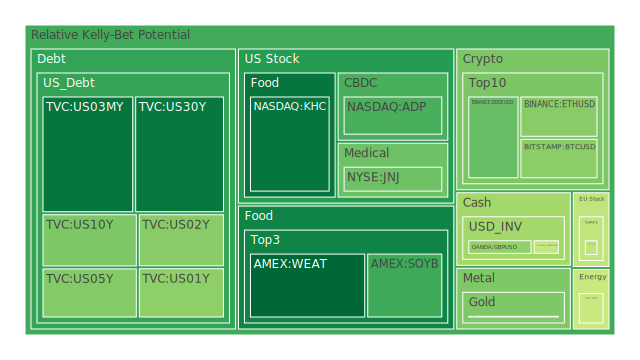
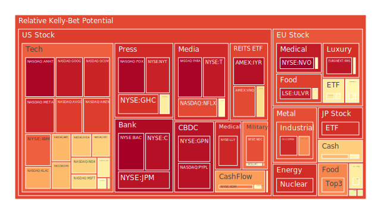
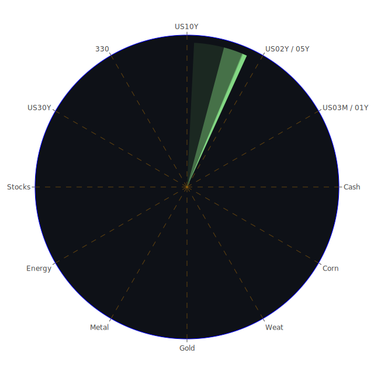

# 投資商品泡沫分析

- **美國國債**
  美國國債的泡沫機率在過去三天中呈現穩定的下降趨勢，特別是30年期國債（TVC:US30Y），其泡沫機率從0.199630下降到0.153832。這可能與近期美國國債殖利率的變動有關，特別是10年期國債殖利率的上升，顯示市場對長期利率上升的預期。投資者可以考慮在泡沫機率下降的情況下，逐步增加對美國國債的投資。

- **美國科技股**
  美國科技股如微軟（NASDAQ:MSFT）和蘋果（NASDAQ:AAPL）的泡沫機率均在高位，特別是微軟，其泡沫機率從0.917966上升到0.655446，顯示出市場對科技股的投資熱情仍然高漲。然而，這也意味著風險增加，投資者應謹慎考慮是否繼續持有或增持這類股票。

- **美國房地產指數**
  房地產相關的ETF（AMEX:VNQ）的泡沫機率從0.930622上升到0.871184，顯示出市場對房地產市場的擔憂。近期商業房地產違約率上升，可能進一步影響市場信心。建議投資者在此時保持觀望，避免進一步的資金投入。

- **加密貨幣**
  比特幣（BITSTAMP:BTCUSD）和以太坊（BINANCE:ETHUSD）的泡沫機率有所下降，特別是比特幣，其泡沫機率從0.355005下降到0.349800。這可能受到市場對加密貨幣的需求增加影響，特別是在傳統市場波動加劇的情況下。投資者可以考慮在泡沫機率下降時，分批進行加密貨幣的投資。

- **金/銀/銅**
  金價（OANDA:XAUUSD）的泡沫機率從0.641580下降到0.332525，顯示出市場對黃金的避險需求增加。近期地緣政治風險上升，可能進一步推動金價上漲。投資者可以考慮增加黃金的配置，以對沖市場風險。

- **黃豆 / 小麥 / 玉米**
  小麥（AMEX:WEAT）的泡沫機率持續下降，從0.117744下降到0.125638，顯示出市場對農產品的需求穩定。近期全球氣候變遷可能影響農產品供應，投資者可以考慮在泡沫機率低時增加對農產品的投資。

- **石油/ 鈾期貨UX!**
  石油（TVC:USOIL）的泡沫機率從0.466708下降到0.445433，顯示出市場對石油供應的擔憂有所緩解。近期中東地區的地緣政治緊張局勢有所緩和，可能進一步影響油價走勢。投資者應密切關注地緣政治動態，以調整投資策略。

- **各國外匯市場**
  美元兌日元（OANDA:USDJPY）的泡沫機率上升，顯示出市場對美元的需求增加。近期日本政治不穩定性增加，可能進一步推動日元貶值。投資者可以考慮在泡沫機率上升時，減少對日元的持有。

- **各國大盤指數**
  歐洲股市（SPREADEX:GDAXI）的泡沫機率有所上升，顯示出市場對歐洲經濟前景的擔憂。近期歐洲政治局勢不穩定，可能進一步影響市場信心。投資者應謹慎考慮是否繼續持有歐洲股市相關資產。

# 投資建議

根據泡沫機率的變化趨勢，我們建議投資者在泡沫機率下降且低於0.5的商品中，考慮分批買入，如美國國債和黃金，以對沖市場風險。對於泡沫機率上升且高於0.5的商品，如美國科技股和房地產指數，建議投資者謹慎持有或考慮減持，以避免未來可能的價格下跌。

# 風險提示

投資有風險，市場總是充滿不確定性。我們的建議僅供參考，投資者應根據自身的風險承受能力和投資目標，做出獨立的投資決策。特別是在市場波動加劇的情況下，投資者應密切關注市場動態，及時調整投資策略。
 
Daily Buy Map:

 
Daily Sell Map:

 
Daily Radar Chart:

 
