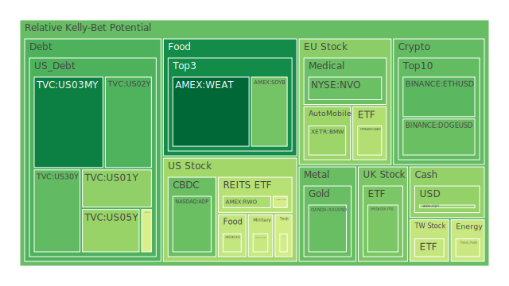
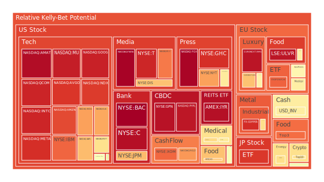
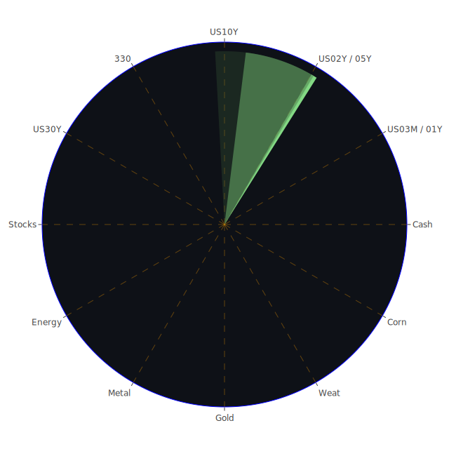

# 投資商品泡沫分析

- **美國國債**
  美國國債的泡沫機率在過去三天內顯示出一些波動，特別是短期國債的利率有上升趨勢。根據最新的FED數據，SOFR為4.82，略低於OIS FED Fund Rate的5.13，這意味著目前美元流動性尚未出現嚴重緊縮。然而，長期國債的殖利率倒掛仍然存在，這可能會對企業融資成本造成壓力。

- **美國科技股**
  科技股如微軟（MSFT）和蘋果（AAPL）的泡沫機率在最近幾天有所下降，特別是微軟的股價在聘請前OpenAI CEO後達到歷史新高。然而，新聞指出微軟預測其雲業務增長將放緩，這可能會影響未來的股價表現。

- **美國房地產指數**
  房地產相關的ETF（如AMEX:VNQ）的泡沫機率在過去三天內有所下降，這可能與商業房地產違約率上升有關。儘管如此，房地產市場的長期趨勢仍需觀察。

- **加密貨幣**
  比特幣（BTCUSD）和以太坊（ETHUSD）的泡沫機率在過去幾天內有所下降，這與Coinbase報告的強勁交易量和加密貨幣逐漸成為主流投資有關。這可能是投資者考慮進一步投資的好時機。

- **金/銀/銅**
  黃金（XAUUSD）的泡沫機率顯示出穩定的下降趨勢，這可能與近期金磚國家增加黃金儲備有關。銀和銅的泡沫機率則顯示出更高的波動性，特別是銅的泡沫機率仍然很高，建議投資者謹慎行事。

- **黃豆 / 小麥 / 玉米**
  小麥（WEAT）和黃豆（SOYB）的泡沫機率在過去幾天內有所下降，這可能與全球供應鏈的改善和市場需求的穩定有關。玉米（CORN）的泡沫機率則相對較高，建議投資者保持觀望。

- **石油/ 鈾期貨UX!**
  石油（USOIL）的泡沫機率顯示出穩定的下降趨勢，這可能與全球能源市場的供需平衡有關。鈾期貨（COMEX:UX1!）的泡沫機率則顯示出波動性，建議投資者謹慎行事。

- **各國外匯市場**
  外匯市場的波動性增加，特別是美元兌日元（USDJPY）和澳元兌美元（AUDUSD）的泡沫機率顯示出不同的趨勢。美元的強勢可能會影響其他貨幣的表現。

- **各國大盤指數**
  各國大盤指數如FTSE和GDAXI的泡沫機率顯示出下降趨勢，這可能與全球經濟的不確定性和地緣政治風險有關。

- **美國半導體股**
  半導體股如NVIDIA（NVDA）和AMD的泡沫機率顯示出上升趨勢，這可能與全球芯片需求的波動有關。

- **美國銀行股**
  銀行股如摩根大通（JPM）和美國銀行（BAC）的泡沫機率顯示出較高的水平，這可能與信貸市場的風險增加有關。

- **美國軍工股**
  軍工股如洛克希德·馬丁（LMT）的泡沫機率顯示出穩定的趨勢，這可能與全球軍事支出的增加有關。

- **美國電子支付股**
  電子支付股如PayPal（PYPL）的泡沫機率顯示出上升趨勢，這可能與消費者支出模式的變化有關。

- **美國藥商股**
  藥商股如默克（MRK）的泡沫機率顯示出波動性，這可能與醫藥行業的政策變化和市場需求有關。

- **美國影視股**
  影視股如迪士尼（DIS）的泡沫機率顯示出上升趨勢，這可能與娛樂行業的競爭加劇有關。

- **美國媒體股**
  媒體股如紐約時報（NYT）的泡沫機率顯示出上升趨勢，這可能與廣告收入的波動有關。

- **石油防禦股**
  石油防禦股如埃克森美孚（XOM）的泡沫機率顯示出上升趨勢，這可能與全球能源政策的變化有關。

- **金礦防禦股**
  金礦防禦股的泡沫機率顯示出穩定的趨勢，這可能與黃金市場的長期需求有關。

- **歐洲奢侈品股**
  奢侈品股如LVMH的泡沫機率顯示出下降趨勢，這可能與全球消費者信心的變化有關。

- **歐洲汽車股**
  汽車股如BMW的泡沫機率顯示出上升趨勢，這可能與歐洲汽車市場的競爭加劇有關。

- **歐美食品股**
  食品股如雀巢（NESN）的泡沫機率顯示出波動性，這可能與全球食品市場的供需變化有關。

# 投資建議

基於以上分析，建議投資者對於泡沫機率持續下降且遠小於0.5的商品，如比特幣和以太坊，考慮分批買入。而對於泡沫機率持續上升且遠大於0.5的商品，如美國銀行股和電子支付股，建議謹慎行事，可能考慮部分獲利了結。

# 風險提示

投資有風險，市場總是充滿不確定性。我們的建議僅供參考，投資者應根據自身的風險承受能力和投資目標，做出獨立的投資決策。特別是對於泡沫機率高的商品，應該謹慎進行投資決策。
 
Daily Buy Map:

 
Daily Sell Map:

 
Daily Radar Chart:

 
