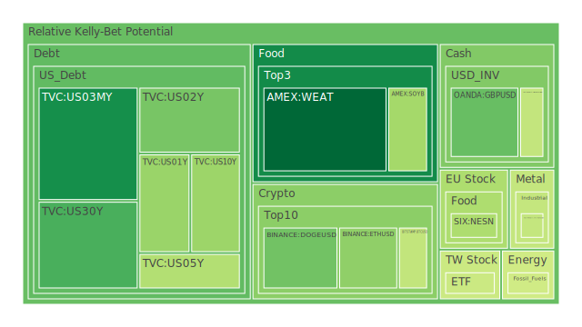
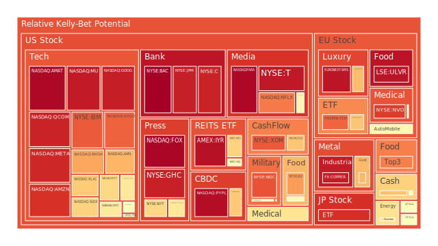
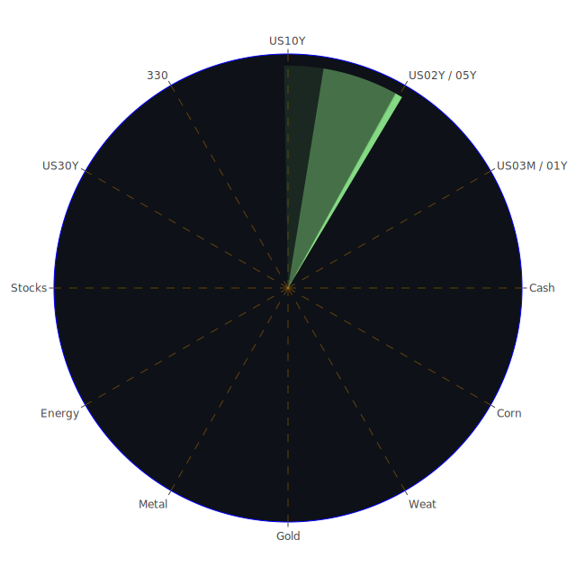

# 投資商品泡沫分析

- **美國國債**
  美國國債的泡沫機率在過去三天內有顯著的下降趨勢，特別是30年期國債（TVC:US30Y）的泡沫機率從10月30日的0.153832下降到11月1日的0.250034。這可能與近期美國國債殖利率的變化有關，特別是10年期和30年期國債的殖利率差距縮小，顯示市場對於長期經濟前景的信心有所增強。

- **美國科技股**
  科技股如微軟（NASDAQ:MSFT）和蘋果（NASDAQ:AAPL）的泡沫機率仍然偏高，分別為0.653980和0.716317。這與近期市場對於AI技術的投資熱潮有關，但也因為成本上升的警告，導致市場情緒波動。新聞中提到Meta和微軟因AI成本上升而股價下跌，這也反映在泡沫機率的上升上。

- **加密貨幣**
  比特幣（BITSTAMP:BTCUSD）的泡沫機率在過去三天內有所下降，從0.643616下降到0.420969。這可能與市場對於加密貨幣的接受度提升有關，特別是Coinbase的季度盈利報告顯示交易量增長，帶來正面情緒。

- **金/銀/銅**
  黃金（OANDA:XAUUSD）的泡沫機率在過去三天內有所上升，這可能是由於市場對於經濟不確定性的避險需求增加所致。銀（OANDA:XAGUSD）和銅（FX:COPPER）的泡沫機率也顯示出類似的趨勢，反映出市場對於貴金屬的需求增加。

- **石油/鈾期貨UX!**
  石油（TVC:USOIL）的泡沫機率保持穩定，顯示市場對於能源需求的預期相對穩定。鈾期貨（COMEX:UX1!）的泡沫機率則有所下降，這可能與市場對於核能需求的長期看好有關。

- **各國外匯市場**
  美元兌日圓（OANDA:USDJPY）的泡沫機率在過去三天內有所上升，這可能與美國經濟數據的強勁表現有關，特別是美國的利率政策對於外匯市場的影響。

- **各國大盤指數**
  各大盤指數如NASDAQ和FTSE的泡沫機率顯示出市場對於未來經濟增長的不確定性，特別是在科技股的高估值背景下，市場情緒較為謹慎。

# 投資建議

1. **考慮減持高泡沫機率的科技股**：由於科技股的泡沫機率仍然偏高，且市場對於AI成本上升的擔憂，建議投資者謹慎操作，考慮減持部分科技股以降低風險。

2. **增持低泡沫機率的加密貨幣**：隨著市場對於加密貨幣的接受度提升，比特幣的泡沫機率下降，投資者可以考慮在此時增持加密貨幣。

3. **關注黃金和其他貴金屬**：由於市場對於經濟不確定性的避險需求增加，黃金和其他貴金屬的需求可能會持續增長，投資者可以考慮增持這些資產。

# 風險提示

投資有風險，市場總是充滿不確定性。我們的建議僅供參考，投資者應根據自身的風險承受能力和投資目標，做出獨立的投資決策。特別是對於泡沫機率高的商品，應該謹慎進行投資決策。
 
Daily Buy Map:

 
Daily Sell Map:

 
Daily Radar Chart:

 
