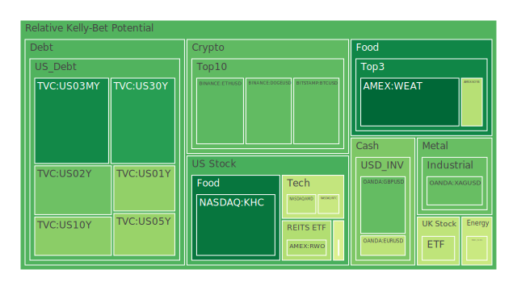
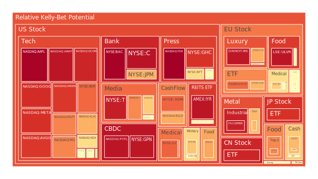

# 投資商品泡沫分析

- **美國國債**
  美國國債的泡沫機率在過去三天內有所下降，特別是30年期國債（US30Y），其泡沫機率從10月31日的0.291989降至11月2日的0.221423。這可能是由於市場對於長期利率的預期有所調整，加上近期美國經濟數據顯示通脹壓力減緩，投資者對於長期債券的需求增加。

- **美國科技股**
  科技股的泡沫機率普遍偏高，特別是微軟（MSFT）和亞馬遜（AMZN），其泡沫機率分別在11月2日達到0.791842和0.902837。這與近期科技公司財報不如預期以及市場對於AI投資的成本上升有關。新聞中提到微軟預測雲業務增長放緩，這可能進一步影響投資者信心。

- **加密貨幣**
  比特幣（BTCUSD）和以太坊（ETHUSD）的泡沫機率在過去三天內顯著下降，特別是比特幣從10月31日的0.643616降至11月2日的0.290771。這可能與市場對於加密貨幣的需求回升有關，尤其是在Coinbase報告強勁的交易量後，市場情緒有所改善。

- **金/銀/銅**
  黃金（XAUUSD）的泡沫機率在過去三天內上升，從10月31日的0.300796上升至11月2日的0.713977。這反映出市場對於避險資產的需求增加，可能是由於地緣政治風險上升以及市場對於經濟增長放緩的擔憂。

- **石油/鈾期貨UX!**
  石油（USOIL）的泡沫機率保持穩定，約在0.445433左右。近期油價受到供應鏈中斷和地緣政治緊張局勢的影響，市場對於未來供應的不確定性增加。

- **各國外匯市場**
  美元兌日元（USDJPY）的泡沫機率在過去三天內有所上升，這可能是由於市場對於美國經濟數據的反應，以及日本央行的貨幣政策影響。

- **美國半導體股**
  英特爾（INTC）的泡沫機率在過去三天內下降，從10月31日的0.928787降至11月2日的0.443986。這可能與市場對於英特爾未來業務復甦的樂觀預期有關，儘管其被道瓊工業指數剔除。

# 投資建議

1. **考慮買入**：比特幣（BTCUSD）和以太坊（ETHUSD）泡沫機率顯著下降，市場需求回升，建議投資者考慮分批買入。
2. **考慮賣出**：微軟（MSFT）和亞馬遜（AMZN）泡沫機率偏高，且近期財報不如預期，建議投資者考慮獲利了結。
3. **觀望**：石油（USOIL）泡沫機率穩定，建議投資者保持觀望，等待市場進一步明朗化。

# 風險提示

投資有風險，市場總是充滿不確定性。我們的建議僅供參考，投資者應根據自身的風險承受能力和投資目標，做出獨立的投資決策。特別是對於泡沫機率高的商品，應該謹慎進行投資決策。
 
Daily Buy Map:

 
Daily Sell Map:

 
Daily Radar Chart:

 
