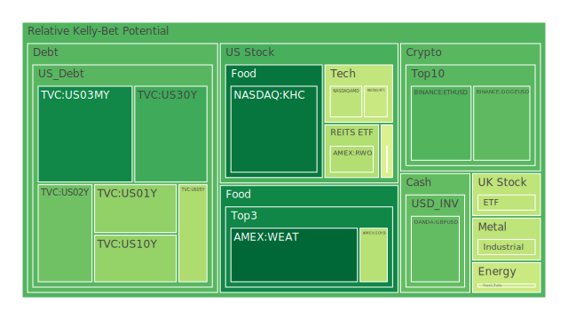
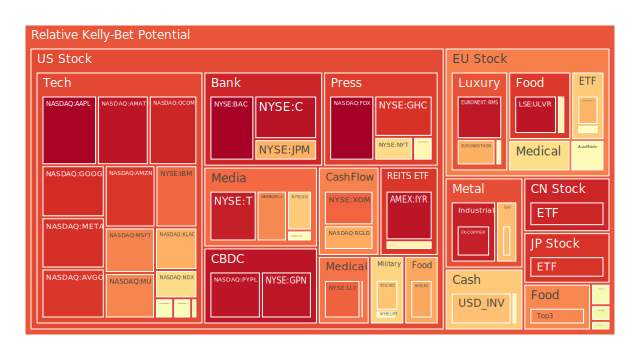
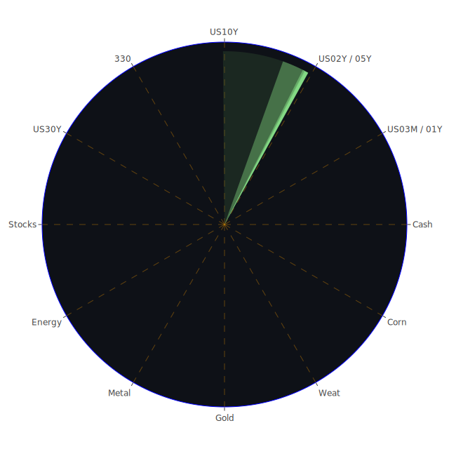

# 投資商品泡沫分析

- **美國國債**
  美國國債的泡沫機率在過去三天內略有波動，但整體趨勢是穩定的。10年期國債的殖利率上升至4.39%，顯示市場對未來經濟的不確定性有所增加。然而，由於SOFR利率高於FED Fund Rate，這可能導致資金流動性緊張，投資者應謹慎觀察市場動態。

- **美國科技股**
  美國科技股的泡沫機率普遍偏高，尤其是像Apple和Google這樣的科技巨頭。新聞中提到Meta和Microsoft因AI成本上升而股價下跌，這進一步加劇了市場對科技股的擔憂。投資者應考慮在高泡沫機率的情況下，適時減少持倉。

- **美國房地產指數**
  房地產市場的泡沫機率顯示出一定的風險，尤其是商業房地產的拖欠率上升，這可能預示著市場的潛在壓力。投資者應密切關注房地產市場的變化，尤其是在利率上升的背景下。

- **加密貨幣**
  比特幣和以太坊的泡沫機率有所下降，這可能是由於市場對加密貨幣的需求增強。然而，投資者應注意市場的波動性，尤其是在全球經濟不確定性增加的情況下。

- **金/銀/銅**
  金價的泡沫機率略有上升，這可能與市場對避險資產的需求增加有關。儘管如此，金銀比和金銅比的變化顯示出市場對貴金屬的需求仍然強勁。

- **黃豆 / 小麥 / 玉米**
  農產品的泡沫機率顯示出穩定的趨勢，特別是小麥和玉米。這可能反映出市場對農產品供應的擔憂有所緩解。

- **石油/ 鈾期貨UX!**
  石油價格的泡沫機率保持穩定，這可能與全球經濟活動的恢復有關。然而，鈾期貨的泡沫機率略有上升，這可能反映出市場對能源資源的需求增加。

- **各國外匯市場**
  外匯市場的波動性增加，特別是美元對其他主要貨幣的匯率變動。這可能是由於市場對美國經濟政策的不確定性所致。

- **各國大盤指數**
  全球股市指數的泡沫機率顯示出一定的風險，特別是在美國總統大選臨近的情況下，市場的不確定性增加。

- **美國半導體股**
  半導體股的泡沫機率有所上升，這可能與市場對芯片供應鏈的擔憂有關。投資者應密切關注行業的發展動態。

- **美國銀行股**
  銀行股的泡沫機率較高，這可能反映出市場對金融業的擔憂，尤其是在利率上升和經濟不確定性增加的背景下。

- **美國軍工股**
  軍工股的泡沫機率顯示出一定的穩定性，這可能與全球地緣政治緊張局勢有關。

- **美國電子支付股**
  電子支付股的泡沫機率上升，這可能是由於市場對科技行業的整體擔憂所致。

- **美國藥商股**
  藥商股的泡沫機率顯示出一定的風險，尤其是在市場對醫藥行業的未來增長持謹慎態度的情況下。

- **美國影視股**
  影視股的泡沫機率偏高，這可能反映出市場對娛樂行業的需求減少。

- **美國媒體股**
  媒體股的泡沫機率上升，這可能與市場對廣告收入減少的擔憂有關。

- **石油防禦股**
  石油防禦股的泡沫機率顯示出一定的風險，這可能是由於市場對能源價格波動的擔憂。

- **金礦防禦股**
  金礦股的泡沫機率略有上升，這可能反映出市場對貴金屬的需求增加。

- **歐洲奢侈品股**
  奢侈品股的泡沫機率顯示出一定的風險，這可能與全球經濟增長放緩有關。

- **歐洲汽車股**
  汽車股的泡沫機率上升，這可能是由於市場對供應鏈問題的擔憂。

- **歐美食品股**
  食品股的泡沫機率顯示出穩定的趨勢，這可能反映出市場對食品需求的持續增長。

# 投資建議

基於以上分析，對於泡沫機率持續上升且遠大於0.5的商品，如美國科技股和銀行股，建議投資者考慮減少持倉，以避免未來可能的價格下跌。相反，對於泡沫機率持續下降且遠小於0.5的商品，如加密貨幣和部分農產品，投資者可以考慮逢低買入，掌握低吸籌碼的時機。

# 風險提示

投資有風險，市場總是充滿不確定性。我們的建議僅供參考，投資者應根據自身的風險承受能力和投資目標，做出獨立的投資決策。特別是對於泡沫機率高的商品，應該謹慎進行投資決策。
 
Daily Buy Map:

 
Daily Sell Map:

 
Daily Radar Chart:

 
