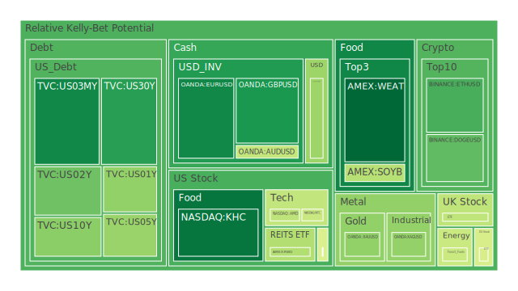
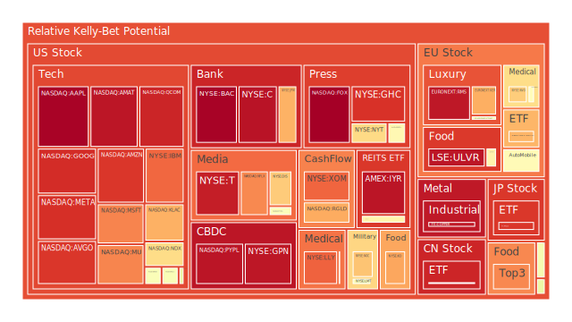
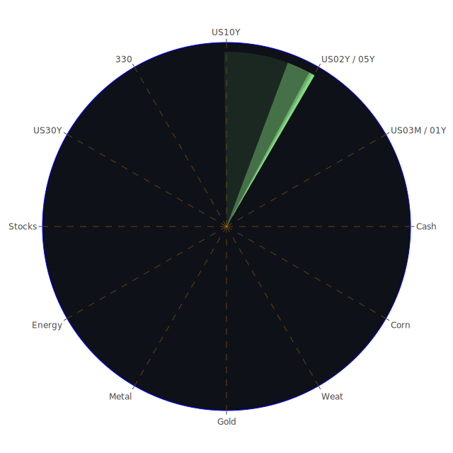

# 投資商品泡沫分析

- **美國國債**
  美國國債的泡沫機率在過去三天內保持穩定，並未出現顯著的變化。根據最新的FED數據，10年期國債殖利率上升至4.39%，顯示市場對長期利率的預期有所增加。這可能是由於市場對經濟增長和通脹的預期上升所致。由於泡沫機率接近中性區間，建議投資者觀望。

- **加密貨幣**
  以太坊（ETH）和比特幣（BTC）的泡沫機率在過去三天內有所下降，顯示出市場對這些加密貨幣的信心有所回升。新聞中提到的美國選舉不確定性和潛在的利率變動可能會影響加密貨幣市場的波動性。由於泡沫機率低於0.5，且新聞支持其潛在的增長，建議投資者考慮分批買入。

- **金/銀/銅**
  金價的泡沫機率在過去幾天內顯著下降，這與近期的新聞事件和經濟數據相符。儘管美國國債殖利率上升，但金價仍然保持穩定，顯示出其作為避險資產的吸引力。由於泡沫機率低於0.5，建議投資者考慮增加黃金的持倉。

- **美國科技股**
  科技股的泡沫機率普遍較高，特別是Nvidia和Meta等公司的泡沫機率接近1.0，顯示出市場對這些股票的過度樂觀情緒。新聞報導中提到Nvidia取代Intel進入道瓊工業指數，這可能進一步推高其股價。由於泡沫機率高且新聞支持其過熱的市場情緒，建議投資者考慮減持科技股以降低風險。

- **石油/鈾期貨UX!**
  石油價格的泡沫機率在過去幾天內保持穩定，OPEC+推遲增產的消息可能會對油價產生支撐作用。然而，全球經濟不確定性和需求疲軟可能會限制油價的上行空間。建議投資者謹慎觀望。

# 投資建議

1. **考慮買入**：對於泡沫機率低於0.5的商品，如黃金和加密貨幣，建議投資者考慮分批買入，利用當前的市場機會。
   
2. **考慮賣出**：對於泡沫機率高於0.5的科技股，特別是Nvidia和Meta，建議投資者考慮減持，以避免潛在的價格回調風險。

3. **觀望**：對於泡沫機率在0.45至0.55之間的商品，如美國國債，建議投資者暫時觀望，等待市場進一步的明確信號。

# 風險提示

投資有風險，市場總是充滿不確定性。我們的建議僅供參考，投資者應根據自身的風險承受能力和投資目標，做出獨立的投資決策。特別是對於泡沫機率高的商品，應該謹慎進行投資決策，避免因市場波動而造成的損失。
 
Daily Buy Map:

 
Daily Sell Map:

 
Daily Radar Chart:

 
