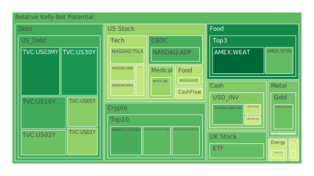
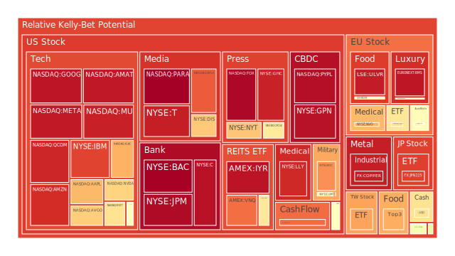
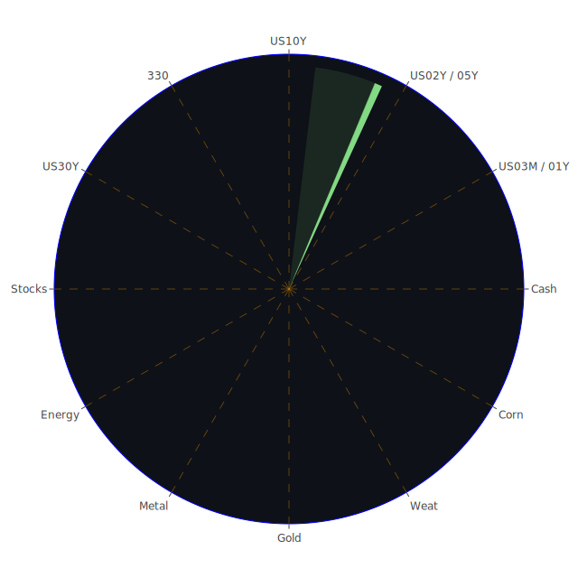

# 投資商品泡沫分析

- **美國國債**
  美國國債的泡沫機率在過去三天內呈現下降趨勢，特別是30年期國債（US30Y），從0.250034下降至0.196515。這可能與近期美國經濟數據顯示的經濟放緩有關，投資者對長期債券的需求增加。此外，SOFR略高於FED Fund Rate，顯示市場對美元的需求增加，這可能進一步推動國債價格上升。

- **美國科技股**
  科技股如Apple（AAPL）和Amazon（AMZN）的泡沫機率持續上升，分別達到0.993585和0.917727。這反映出市場對科技股的高估值擔憂，特別是在宏觀經濟不確定性增加的情況下。新聞中提到的美國選舉和潛在的利率變動都可能對科技股造成壓力。

- **美國房地產指數**
  房地產相關的ETF如VNQ的泡沫機率上升至0.821570，顯示市場對房地產的信心減弱。這可能與近期的高利率環境和商業地產違約率上升有關。

- **加密貨幣**
  比特幣（BTCUSD）的泡沫機率下降至0.281640，顯示市場對加密貨幣的興趣回升。這可能是由於市場對傳統資產的避險需求增加所致。

- **金/銀/銅**
  黃金（XAUUSD）的泡沫機率下降至0.303120，顯示出在市場不確定性增加時，投資者對黃金的需求增加。這與新聞中提到的地緣政治緊張局勢和經濟不確定性相符。

- **黃豆 / 小麥 / 玉米**
  小麥（WEAT）的泡沫機率持續下降，顯示市場對農產品的需求穩定。這可能與全球糧食供應鏈的恢復有關。

- **石油/ 鈾期貨UX!**
  石油（USOIL）的泡沫機率保持穩定，顯示市場對石油價格的預期較為穩定。然而，新聞中提到的颶風可能影響美國石油產量，需密切關注。

- **各國外匯市場**
  歐元/美元（EURUSD）的泡沫機率上升至0.430734，顯示市場對歐元的信心減弱，這可能與歐洲經濟的不確定性有關。

- **各國大盤指數**
  歐洲大盤指數如GDAXI的泡沫機率上升至0.638829，顯示市場對歐洲經濟前景的擔憂。

- **美國半導體股**
  半導體股如NVIDIA（NVDA）的泡沫機率上升至0.666847，這可能與全球半導體需求的不確定性有關。

- **美國銀行股**
  JPMorgan（JPM）的泡沫機率上升至0.979438，顯示市場對銀行股的信心減弱，這可能與高利率環境和貸款違約率上升有關。

- **美國軍工股**
  軍工股如Lockheed Martin（LMT）的泡沫機率保持穩定，顯示市場對軍工行業的需求穩定。

- **美國電子支付股**
  PayPal（PYPL）的泡沫機率上升至0.972391，顯示市場對電子支付行業的信心減弱，這可能與競爭加劇和利率上升有關。

- **美國藥商股**
  藥商股如Johnson & Johnson（JNJ）的泡沫機率下降至0.364839，顯示市場對醫藥行業的信心回升，這可能與疫情後醫療需求增加有關。

- **美國影視股**
  Netflix（NFLX）的泡沫機率上升至0.848384，顯示市場對影視行業的擔憂，這可能與競爭加劇和消費者支出減少有關。

- **美國媒體股**
  媒體股如Fox（FOX）的泡沫機率達到1.000000，顯示市場對媒體行業的高度不確定性。

- **石油防禦股**
  石油防禦股如ExxonMobil（XOM）的泡沫機率保持在高位，顯示市場對石油行業的擔憂。

- **金礦防禦股**
  金礦股如Royal Gold（RGLD）的泡沫機率下降至0.449256，顯示市場對金礦行業的信心回升。

- **歐洲奢侈品股**
  奢侈品股如LVMH（RMS）的泡沫機率上升至0.957197，顯示市場對奢侈品行業的擔憂，這可能與全球經濟放緩有關。

- **歐洲汽車股**
  汽車股如BMW的泡沫機率保持穩定，顯示市場對汽車行業的需求穩定。

- **歐美食品股**
  食品股如Nestle（NESN）的泡沫機率下降至0.572995，顯示市場對食品行業的信心回升。

# 投資建議

1. **考慮買入**：黃金（XAUUSD）和比特幣（BTCUSD）顯示出較低的泡沫機率，且新聞中提到的地緣政治緊張局勢和經濟不確定性可能進一步推動這些避險資產的需求。

2. **考慮賣出**：科技股如Apple（AAPL）和Amazon（AMZN）泡沫機率高企，且面臨宏觀經濟不確定性和高估值的壓力，建議投資者謹慎考慮減少持倉。

3. **觀望**：對於泡沫機率在0.45至0.55之間的商品，如某些大盤指數和外匯市場，建議投資者保持觀望，等待更明確的市場信號。

# 風險提示

投資有風險，市場總是充滿不確定性。我們的建議僅供參考，投資者應根據自身的風險承受能力和投資目標，做出獨立的投資決策。特別是在當前的全球經濟環境下，投資者應密切關注市場動態和政策變化，謹慎進行投資決策。
 
Daily Buy Map:

 
Daily Sell Map:

 
Daily Radar Chart:

 
