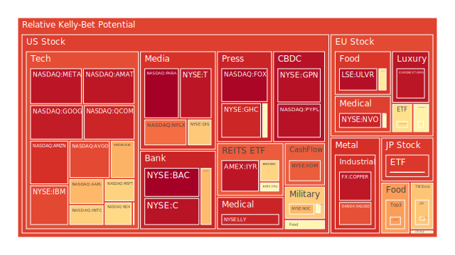
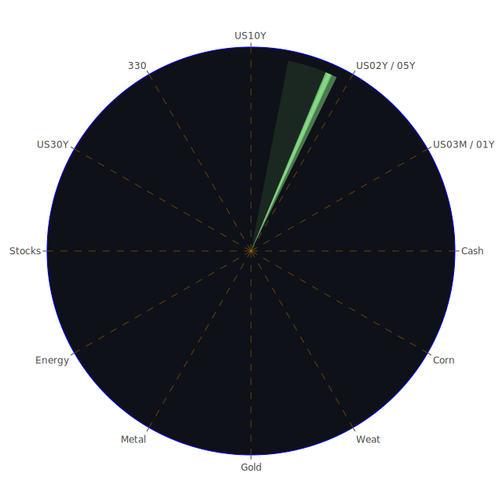

# 投資商品泡沫分析

- **美國國債**
  美國國債的泡沫機率在過去三天內呈現下降趨勢，尤其是30年期國債（US30Y），其泡沫機率從0.221下降至0.214。這與近期美國國債殖利率的下降有關，顯示市場對於美國經濟的長期信心有所增強。然而，需注意的是，SOFR交易量上升，顯示市場對短期流動性需求增加，可能會對短期國債造成壓力。

- **美國科技股**
  科技股如Apple (AAPL) 和Microsoft (MSFT) 的泡沫機率有所上升，尤其是AAPL從0.715上升至0.713。這可能與近期美國大選的不確定性有關，市場對於政策變動的擔憂可能影響科技股的表現。此外，新聞中提到的選舉相關不確定性也可能加劇市場波動。

- **美國房地產指數**
  房地產相關ETF如VNQ的泡沫機率在過去三天內有所下降，從0.821下降至0.574。這可能受到美國房地產市場的持續復甦影響，儘管商業地產違約率上升，但整體市場仍顯示出一定的韌性。

- **加密貨幣**
  比特幣（BTCUSD）的泡沫機率顯著下降，從0.281降至0.246，顯示市場對於加密貨幣的信心有所增強。這可能與美元走弱及市場對於加密貨幣作為避險資產的需求增加有關。

- **金/銀/銅**
  黃金（XAUUSD）的泡沫機率顯著下降至0.274，顯示出市場對於黃金的需求增加，尤其是在地緣政治不穩定的背景下。銀（XAGUSD）的泡沫機率則顯著上升，可能因為市場對於工業需求的擔憂。

- **黃豆 / 小麥 / 玉米**
  黃豆（SOYB）和小麥（WEAT）的泡沫機率均呈下降趨勢，顯示出市場對於農產品的需求穩定。這可能與全球糧食供應鏈的改善有關。

- **石油/ 鈾期貨UX!**
  石油（USOIL）的泡沫機率保持穩定，顯示市場對於石油需求的預期較為穩定。然而，鈾期貨（UX1!）的泡沫機率顯著下降，這可能與全球能源政策的變化有關。

- **各國外匯市場**
  英鎊（GBPUSD）和歐元（EURUSD）的泡沫機率均有所下降，顯示市場對於歐洲貨幣的需求增加，這可能與美元疲軟有關。

- **各國大盤指數**
  歐洲和亞洲大盤指數如FTSE和GDAXI的泡沫機率有所下降，顯示市場對於這些地區經濟的信心有所回升。

# 投資建議

1. **考慮買入黃金**：黃金的泡沫機率顯著下降，且在地緣政治不穩定的背景下，黃金作為避險資產的需求增加。
2. **觀望科技股**：由於市場對於美國大選的政策不確定性，建議對於科技股保持觀望。
3. **關注房地產市場**：儘管商業地產違約率上升，但房地產市場的整體韌性值得關注，尤其是房地產相關ETF的泡沫機率下降。

# 風險提示

投資有風險，市場總是充滿不確定性。我們的建議僅供參考，投資者應根據自身的風險承受能力和投資目標，做出獨立的投資決策。特別是對於泡沫機率高的商品，應該謹慎進行投資決策。
 
Daily Buy Map:

 
Daily Sell Map:

 
Daily Radar Chart:

 
