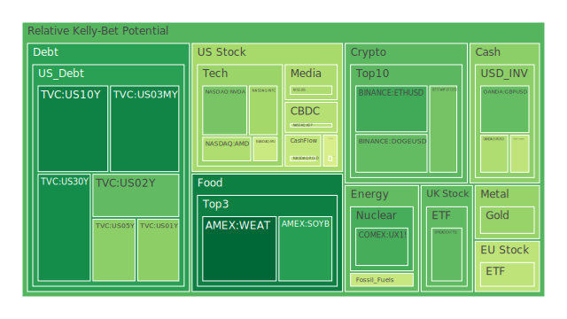
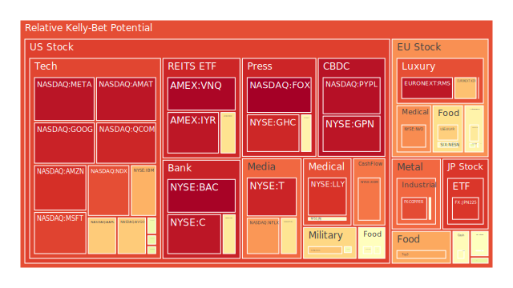
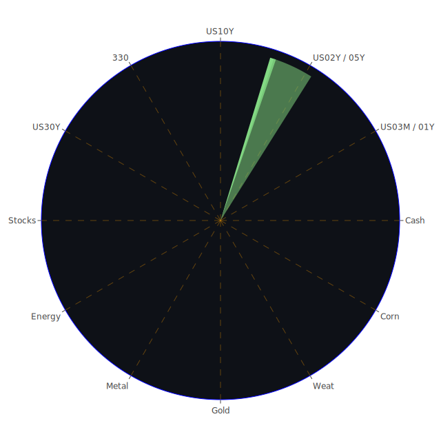

# 投資商品泡沫分析

- **美國國債**
  美國國債的泡沫機率在過去三天內有所下降，特別是10年期國債的泡沫機率從0.246676下降到0.171933。這可能與近期美國總統選舉結果及聯準會政策的影響有關。儘管如此，需注意SOFR利率略高於FED Fund Rate，這可能導致短期內美元流動性緊張，影響國債價格。

- **美國科技股**
  科技股如Apple和Microsoft的泡沫機率仍然偏高，分別為0.687077和0.885612。這反映出市場對科技股的高估值擔憂，尤其是在選舉後市場波動加劇的情況下。建議投資者謹慎行事，考慮在高點時獲利了結。

- **美國房地產指數**
  房地產相關ETF如VNQ的泡沫機率高達0.988393，顯示出市場對房地產的過度熱情。由於高利率環境持續，房地產市場可能面臨壓力，建議投資者保持觀望。

- **加密貨幣**
  比特幣的泡沫機率從0.281640上升到0.320804，顯示出市場對加密貨幣的興趣增加。然而，需注意市場波動性和潛在的監管風險。

- **金/銀/銅**
  黃金的泡沫機率下降至0.368343，顯示出在市場不確定性增加時，黃金仍然是避險資產的選擇。銅的泡沫機率則高達0.873181，反映出市場對工業金屬需求的擔憂。

- **黃豆 / 小麥 / 玉米**
  小麥的泡沫機率略有上升至0.126058，顯示出市場對農產品的需求穩定。玉米的泡沫機率仍然偏高，建議投資者謹慎行事。

- **石油/ 鈾期貨UX!**
  石油的泡沫機率保持穩定，但需注意近期的颶風可能影響供應。鈾期貨的泡沫機率則顯示出市場對能源資源的長期需求。

- **各國外匯市場**
  英鎊兌美元的泡沫機率下降至0.300271，顯示出市場對英鎊的信心有所恢復。然而，需注意美國選舉結果對匯市的潛在影響。

- **各國大盤指數**
  歐洲股市如FTSE的泡沫機率略有下降，顯示出市場對歐洲經濟的信心有所增強。然而，德國政治不穩定可能帶來風險。

- **美國半導體股**
  半導體股如NVIDIA的泡沫機率有所下降，顯示出市場對該行業的長期增長潛力仍持樂觀態度。

- **美國銀行股**
  銀行股如JPMorgan的泡沫機率上升至0.620717，反映出市場對金融業的擔憂，特別是在高利率環境下。

- **美國軍工股**
  軍工股如Lockheed Martin的泡沫機率保持穩定，顯示出市場對該行業的需求持續。

- **美國電子支付股**
  電子支付股如PayPal的泡沫機率高達0.970312，顯示出市場對該行業的高期望，但需警惕競爭加劇的風險。

- **美國藥商股**
  藥商股如Merck的泡沫機率略有下降，顯示出市場對醫藥行業的穩定需求。

- **美國影視股**
  影視股如Netflix的泡沫機率下降至0.768877，顯示出市場對該行業的長期增長潛力仍持樂觀態度。

- **美國媒體股**
  媒體股如Fox的泡沫機率高達1.000000，顯示出市場對該行業的過度熱情，建議投資者謹慎行事。

- **石油防禦股**
  石油防禦股如ExxonMobil的泡沫機率下降，顯示出市場對該行業的穩定需求。

- **金礦防禦股**
  金礦股如Royal Gold的泡沫機率下降，顯示出市場對黃金的避險需求。

- **歐洲奢侈品股**
  奢侈品股如LVMH的泡沫機率略有下降，顯示出市場對奢侈品的需求穩定。

- **歐洲汽車股**
  汽車股如BMW的泡沫機率略有下降，顯示出市場對該行業的需求穩定。

- **歐美食品股**
  食品股如Nestle的泡沫機率略有下降，顯示出市場對該行業的需求穩定。

# 投資建議

基於以上分析，建議投資者對於泡沫機率高的商品如電子支付股和媒體股保持謹慎，考慮在高點時獲利了結。對於泡沫機率下降的商品如黃金和半導體股，可以考慮在低點時逐步買入。

# 風險提示

投資有風險，市場總是充滿不確定性。我們的建議僅供參考，投資者應根據自身的風險承受能力和投資目標，做出獨立的投資決策。特別是對於泡沫機率高的商品，應該謹慎進行投資決策。
 
Daily Buy Map:

 
Daily Sell Map:

 
Daily Radar Chart:

 
