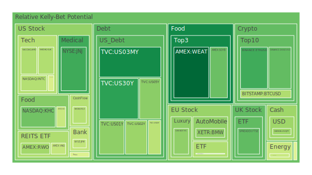
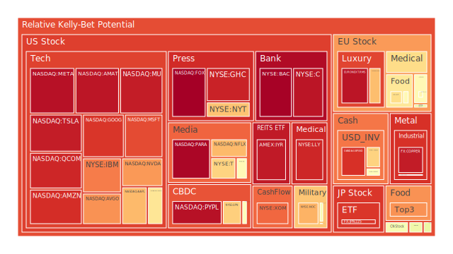
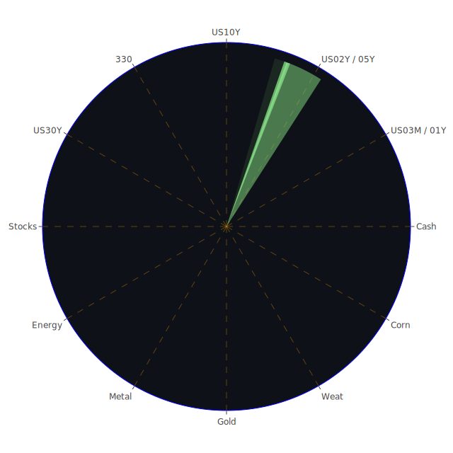

# 投資商品泡沫分析

- **美國國債**
  美國國債的泡沫機率在過去三天內有所波動，特別是30年期國債（TVC:US30Y）的泡沫機率從11月6日的0.214533上升到11月8日的0.233778。這反映出市場對長期利率的擔憂，尤其是在美國大選後政治不確定性增加的背景下。根據FED的數據，10年期和30年期國債的殖利率持續上升，顯示出市場對未來經濟增長的信心不足。

- **美國科技股**
  科技股如蘋果（NASDAQ:AAPL）和微軟（NASDAQ:MSFT）的泡沫機率仍然偏高，分別在0.716143和0.873073附近。這可能與市場對於科技股過去的高估值和未來增長的擔憂有關。值得注意的是，微軟在11月8日的泡沫機率顯著上升，這可能受到美國大選後市場情緒波動的影響。

- **美國房地產指數**
  房地產相關的ETF（AMEX:VNQ）的泡沫機率在11月8日下降至0.438427，顯示出市場對房地產市場的信心有所回升。這可能與近期美聯儲降息的消息有關，降低了房貸利率，提升了房地產市場的吸引力。

- **加密貨幣**
  比特幣（BITSTAMP:BTCUSD）的泡沫機率在11月8日下降至0.403928，顯示出市場對加密貨幣的信心有所增強。這可能與美國大選後市場對於避險資產的需求增加有關。

- **金/銀/銅**
  黃金（OANDA:XAUUSD）的泡沫機率在11月8日為0.490390，顯示出市場對黃金的需求仍然穩定。這可能與全球經濟不確定性增加有關，特別是在美國大選後。

- **黃豆 / 小麥 / 玉米**
  小麥（AMEX:WEAT）的泡沫機率在11月8日為0.125109，顯示出市場對農產品的需求穩定。這可能與全球供應鏈問題和氣候變化影響農產品供應有關。

- **石油/ 鈾期貨UX!**
  石油（TVC:USOIL）的泡沫機率在11月8日保持在0.445433，顯示出市場對石油價格的預期穩定。這可能與OPEC+的產量決策和全球經濟增長前景有關。

- **各國外匯市場**
  美元兌日圓（OANDA:USDJPY）的泡沫機率在11月8日為0.378003，顯示出市場對美元的需求增強。這可能與美國大選後的政治不確定性和美聯儲的貨幣政策有關。

- **各國大盤指數**
  歐洲大盤指數（SPREADEX:FTSE）的泡沫機率在11月8日為0.294651，顯示出市場對歐洲經濟的信心有所增強。這可能與歐洲央行的貨幣政策和全球經濟復甦有關。

- **美國半導體股**
  英偉達（NASDAQ:NVDA）的泡沫機率在11月8日上升至0.765086，顯示出市場對半導體行業的擔憂增加。這可能與全球供應鏈問題和美國大選後的政策不確定性有關。

- **美國銀行股**
  摩根大通（NYSE:JPM）的泡沫機率在11月8日為0.435567，顯示出市場對銀行業的信心有所回升。這可能與美聯儲的降息政策和經濟復甦預期有關。

- **美國軍工股**
  洛克希德·馬丁（NYSE:LMT）的泡沫機率在11月8日保持在0.545112，顯示出市場對軍工行業的穩定需求。這可能與全球地緣政治風險增加有關。

- **美國電子支付股**
  PayPal（NASDAQ:PYPL）的泡沫機率在11月8日為0.967550，顯示出市場對電子支付行業的擔憂增加。這可能與市場對於電子支付行業競爭加劇的擔憂有關。

- **美國藥商股**
  強生（NYSE:JNJ）的泡沫機率在11月8日下降至0.254636，顯示出市場對醫藥行業的信心有所增強。這可能與全球健康需求增加和疫苗研發進展有關。

- **美國影視股**
  Netflix（NASDAQ:NFLX）的泡沫機率在11月8日為0.715752，顯示出市場對影視行業的需求穩定。這可能與全球流媒體需求增加有關。

- **美國媒體股**
  康卡斯特（NASDAQ:CMCSA）的泡沫機率在11月8日為0.483565，顯示出市場對媒體行業的信心有所回升。這可能與美國大選後的政治不確定性減少有關。

- **石油防禦股**
  埃克森美孚（NYSE:XOM）的泡沫機率在11月8日為0.833325，顯示出市場對石油防禦股的需求穩定。這可能與全球能源需求增加和油價上升有關。

- **金礦防禦股**
  金礦相關股票的泡沫機率在11月8日保持穩定，顯示出市場對金礦行業的需求穩定。這可能與全球經濟不確定性增加和避險需求有關。

- **歐洲奢侈品股**
  歐洲奢侈品股（EURONEXT:KER）的泡沫機率在11月8日為0.709089，顯示出市場對奢侈品行業的需求穩定。這可能與全球經濟復甦和消費者信心增強有關。

- **歐洲汽車股**
  歐洲汽車股（XETR:BMW）的泡沫機率在11月8日為0.359531，顯示出市場對汽車行業的信心有所增強。這可能與全球汽車需求回升和供應鏈問題緩解有關。

- **歐美食品股**
  歐洲和美國食品股的泡沫機率在11月8日保持穩定，顯示出市場對食品行業的需求穩定。這可能與全球食品供應鏈問題和消費者需求增強有關。

# 投資建議

1. **考慮買入**：對於泡沫機率持續下降且遠小於0.5的商品，如黃豆（AMEX:SOYB）和強生（NYSE:JNJ），建議投資者考慮買入，因為市場對這些行業的需求增強且風險相對較低。

2. **考慮賣出**：對於泡沫機率持續上升且遠大於0.5的商品，如微軟（NASDAQ:MSFT）和PayPal（NASDAQ:PYPL），建議投資者考慮賣出，以避免未來價格下跌時的損失。

3. **觀望**：對於泡沫機率在0.45至0.55之間的商品，如康卡斯特（NASDAQ:CMCSA），建議投資者觀望，不要有任何動作，因為市場風險和機會尚不明朗。

# 風險提示

投資有風險，市場總是充滿不確定性。我們的建議僅供參考，投資者應根據自身的風險承受能力和投資目標，做出獨立的投資決策。特別是對於泡沫機率高的商品，應該謹慎進行投資決策。
 
Daily Buy Map:

 
Daily Sell Map:

 
Daily Radar Chart:

 
