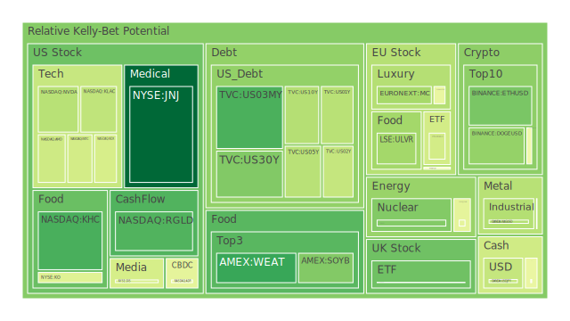
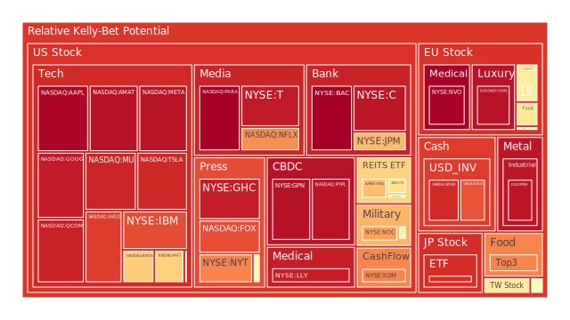
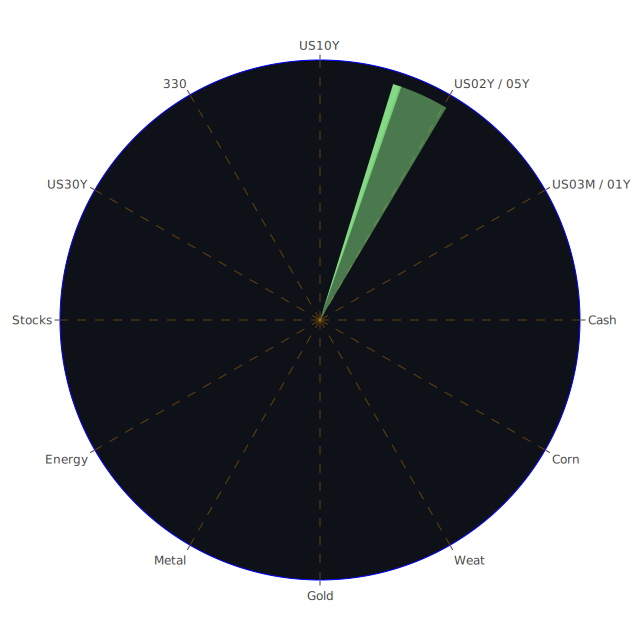

# 投資商品泡沫分析

- **美國國債**
  美國國債的泡沫機率在過去三天中顯示出下降趨勢，特別是30年期國債（TVC:US30Y）從0.233778下降至0.265516。這可能反映出市場對長期利率的預期變化，特別是在近期美國總統大選後，市場對於未來經濟政策的不確定性有所增加。

- **美國科技股**
  美國科技股如微軟（NASDAQ:MSFT）和谷歌（NASDAQ:GOOG）的泡沫機率持續上升，分別達到0.885612和0.940571。這可能是因為市場對於科技股在特朗普勝選後的政策支持抱有較高期望，但同時也伴隨著高估值的風險。

- **美國房地產指數**
  房地產相關的ETF（AMEX:IYR）的泡沫機率非常高，達到0.599103，顯示出市場對房地產市場的擔憂，尤其是在商業地產違約率上升的背景下。

- **加密貨幣**
  比特幣（BITSTAMP:BTCUSD）的泡沫機率在過去三天中有所下降，從0.473200降至0.403928，這可能是因為市場對於加密貨幣在政治不確定性中的避險功能有所期待。

- **金/銀/銅**
  銀（OANDA:XAGUSD）的泡沫機率從0.555519下降至0.345242，顯示出投資者對貴金屬的需求增加，可能是因為市場對於通脹的擔憂。

- **黃豆 / 小麥 / 玉米**
  小麥（AMEX:WEAT）的泡沫機率略有上升，從0.125109升至0.164641，這可能與全球供應鏈問題和氣候變化相關。

- **石油/ 鈾期貨UX!**
  石油（TVC:USOIL）的泡沫機率保持穩定在0.445433，顯示出市場對於石油價格的預期相對穩定，儘管地緣政治風險依然存在。

- **各國外匯市場**
  美元兌日元（OANDA:USDJPY）的泡沫機率在0.378003，顯示出市場對於美元的需求依然強勁，特別是在特朗普勝選後。

- **各國大盤指數**
  歐洲股市如德國DAX指數（SPREADEX:GDAXI）的泡沫機率有所下降，從0.414302降至0.404984，這可能是因為市場對於歐洲政治不穩定的擔憂。

- **美國半導體股**
  NVIDIA（NASDAQ:NVDA）的泡沫機率從0.326272上升至0.354100，顯示出市場對於半導體行業的需求依然強勁，但也伴隨著高估值的風險。

# 投資建議

1. **考慮買入**：對於泡沫機率持續下降且遠小於0.5的商品，如比特幣（BITSTAMP:BTCUSD）和銀（OANDA:XAGUSD），建議投資者考慮買入，因為這些商品在市場不確定性中可能提供避險功能。

2. **考慮賣出**：對於泡沫機率持續上升且遠大於0.5的商品，如美國科技股（NASDAQ:MSFT, NASDAQ:GOOG），建議投資者考慮賣出，因為這些商品的高估值可能在未來面臨調整風險。

3. **觀望**：對於泡沫機率在0.45 ~ 0.55之間的商品，如石油（TVC:USOIL），建議投資者保持觀望，等待市場進一步明朗。

# 風險提示

投資有風險，市場總是充滿不確定性。我們的建議僅供參考，投資者應根據自身的風險承受能力和投資目標，做出獨立的投資決策。特別是在當前政治和經濟環境變動較大的情況下，投資者應該謹慎進行投資決策。
 
Daily Buy Map:

 
Daily Sell Map:

 
Daily Radar Chart:

 
