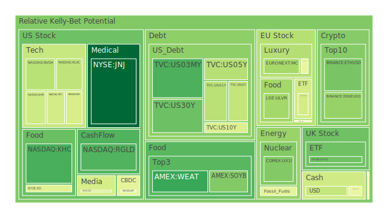
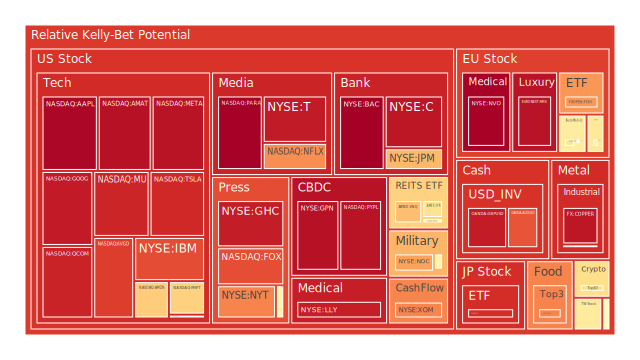
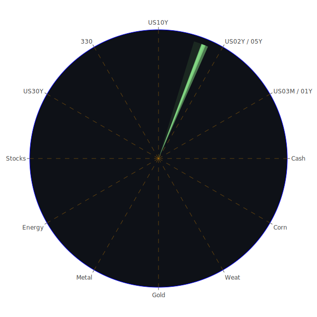

# 投資商品泡沫分析

- **美國國債**
  美國國債的泡沫機率在過去三天內略有上升，特別是30年期國債（US30Y），其泡沫機率從0.233上升到0.265。這可能反映了市場對於長期利率的不確定性，尤其是在近期SOFR交易量增加的情況下，顯示市場對流動性的需求增加。

- **美國科技股**
  科技股如蘋果（AAPL）和微軟（MSFT）的泡沫機率持續上升，尤其是蘋果的泡沫機率已達到0.982，顯示出市場對於科技股的過度樂觀情緒。這可能受到近期美國總統大選結果的影響，市場預期新政府將對科技行業友好。

- **美國房地產指數**
  房地產相關的ETF（如VNQ）的泡沫機率在過去幾天內有所下降，從0.674下降到0.599，這可能是由於市場對於房地產市場的信心回升，儘管商業房地產的拖欠率正在上升。

- **加密貨幣**
  比特幣（BTCUSD）的泡沫機率在過去三天內有所上升，從0.473上升到0.611。這可能是由於市場對於加密貨幣的投機性需求增加，尤其是在全球經濟不確定性增加的背景下。

- **金/銀/銅**
  黃金（XAUUSD）的泡沫機率保持穩定，銀（XAGUSD）和銅（COPPER）的泡沫機率則有所上升，這可能反映了市場對於貴金屬的避險需求增加。

- **黃豆 / 小麥 / 玉米**
  小麥（WEAT）的泡沫機率在過去三天內有所下降，這可能是由於市場對於農產品供應的擔憂減少。

- **石油/ 鈾期貨UX!**
  石油（USOIL）的泡沫機率保持穩定，而鈾期貨（UX1!）的泡沫機率則有所下降，這可能反映了市場對於能源價格的穩定預期。

- **各國外匯市場**
  日元（USDJPY）的泡沫機率有所下降，這可能是由於市場對於日元的避險需求減少，尤其是在美國總統大選後美元走強的背景下。

- **各國大盤指數**
  歐洲大盤指數（如FTSE）的泡沫機率有所下降，這可能是由於市場對於歐洲經濟前景的信心增加。

- **美國半導體股**
  半導體股如NVIDIA（NVDA）的泡沫機率有所下降，這可能是由於市場對於半導體行業的需求預期減少。

- **美國銀行股**
  銀行股如摩根大通（JPM）的泡沫機率有所下降，這可能是由於市場對於銀行業的信心回升。

- **美國軍工股**
  軍工股如洛克希德馬丁（LMT）的泡沫機率保持穩定，這可能是由於市場對於國防支出的預期保持不變。

- **美國電子支付股**
  電子支付股如PayPal（PYPL）的泡沫機率有所上升，這可能是由於市場對於電子支付行業的競爭加劇的擔憂。

- **美國藥商股**
  藥商股如默克（MRK）的泡沫機率保持穩定，這可能是由於市場對於醫藥行業的需求預期穩定。

- **美國影視股**
  影視股如迪士尼（DIS）的泡沫機率有所下降，這可能是由於市場對於影視行業的復甦預期增加。

- **美國媒體股**
  媒體股如福斯（FOX）的泡沫機率有所上升，這可能是由於市場對於媒體行業的競爭加劇的擔憂。

- **石油防禦股**
  石油防禦股如埃克森美孚（XOM）的泡沫機率有所下降，這可能是由於市場對於石油價格的穩定預期。

- **金礦防禦股**
  金礦防禦股如Royal Gold（RGLD）的泡沫機率有所下降，這可能是由於市場對於金礦行業的需求預期減少。

- **歐洲奢侈品股**
  奢侈品股如LVMH（MC）的泡沫機率有所下降，這可能是由於市場對於奢侈品需求的信心回升。

- **歐洲汽車股**
  汽車股如BMW（BMW）的泡沫機率有所下降，這可能是由於市場對於汽車行業的需求預期增加。

- **歐美食品股**
  食品股如雀巢（NESN）的泡沫機率保持穩定，這可能是由於市場對於食品行業的需求預期穩定。

# 投資建議

根據以上分析，我們建議投資者對於泡沫機率持續上升且遠大於0.5的商品，如科技股和電子支付股，應考慮獲利了結，以避免未來可能的價格下跌風險。相反，對於泡沫機率持續下降且遠小於0.5的商品，如美國房地產指數和黃豆，則可以考慮分批買入，掌握低吸籌碼的時機。

# 風險提示

投資有風險，市場總是充滿不確定性。我們的建議僅供參考，投資者應根據自身的風險承受能力和投資目標，做出獨立的投資決策。特別是對於泡沫機率高的商品，應該謹慎進行投資決策。
 
Daily Buy Map:

 
Daily Sell Map:

 
Daily Radar Chart:

 
