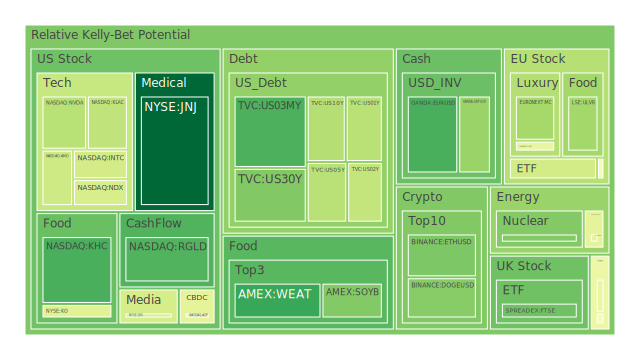
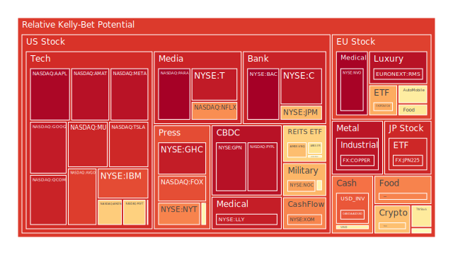
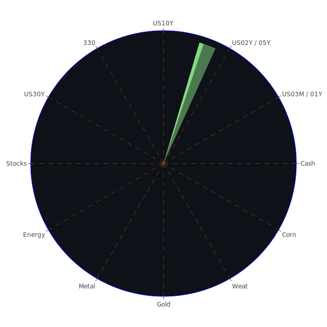

# 投資商品泡沫分析

- **美國國債**
  美國國債的泡沫機率在過去三天內保持相對穩定。儘管美國國債殖利率長期倒掛，這通常會導致企業融資成本上升，但目前泡沫機率顯示，投資者對美國國債的需求仍然堅挺。這可能是因為市場對於美國經濟的信心仍然存在，特別是在聯準會的政策支持下。

- **美國科技股**
  美國科技股的泡沫機率持續上升，特別是像Google和Meta這樣的公司。這可能與近期科技股的高估值以及市場對於未來增長的過度樂觀有關。新聞中提到的微軟股價創新高，顯示出市場對於科技股的熱情，但這也可能是泡沫的前兆。

- **美國房地產指數**
  房地產相關的ETF如IYR的泡沫機率在高位徘徊，這反映了市場對於房地產市場的擔憂。隨著商業地產違約率上升，投資者應該謹慎對待房地產市場的投資。

- **加密貨幣**
  比特幣的泡沫機率在過去三天內有所上升，這可能是由於市場對於加密貨幣的投機行為增加所致。儘管如此，泡沫機率仍未達到極端高位，顯示出市場對於加密貨幣的信心尚未完全崩潰。

- **金/銀/銅**
  金價的泡沫機率略有下降，這可能與近期金磚國家增持黃金有關。銀和銅的泡沫機率則相對較高，顯示出市場對於這些工業金屬的需求可能減弱。

- **黃豆 / 小麥 / 玉米**
  農產品的泡沫機率顯示出市場對於這些商品的需求穩定。特別是小麥的泡沫機率下降，可能與全球供應鏈的恢復有關。

- **石油/ 鈾期貨UX!**
  石油的泡沫機率保持穩定，然而，鈾期貨的泡沫機率顯示出市場對於核能需求的擔憂。這可能與近期地緣政治風險增加有關。

- **各國外匯市場**
  外匯市場中，美元相對於其他主要貨幣的泡沫機率上升，這可能是由於市場對於美國經濟的信心增強，以及其他國家經濟的不確定性增加。

- **各國大盤指數**
  各國大盤指數的泡沫機率顯示出市場對於全球經濟增長的擔憂。特別是歐洲市場，由於經濟增長放緩和政治不穩定，泡沫機率較高。

- **美國半導體股**
  半導體股的泡沫機率在高位徘徊，這可能是由於市場對於科技需求的過度樂觀。儘管如此，半導體行業的長期增長潛力仍然存在。

- **美國銀行股**
  美國銀行股如摩根大通（JPM）的泡沫機率上升，這可能與市場對於銀行業務增長的擔憂有關，特別是在利率上升的環境下。

- **美國軍工股**
  軍工股的泡沫機率相對較高，這可能是由於地緣政治風險增加，市場對於軍工企業的需求預期上升。

- **美國電子支付股**
  電子支付股如PayPal的泡沫機率持續上升，這可能與市場對於電子支付行業增長的過度樂觀有關。

- **美國藥商股**
  藥商股的泡沫機率顯示出市場對於醫藥行業的信心，特別是在疫情後的醫療需求增加。

- **美國影視股**
  影視股的泡沫機率顯示出市場對於娛樂行業的需求，特別是在疫情後消費者重返影院和娛樂場所。

- **美國媒體股**
  媒體股的泡沫機率顯示出市場對於媒體行業的信心，特別是在數位轉型加速的背景下。

- **石油防禦股**
  石油防禦股的泡沫機率顯示出市場對於能源行業的需求，特別是在地緣政治風險增加的情況下。

- **金礦防禦股**
  金礦防禦股的泡沫機率顯示出市場對於貴金屬的需求，特別是在經濟不確定性增加的情況下。

- **歐洲奢侈品股**
  歐洲奢侈品股的泡沫機率顯示出市場對於奢侈品需求的擔憂，特別是在全球經濟增長放緩的背景下。

- **歐洲汽車股**
  歐洲汽車股的泡沫機率顯示出市場對於汽車行業的需求，特別是在電動車轉型加速的背景下。

- **歐美食品股**
  歐美食品股的泡沫機率顯示出市場對於食品行業的需求，特別是在全球供應鏈恢復的背景下。

# 投資建議

根據泡沫機率的分析，我們建議投資者對於泡沫機率持續上升且遠大於0.5的商品，如美國科技股和電子支付股，應該考慮獲利了結，以避免未來可能的市場調整。對於泡沫機率持續下降且遠小於0.5的商品，如美國國債和黃金，投資者可以考慮分批買入，特別是在市場不確定性增加的情況下。

# 風險提示

投資有風險，市場總是充滿不確定性。我們的建議僅供參考，投資者應根據自身的風險承受能力和投資目標，做出獨立的投資決策。特別是對於泡沫機率高的商品，應該謹慎進行投資決策。
 
Daily Buy Map:

 
Daily Sell Map:

 
Daily Radar Chart:

 
