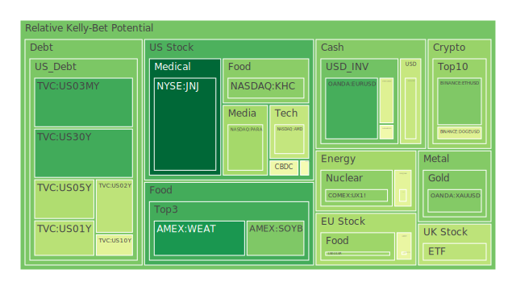
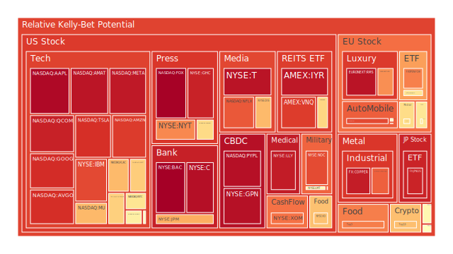
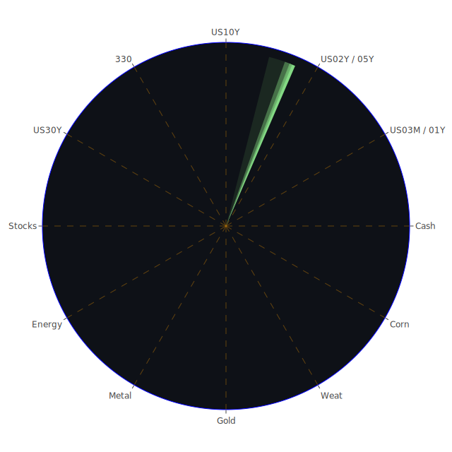

# 投資商品泡沫分析

- **美國國債**
  美國國債的泡沫機率在過去三天內呈現下降趨勢，尤其是30年期國債（US30Y）從0.233778下降到0.176845。這反映出市場對於長期美債的需求增加，可能是因為投資者尋求避險資產以對抗當前的市場不確定性。聯準會的數據顯示，儘管SOFR略高於聯邦基金利率，但尚未達到危險水平，因此美國國債目前仍被視為相對安全的投資選擇。

- **美國科技股**
  科技股如微軟（MSFT）和亞馬遜（AMZN）的泡沫機率持續上升，分別達到0.647024和0.882348。這可能與近期的市場情緒和高估值有關。儘管微軟因為聘請前OpenAI CEO而股價上漲，但整體科技股的高泡沫機率顯示出市場對於科技股的熱情可能過熱，建議投資者謹慎行事。

- **美國房地產指數**
  房地產相關ETF（如VNQ）的泡沫機率上升至0.880953，顯示出市場對房地產的擔憂。聯準會的數據顯示，商業房地產違約率上升，這可能進一步加劇房地產市場的壓力。

- **加密貨幣**
  比特幣（BTCUSD）在特朗普當選後飆升至歷史新高，泡沫機率也上升至0.672798。這顯示出市場對於加密貨幣的樂觀情緒，但也需警惕潛在的波動風險。

- **金/銀/銅**
  黃金的泡沫機率下降至0.269170，顯示出在當前經濟不確定性下，黃金仍然是一個受歡迎的避險資產。相較之下，銅的泡沫機率高達0.938322，可能反映出市場對於工業需求的擔憂。

- **黃豆 / 小麥 / 玉米**
  小麥（WEAT）的泡沫機率下降至0.126027，顯示出市場對於農產品的需求穩定。這可能與全球氣候變遷影響農業生產有關。

- **石油/ 鈾期貨UX!**
  石油的泡沫機率維持在0.445433，顯示出市場對於石油供應和需求的擔憂。近期中國刺激政策未達預期，導致油價下跌。

- **各國外匯市場**
  歐元兌美元的泡沫機率下降至0.183494，顯示出市場對於歐元區經濟的擔憂，特別是在美國可能實施新關稅的背景下。

- **各國大盤指數**
  歐洲股市如法國CAC指數（FCHI）的泡沫機率上升至0.775307，顯示出市場對於歐洲經濟的擔憂。

- **美國半導體股**
  英特爾（INTC）的泡沫機率上升至0.595016，顯示出市場對於半導體行業的擔憂，可能與全球供應鏈問題有關。

- **美國銀行股**
  摩根大通（JPM）的泡沫機率上升至0.706620，顯示出市場對於金融行業的擔憂，特別是在高利率環境下。

- **美國軍工股**
  洛克希德馬丁（LMT）的泡沫機率維持在0.545112，顯示出市場對於軍工股的穩定需求。

- **美國電子支付股**
  PayPal（PYPL）的泡沫機率高達0.964044，顯示出市場對於電子支付行業的過熱情緒。

- **美國藥商股**
  默克（MRK）的泡沫機率接近中性，顯示出市場對於藥商股的穩定需求。

- **美國影視股**
  Netflix（NFLX）的泡沫機率上升至0.836071，顯示出市場對於影視行業的高估值擔憂。

- **美國媒體股**
  紐約時報（NYT）的泡沫機率上升至0.763130，顯示出市場對於傳統媒體的擔憂。

- **石油防禦股**
  埃克森美孚（XOM）的泡沫機率上升至0.797206，顯示出市場對於石油防禦股的擔憂。

- **金礦防禦股**
  金礦股的泡沫機率下降，顯示出市場對於金礦股的需求增加，可能是因為投資者尋求避險資產。

- **歐洲奢侈品股**
  歐洲奢侈品股如LVMH的泡沫機率上升，顯示出市場對於奢侈品需求的擔憂。

- **歐洲汽車股**
  歐洲汽車股如大眾汽車的泡沫機率上升，顯示出市場對於汽車行業的擔憂。

- **歐美食品股**
  歐洲和美國的食品股泡沫機率接近中性，顯示出市場對於食品行業的穩定需求。

# 投資建議

基於以上分析，我們建議投資者對於泡沫機率高且持續上升的科技股和電子支付股保持謹慎，考慮獲利了結以降低風險。對於泡沫機率低且持續下降的黃金和小麥等避險資產，可以考慮分批買入以分散風險。

# 風險提示

投資有風險，市場總是充滿不確定性。我們的建議僅供參考，投資者應根據自身的風險承受能力和投資目標，做出獨立的投資決策。特別是對於泡沫機率高的商品，應該謹慎進行投資決策。
 
Daily Buy Map:

 
Daily Sell Map:

 
Daily Radar Chart:

 
