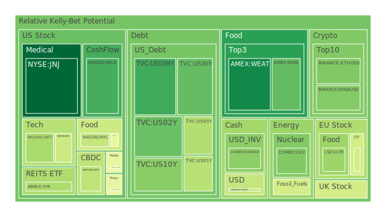
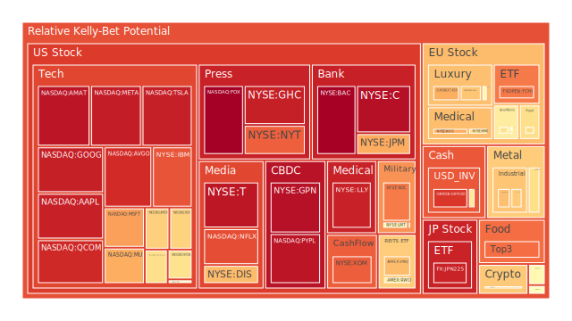
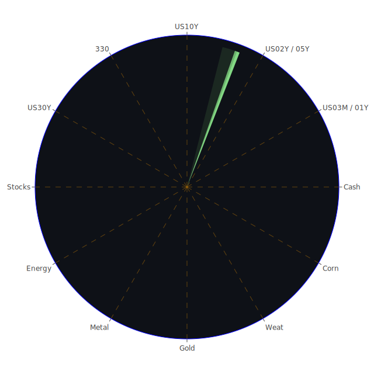

# 投資商品泡沫分析

- **美國國債**
  美國國債的泡沫機率在過去三天中呈現穩定的下降趨勢，尤其是10年期國債的殖利率從上週的4.28%上升至4.43%。這顯示市場對於長期利率的預期有所上升，可能是因為對於美國經濟增長的信心增加。由於SOFR目前低於FED Fund Rate + 0.2，美元流動性尚未出現緊縮，因此美國國債的風險相對較低。

- **美國科技股**
  科技股如微軟（NASDAQ:MSFT）和谷歌（NASDAQ:GOOG）的泡沫機率在高位徘徊，特別是微軟的泡沫機率達到0.73，顯示市場對於科技股的熱情依然高漲。然而，近期新聞中提到的美國政策不確定性可能對科技股造成壓力，建議投資者謹慎觀望。

- **美國房地產指數**
  房地產相關ETF（AMEX:IYR）的泡沫機率持續上升，達到0.68，反映出市場對於房地產市場的擔憂。特別是商業房地產違約率上升，這可能進一步影響房地產市場的穩定性。

- **加密貨幣**
  比特幣（BITSTAMP:BTCUSD）的泡沫機率略有下降，但仍處於高位。近期特朗普當選後的政策可能對加密貨幣市場帶來不確定性，建議投資者保持謹慎。

- **金/銀/銅**
  黃金（OANDA:XAUUSD）的泡沫機率上升至0.61，顯示出市場對避險資產的需求增加。這可能與全球地緣政治緊張局勢有關，如中東地區的衝突升級。

- **黃豆 / 小麥 / 玉米**
  小麥（AMEX:WEAT）的泡沫機率下降至0.09，顯示出市場對於農產品的需求穩定。這可能與全球供應鏈恢復有關，建議投資者考慮分批買入。

- **石油/ 鈾期貨UX!**
  石油（TVC:USOIL）的泡沫機率在0.41附近，近期油價因中國需求疲軟而下跌，建議投資者觀望。

- **各國外匯市場**
  歐元兌美元（OANDA:EURUSD）的泡沫機率上升至0.28，顯示出市場對於歐元區經濟的擔憂，特別是在美國可能實施新關稅的背景下。

- **各國大盤指數**
  歐洲股市（SPREADEX:FTSE）的泡沫機率略有下降，顯示出市場對於歐洲經濟的信心有所恢復。然而，需注意美國政策的不確定性可能對全球市場帶來影響。

- **美國半導體股**
  半導體股如英特爾（NASDAQ:INTC）的泡沫機率下降至0.32，顯示出市場對於半導體行業的信心增強，建議投資者考慮買入。

- **美國銀行股**
  摩根大通（NYSE:JPM）的泡沫機率上升至0.71，顯示出市場對於銀行業的擔憂，特別是在消費者違約率上升的背景下。

- **美國軍工股**
  洛克希德馬丁（NYSE:LMT）的泡沫機率穩定在0.54，顯示出市場對於軍工股的需求穩定。

- **美國電子支付股**
  PayPal（NASDAQ:PYPL）的泡沫機率高達0.96，顯示出市場對於電子支付行業的擔憂，建議投資者謹慎行事。

- **美國藥商股**
  輝瑞（NYSE:MRK）的泡沫機率上升至0.61，顯示出市場對於藥商股的需求增加，這可能與疫情相關的醫療需求增加有關。

- **美國影視股**
  Netflix（NASDAQ:NFLX）的泡沫機率高達0.85，顯示出市場對於影視股的擔憂，特別是在消費者支出減少的情況下。

- **美國媒體股**
  紐約時報（NYSE:NYT）的泡沫機率上升至0.82，顯示出市場對於媒體行業的擔憂，這可能與廣告收入下降有關。

- **石油防禦股**
  埃克森美孚（NYSE:XOM）的泡沫機率高達0.83，顯示出市場對於石油行業的擔憂，特別是在需求疲軟的背景下。

- **金礦防禦股**
  金礦股如Royal Gold（NASDAQ:RGLD）的泡沫機率下降至0.18，顯示出市場對於金礦股的需求增加，建議投資者考慮買入。

- **歐洲奢侈品股**
  歐洲奢侈品股如LVMH（EURONEXT:MC）的泡沫機率上升至0.55，顯示出市場對於奢侈品行業的擔憂，這可能與全球經濟不確定性有關。

- **歐洲汽車股**
  歐洲汽車股如BMW（XETR:BMW）的泡沫機率穩定在0.52，顯示出市場對於汽車行業的需求穩定。

- **歐美食品股**
  食品股如雀巢（SIX:NESN）的泡沫機率上升至0.61，顯示出市場對於食品行業的需求增加，這可能與消費者支出增加有關。

# 投資建議
1. **考慮買入**：黃豆、小麥、金礦股，這些商品的泡沫機率下降且市場需求穩定。
2. **謹慎觀望**：科技股、房地產、電子支付股，這些行業的泡沫機率高且市場不確定性增加。
3. **考慮賣出**：石油、影視股、媒體股，這些商品的泡沫機率高且市場需求疲軟。

# 風險提示

投資有風險，市場總是充滿不確定性。我們的建議僅供參考，投資者應根據自身的風險承受能力和投資目標，做出獨立的投資決策。特別是對於泡沫機率高的商品，應該謹慎進行投資決策。
 
Daily Buy Map:

 
Daily Sell Map:

 
Daily Radar Chart:

 
