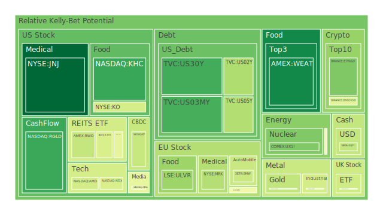
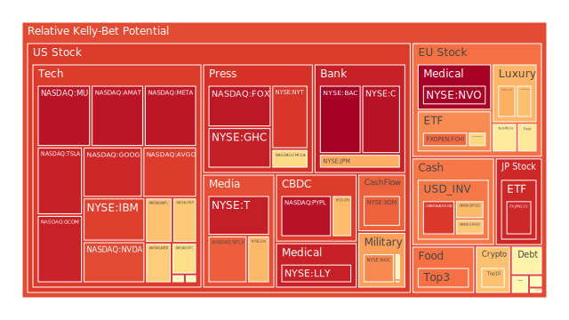
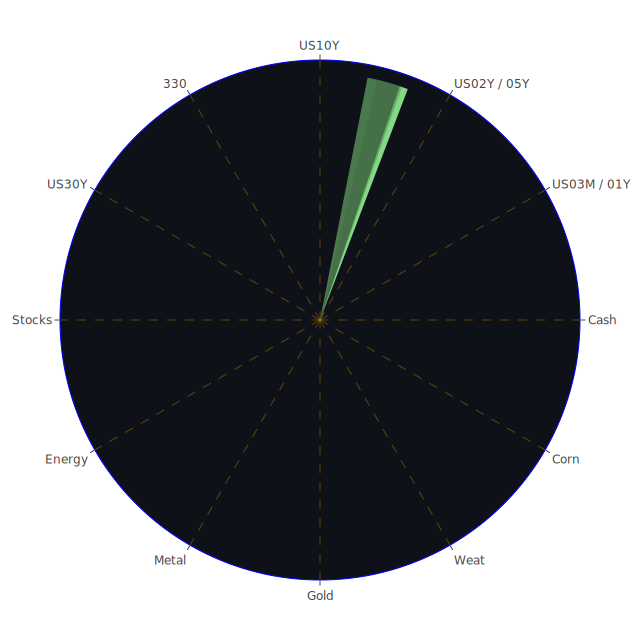

# 投資商品泡沫分析

- **美國國債**
  美國國債的泡沫機率在過去三天內呈現穩定狀態，特別是30年期國債的殖利率略有上升，這可能與市場對於長期經濟增長的信心有所提升有關。然而，值得注意的是，短期國債的殖利率仍然高於長期國債，顯示出市場對短期經濟前景的擔憂。

- **美國科技股**
  美國科技股的泡沫機率普遍偏高，特別是像是Apple和Google這些大型科技公司的泡沫機率接近1.0，這意味著市場對這些股票的未來價格下跌風險有較高的預期。近期新聞中，微軟因為聘請了前OpenAI CEO而股價創新高，這顯示出市場對於人工智慧相關技術的高度期待。

- **美國房地產指數**
  房地產相關的ETF如AMEX:IYR的泡沫機率在過去幾天有所下降，但仍然處於高位。這可能反映出市場對於房地產市場的擔憂，尤其是在商業地產違約率上升的背景下。

- **加密貨幣**
  比特幣和以太坊的泡沫機率略有下降，這可能與近期加密貨幣市場的回暖有關。新聞中提到特朗普當選後，市場對於加密貨幣的監管環境持樂觀態度，這可能進一步推動加密貨幣的需求。

- **金/銀/銅**
  黃金的泡沫機率在過去幾天內有所下降，這可能是由於市場對於避險資產的需求減少所致。另一方面，銅的泡沫機率仍然很高，這可能反映出市場對於全球經濟增長放緩的擔憂。

- **黃豆 / 小麥 / 玉米**
  農產品如黃豆和小麥的泡沫機率有所下降，這可能與中國推出的稅收激勵措施有關，這些措施旨在支持受危機影響的房地產市場，間接提升對農產品的需求。

- **石油/ 鈾期貨UX!**
  石油的泡沫機率略有上升，這可能與中國刺激措施未達市場預期有關，導致市場對於石油需求的擔憂加劇。

- **各國外匯市場**
  歐元兌美元的匯率在過去幾天內持續走低，這可能是由於市場對於特朗普政府可能實施的關稅政策感到擔憂，這些政策可能對歐元區經濟造成負面影響。

- **各國大盤指數**
  歐洲和亞洲市場的大盤指數泡沫機率普遍偏高，這可能反映出市場對於全球經濟不確定性的擔憂。

- **美國半導體股**
  半導體股如NVIDIA的泡沫機率較高，這可能與近期科技股的整體高估值有關。

- **美國銀行股**
  美國銀行股的泡沫機率普遍偏高，這可能與市場對於未來經濟增長放緩的擔憂有關。

- **美國軍工股**
  軍工股如洛克希德·馬丁的泡沫機率相對穩定，這可能反映出市場對於國防支出的穩定預期。

- **美國電子支付股**
  電子支付股如PayPal的泡沫機率接近1.0，這顯示出市場對於這些公司的未來增長持謹慎態度。

- **美國藥商股**
  藥商股如默克的泡沫機率在過去幾天有所下降，這可能與美國食品藥品監督管理局批准新療法有關，提振了市場信心。

- **美國影視股**
  影視股如Netflix的泡沫機率較高，這可能與市場對於流媒體行業競爭加劇的擔憂有關。

- **美國媒體股**
  媒體股如紐約時報的泡沫機率偏高，這可能反映出市場對於傳統媒體行業未來增長的擔憂。

- **石油防禦股**
  石油防禦股如埃克森美孚的泡沫機率略有上升，這可能與市場對於石油需求的不確定性有關。

- **金礦防禦股**
  金礦股的泡沫機率在過去幾天有所下降，這可能反映出市場對於黃金作為避險資產的需求減少。

- **歐洲奢侈品股**
  奢侈品股如LVMH的泡沫機率較高，這可能與市場對於全球經濟增長放緩的擔憂有關。

- **歐洲汽車股**
  汽車股如BMW的泡沫機率有所下降，這可能與市場對於電動車市場增長的樂觀預期有關。

- **歐美食品股**
  食品股如雀巢的泡沫機率略有上升，這可能反映出市場對於消費品行業的擔憂。

# 投資建議

根據泡沫機率的分析，建議投資者對於泡沫機率高於0.9的科技股和電子支付股保持謹慎，考慮逐步減持以降低風險。對於泡沫機率低於0.3的黃金和農產品，若市場情緒支持，則可以考慮逢低買入。

# 風險提示

投資有風險，市場總是充滿不確定性。我們的建議僅供參考，投資者應根據自身的風險承受能力和投資目標，做出獨立的投資決策。特別是對於泡沫機率高的商品，應該謹慎進行投資決策。
 
Daily Buy Map:

 
Daily Sell Map:

 
Daily Radar Chart:

 
