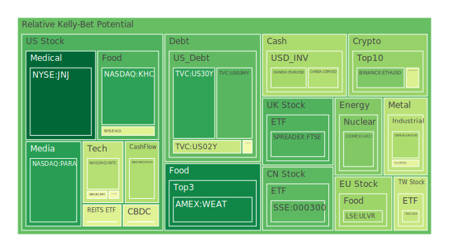
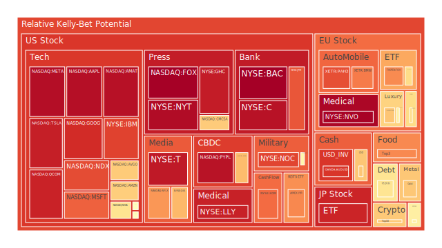

# 投資商品泡沫分析

- **美國國債**
  美國國債的泡沫機率在過去三天中呈現下降趨勢，特別是30年期國債（TVC:US30Y）從0.223198下降到0.156841。這可能與近期SOFR利率的變動有關，SOFR目前為4.59，略低於FED Fund Rate的4.83，顯示市場對美元流動性的需求略有放緩。這對於美國國債來說是一個相對穩定的信號。

- **美國科技股**
  科技股如微軟（NASDAQ:MSFT）和蘋果（NASDAQ:AAPL）的泡沫機率在高位徘徊，尤其是蘋果的泡沫機率從0.934631上升到0.965135。這反映出市場對科技股的高估值持續存在，儘管微軟在近期因為聘請前OpenAI CEO而股價創新高，但整體市場情緒仍偏向謹慎。

- **美國房地產指數**
  房地產相關ETF（AMEX:IYR）的泡沫機率從0.336141上升到0.762309，顯示市場對房地產的擔憂加劇。這可能受到美國房地產違約率上升的影響，FED數據顯示商業房地產違約率正在上升，這對房地產市場構成壓力。

- **加密貨幣**
  以太坊（BINANCE:ETHUSD）的泡沫機率略有下降，從0.266650降至0.258360，顯示市場對加密貨幣的信心有所回升。然而，近期市場波動性仍高，投資者應保持謹慎。

- **金/銀/銅**
  黃金（OANDA:XAUUSD）和白銀（OANDA:XAGUSD）的泡沫機率均有所上升，這與近期市場避險情緒增強有關。特別是金價在高利率環境下仍能保持穩定，顯示其避險屬性。

- **黃豆 / 小麥 / 玉米**
  小麥（AMEX:WEAT）的泡沫機率持續下降，從0.097574降至0.091517，顯示市場對農產品的需求穩定。這可能與全球供應鏈恢復有關。

- **石油/ 鈾期貨UX!**
  石油（TVC:USOIL）的泡沫機率在0.4至0.5之間波動，顯示市場對能源價格的預期不穩定。近期油價受地緣政治影響較大，投資者需密切關注相關新聞。

- **各國外匯市場**
  歐元兌美元（OANDA:EURUSD）的泡沫機率從0.283551上升至0.320558，顯示市場對歐元的信心減弱，這可能與歐洲經濟數據疲軟有關。

- **各國大盤指數**
  歐洲大盤指數（SPREADEX:GDAXI）的泡沫機率上升，反映出市場對歐洲經濟的不確定性增加，特別是在政治局勢不穩定的背景下。

- **美國半導體股**
  英特爾（NASDAQ:INTC）的泡沫機率從0.328876上升至0.350514，顯示市場對半導體行業的擔憂仍在，特別是供應鏈問題尚未完全解決。

# 投資建議

1. **美國國債**：由於SOFR略低於FED Fund Rate，建議投資者可以考慮增加美國國債的持倉，特別是長期國債，因為其泡沫風險相對較低。
   
2. **美國科技股**：由於泡沫機率高企，建議謹慎對待，特別是對於估值過高的公司，如蘋果和微軟，應考慮逐步減少持倉。

3. **房地產市場**：由於泡沫風險增加，建議減少房地產相關投資，特別是在商業房地產違約率上升的背景下。

4. **加密貨幣**：儘管泡沫機率略有下降，但市場波動性仍高，建議投資者保持謹慎，避免過度集中於單一加密資產。

5. **黃金和白銀**：由於避險需求增加，建議適度增加黃金和白銀的配置，以對沖市場不確定性。

# 風險提示

投資有風險，市場總是充滿不確定性。我們的建議僅供參考，投資者應根據自身的風險承受能力和投資目標，做出獨立的投資決策。特別是對於泡沫機率高的商品，應該謹慎進行投資決策。
 
Daily Buy Map:

 
Daily Sell Map:

 
Daily Radar Chart:

 
