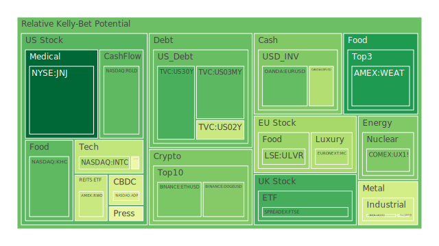
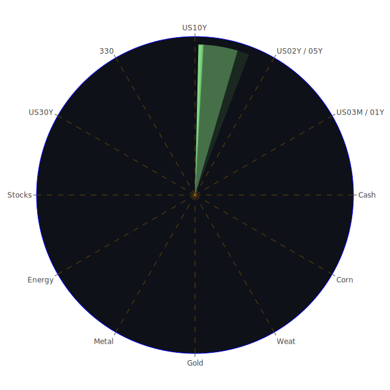

# 投資商品泡沫分析

- **美國國債**
  美國國債的泡沫機率在過去三天內略有下降，這可能是因為近期美國國債殖利率的變動。根據最新的FED數據，美國國債10年期殖利率略有上升，這可能反映了市場對未來經濟增長的樂觀預期。然而，需注意的是，SOFR的交易量相對較高，這可能會對流動性產生壓力。

- **美國科技股**
  科技股如微軟（MSFT）和谷歌（GOOG）的泡沫機率持續上升，尤其是微軟的泡沫機率已經達到0.88。這可能與近期市場對科技股的樂觀情緒有關，但也顯示出市場對這些股票的過度投機。新聞中提到微軟在聘請前OpenAI CEO後股價達到歷史新高，這進一步推動了科技股的上漲。

- **美國房地產指數**
  房地產相關的ETF如VNQ的泡沫機率在0.65左右，建議投資者保持觀望。儘管房地產市場的基本面仍然穩健，但高利率環境可能會對未來的房地產價格造成壓力。

- **加密貨幣**
  比特幣（BTC）的泡沫機率略有上升，達到0.67。這可能與近期特朗普當選後市場對加密貨幣的樂觀情緒有關。新聞中提到加密貨幣投資者在特朗普當選後對比特幣的未來價格表示樂觀，這可能進一步推動了市場的投機行為。

- **金/銀/銅**
  黃金（XAUUSD）的泡沫機率在0.65左右，顯示出市場對黃金的需求仍然穩定。近期的新聞顯示，儘管市場對經濟增長的預期有所改善，但地緣政治風險仍然存在，這可能支撐了黃金的價格。

- **黃豆 / 小麥 / 玉米**
  小麥（WEAT）的泡沫機率在0.13，顯示出市場對農產品的需求仍然穩定。儘管近期的新聞中提到全球經濟不確定性增加，但農產品的基本需求仍然強勁。

- **石油/ 鈾期貨UX!**
  石油的泡沫機率在0.56左右，顯示出市場對石油的需求仍然穩定。然而，近期的新聞中提到俄羅斯計劃停止對歐洲的天然氣供應，這可能會對石油市場產生影響。

- **各國外匯市場**
  美元兌日元（USDJPY）的泡沫機率在0.66，顯示出市場對美元的需求仍然強勁。近期的新聞中提到美國經濟數據強勁，這可能進一步支撐了美元的走強。

- **各國大盤指數**
  歐洲股市如FTSE的泡沫機率在0.18，顯示出市場對歐洲股市的信心仍然較高。近期的新聞中提到英國政府計劃推動經濟改革，這可能進一步提振了市場情緒。

- **美國半導體股**
  半導體股如英偉達（NVDA）的泡沫機率在0.83，顯示出市場對半導體行業的需求仍然強勁。然而，需注意的是，市場對這些股票的投機情緒較高，投資者應謹慎行事。

- **美國銀行股**
  美國銀行（BAC）的泡沫機率接近1.0，顯示出市場對銀行股的投機情緒較高。近期的新聞中提到美國銀行業務的表現良好，但高利率環境可能會對未來的盈利能力造成壓力。

- **美國軍工股**
  軍工股如洛克希德馬丁（LMT）的泡沫機率在0.54，顯示出市場對軍工行業的需求仍然穩定。近期的新聞中提到地緣政治風險增加，這可能進一步支撐了軍工股的需求。

- **美國電子支付股**
  電子支付股如PayPal（PYPL）的泡沫機率在0.96，顯示出市場對電子支付行業的需求仍然強勁。然而，需注意的是，市場對這些股票的投機情緒較高，投資者應謹慎行事。

- **美國藥商股**
  藥商股如默克（MRK）的泡沫機率在0.61，顯示出市場對藥商行業的需求仍然穩定。近期的新聞中提到美國FDA批准了一些新的藥物，這可能進一步支撐了藥商股的需求。

- **美國影視股**
  迪士尼（DIS）的泡沫機率在0.68，顯示出市場對影視行業的需求仍然強勁。近期的新聞中提到迪士尼的業績超出預期，這可能進一步提振了市場情緒。

- **美國媒體股**
  媒體股如紐約時報（NYT）的泡沫機率在0.97，顯示出市場對媒體行業的需求仍然強勁。然而，需注意的是，市場對這些股票的投機情緒較高，投資者應謹慎行事。

- **石油防禦股**
  石油防禦股如埃克森美孚（XOM）的泡沫機率在0.80，顯示出市場對石油防禦行業的需求仍然強勁。近期的新聞中提到全球石油供應的不確定性增加，這可能進一步支撐了石油防禦股的需求。

- **金礦防禦股**
  金礦防禦股如皇家黃金（RGLD）的泡沫機率在0.21，顯示出市場對金礦防禦行業的需求仍然穩定。近期的新聞中提到地緣政治風險增加，這可能進一步支撐了金礦防禦股的需求。

- **歐洲奢侈品股**
  歐洲奢侈品股如LVMH（MC）的泡沫機率在0.34，顯示出市場對奢侈品行業的需求仍然穩定。近期的新聞中提到中國政府推出了支持房地產市場的政策，這可能進一步提振了市場對奢侈品的需求。

- **歐洲汽車股**
  歐洲汽車股如BMW的泡沫機率在0.74，顯示出市場對汽車行業的需求仍然強勁。近期的新聞中提到全球汽車市場的需求增加，這可能進一步支撐了汽車股的需求。

- **歐美食品股**
  食品股如雀巢（NESN）的泡沫機率在0.57，顯示出市場對食品行業的需求仍然穩定。近期的新聞中提到全球經濟增長的預期改善，這可能進一步支撐了食品股的需求。

# 投資建議

1. **謹慎行事**：對於泡沫機率接近或超過0.9的股票，如GOOG、MSFT、PYPL等，建議投資者謹慎行事，考慮分批賣出以鎖定利潤。
   
2. **觀望態度**：對於泡沫機率在0.45到0.55之間的股票，如黃金（XAUUSD）和房地產ETF（VNQ），建議投資者保持觀望，等待市場進一步明朗。

3. **低吸籌碼**：對於泡沫機率低於0.3的股票，如RGLD和WEAT，建議投資者考慮分批買入，以低吸籌碼。

# 風險提示

投資有風險，市場總是充滿不確定性。我們的建議僅供參考，投資者應根據自身的風險承受能力和投資目標，做出獨立的投資決策。特別是對於泡沫機率高的商品，應該謹慎進行投資決策。
 
Daily Buy Map:

 
Daily Sell Map:

 
Daily Radar Chart:

 
