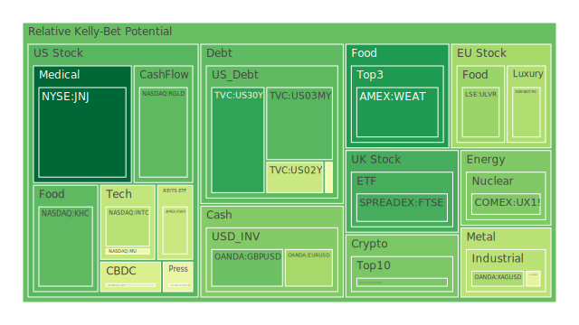
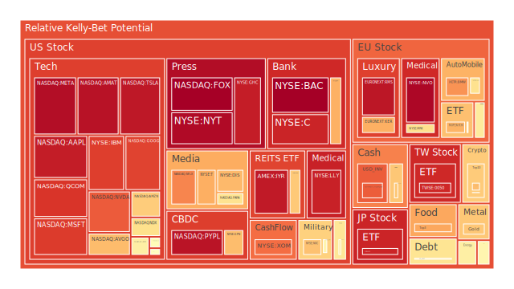
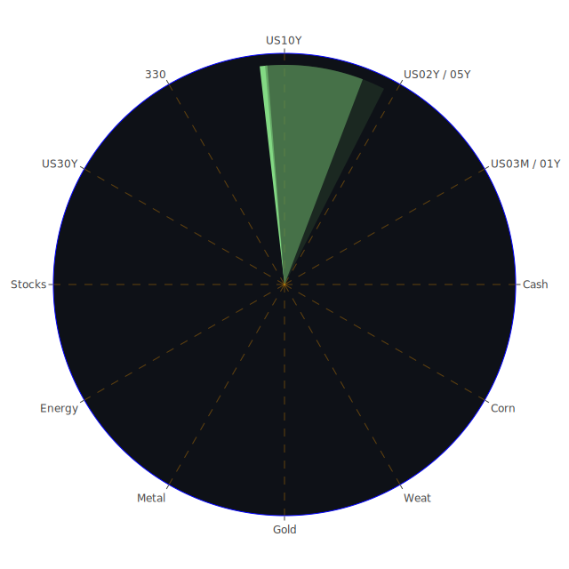

# 投資商品泡沫分析

- **美國國債**
  美國國債的泡沫機率在過去三天內呈現下降趨勢，尤其是30年期國債（TVC:US30Y）從0.186889下降至0.156841。這可能與市場對於美國經濟穩定的信心增強有關，儘管聯準會主席鮑威爾表示不急於降息，這對國債市場來說是個正面消息。

- **美國科技股**
  科技股如NASDAQ:GOOG和NASDAQ:AAPL的泡沫機率持續高於0.9，顯示市場對於科技股的過度樂觀。特別是GOOG，泡沫機率在0.870187至0.908927之間波動，這可能受到近期科技股普遍高估值的影響，加上市場對於未來科技創新的期待。

- **美國房地產指數**
  房地產相關的ETF如AMEX:VNQ的泡沫機率在0.654473，顯示市場對於房地產的信心仍然不穩定。這可能受到美國房地產市場的高利率環境影響，儘管固定抵押貸款利率有所下降，但仍處於高位。

- **加密貨幣**
  比特幣（BITSTAMP:BTCUSD）的泡沫機率在0.678112，顯示市場對於加密貨幣的信心有所回升，這可能與近期特朗普當選後的市場情緒有關，市場預期加密貨幣可能在未來獲得更廣泛的接受。

- **金/銀/銅**
  金價（OANDA:XAUUSD）的泡沫機率在0.658356，顯示市場對於黃金的需求仍然強勁，這可能是因為市場對於經濟不確定性的避險需求增加。銅的泡沫機率則在0.449469，顯示市場對於工業金屬的需求仍然存在不確定性。

- **黃豆 / 小麥 / 玉米**
  小麥（AMEX:WEAT）的泡沫機率在0.132572，顯示市場對於農產品的需求穩定，這可能與全球糧食供應鏈的穩定有關。

- **石油/ 鈾期貨UX!**
  石油（TVC:USOIL）的泡沫機率在0.564247，顯示市場對於石油的需求仍然不穩定，這可能受到全球地緣政治風險的影響。

- **各國外匯市場**
  歐元兌美元（OANDA:EURUSD）的泡沫機率在0.320558，顯示市場對於歐元的信心有所增強，這可能與歐洲經濟數據的改善有關。

- **各國大盤指數**
  歐洲股市如SPREADEX:FTSE的泡沫機率在0.182465，顯示市場對於歐洲經濟的信心增強，這可能受到近期歐洲經濟數據改善的影響。

- **美國半導體股**
  半導體股如NASDAQ:NVDA的泡沫機率在0.831854，顯示市場對於半導體行業的需求仍然強勁，這可能受到全球科技需求增加的影響。

- **美國銀行股**
  美國銀行（NYSE:BAC）的泡沫機率在0.996711，顯示市場對於銀行股的信心不足，這可能受到高利率環境對銀行業務的壓力影響。

- **美國軍工股**
  軍工股如NYSE:LMT的泡沫機率在0.545112，顯示市場對於軍工行業的需求穩定，這可能受到全球地緣政治風險的影響。

- **美國電子支付股**
  電子支付股如NASDAQ:PYPL的泡沫機率在0.956910，顯示市場對於電子支付行業的需求仍然強勁，這可能受到全球電子商務增長的影響。

- **美國藥商股**
  藥商股如NYSE:JNJ的泡沫機率在0.031133，顯示市場對於藥品行業的需求穩定，這可能受到全球健康需求增加的影響。

- **美國影視股**
  影視股如NASDAQ:DIS的泡沫機率在0.685015，顯示市場對於影視行業的需求仍然不穩定，這可能受到全球娛樂需求的影響。

- **美國媒體股**
  媒體股如NASDAQ:FOX的泡沫機率在0.995726，顯示市場對於媒體行業的信心不足，這可能受到全球媒體市場競爭加劇的影響。

- **石油防禦股**
  石油防禦股如NYSE:XOM的泡沫機率在0.803524，顯示市場對於石油行業的需求仍然不穩定，這可能受到全球地緣政治風險的影響。

- **金礦防禦股**
  金礦防禦股如NASDAQ:RGLD的泡沫機率在0.213772，顯示市場對於金礦行業的需求穩定，這可能受到全球經濟不確定性的影響。

- **歐洲奢侈品股**
  奢侈品股如EURONEXT:MC的泡沫機率在0.340689，顯示市場對於奢侈品行業的需求穩定，這可能受到全球消費需求的影響。

- **歐洲汽車股**
  汽車股如XETR:BMW的泡沫機率在0.747874，顯示市場對於汽車行業的需求不穩定，這可能受到全球汽車市場競爭加劇的影響。

- **歐美食品股**
  食品股如NYSE:KO的泡沫機率在0.587314，顯示市場對於食品行業的需求穩定，這可能受到全球食品需求的影響。

# 投資建議

根據目前的泡沫機率數據和市場新聞，我們建議投資者對於泡沫機率持續上升且高於0.5的商品，如科技股和銀行股，應考慮減少持倉，以避免未來可能的價格下跌風險。對於泡沫機率持續下降且低於0.5的商品，如黃金和農產品，則可考慮增加持倉，以把握潛在的投資機會。

# 風險提示

投資有風險，市場總是充滿不確定性。我們的建議僅供參考，投資者應根據自身的風險承受能力和投資目標，做出獨立的投資決策。特別是對於泡沫機率高的商品，應該謹慎進行投資決策。
 
Daily Buy Map:

 
Daily Sell Map:

 
Daily Radar Chart:

 
