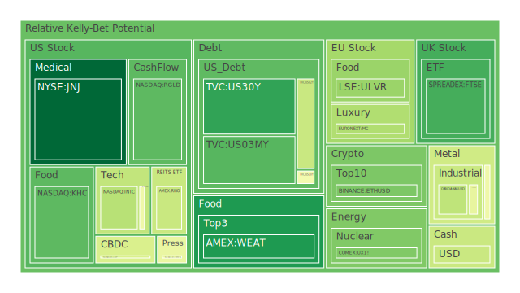
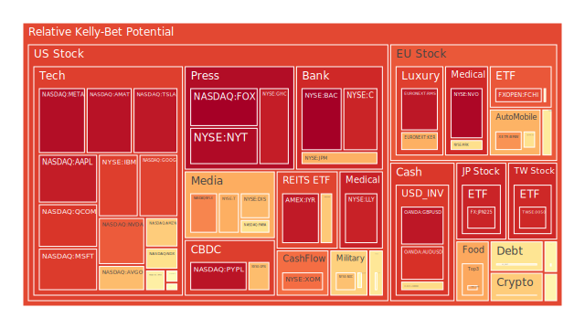
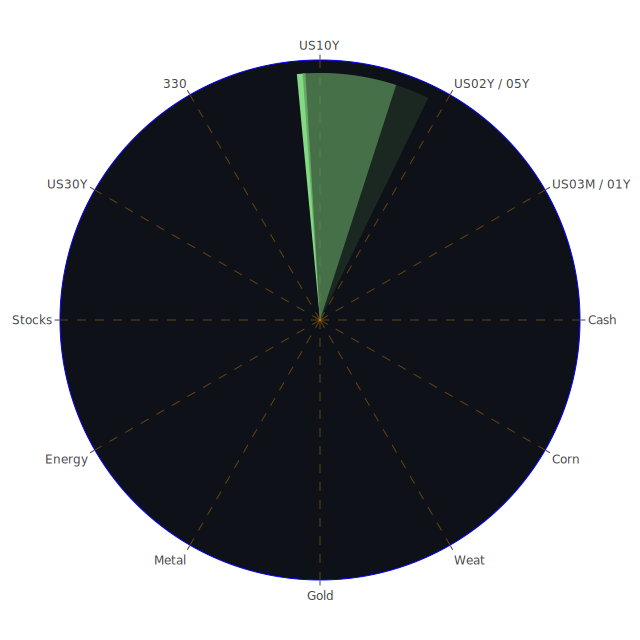

# 投資商品泡沫分析

- **美國國債**
  美國國債的泡沫機率在過去三天內呈現下降趨勢，尤其是30年期國債的泡沫機率從0.186889下降至0.156841。這可能與近期美國國債殖利率的上升有關，特別是30年期國債殖利率從上週的4.53%上升至4.62%。這表明市場對長期債券的需求增加，可能是因為投資者尋求避險資產。

- **美國科技股**
  科技股的泡沫機率普遍偏高，尤其是Google和Microsoft的泡沫機率分別達到0.870187和0.883258。這可能受到近期新聞中對於Nvidia AI晶片過熱問題的負面報導影響，導致市場對科技股的信心減弱。此外，美國聯準會的鷹派言論也可能增加了市場對科技股的壓力。

- **美國房地產指數**
  房地產指數的泡沫機率在0.654473，略高於中性水平，顯示出市場對房地產的信心有所減弱。這與近期商業房地產不良貸款率上升有關，顯示出房地產市場可能面臨挑戰。

- **加密貨幣**
  比特幣的泡沫機率從0.671864下降至0.658312，顯示出市場對加密貨幣的信心有所回升。這可能受到El Salvador的比特幣集會及其價值上升的正面新聞影響。

- **金/銀/銅**
  金價的泡沫機率略有下降，從0.473519下降至0.367511，這可能與近期金價的穩定性有關。儘管如此，金價仍受到高利率環境的壓力，投資者應謹慎考慮。

- **黃豆 / 小麥 / 玉米**
  小麥的泡沫機率在0.132572，顯示出市場對農產品的需求仍然穩定。這可能與全球糧食供應鏈的持續挑戰有關。

- **石油/ 鈾期貨UX!**
  石油的泡沫機率從0.564247下降至0.548935，顯示出市場對石油的需求有所增強。這可能受到近期中東地區緊張局勢的影響。

- **各國外匯市場**
  美元兌日元的泡沫機率上升至0.658810，顯示出市場對美元的需求增加，這可能與美國利率上升預期有關。

- **各國大盤指數**
  歐洲大盤指數的泡沫機率普遍偏高，這可能受到近期歐洲經濟數據不佳的影響。

# 投資建議

1. **美國國債**：由於泡沫機率下降且殖利率上升，建議考慮增加長期國債的持有量，作為避險資產。
2. **美國科技股**：由於泡沫機率偏高且市場信心減弱，建議謹慎持有，避免大幅加倉。
3. **加密貨幣**：考慮在市場信心回升的情況下，適度增加比特幣的投資。
4. **石油**：由於地緣政治因素影響，石油需求可能增加，建議適度增加石油期貨的持有量。

# 風險提示

投資有風險，市場總是充滿不確定性。我們的建議僅供參考，投資者應根據自身的風險承受能力和投資目標，做出獨立的投資決策。特別是對於泡沫機率高的商品，應該謹慎進行投資決策，以避免潛在的市場波動帶來的損失。
 
Daily Buy Map:

 
Daily Sell Map:

 
Daily Radar Chart:

 
