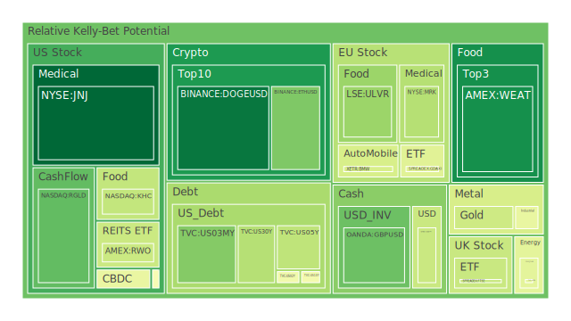
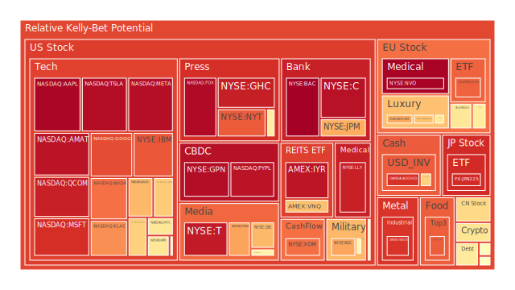
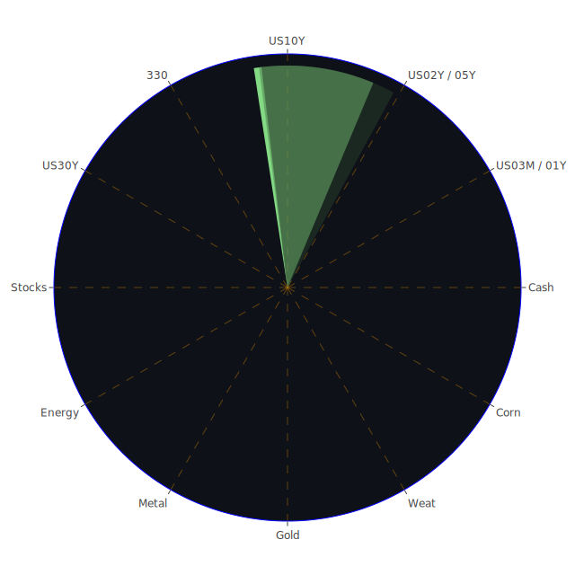

# 投資商品泡沫分析

- **美國國債**
  美國國債的泡沫機率在過去三天內有所上升，特別是30年期國債的殖利率從4.49%上升至4.61%。這顯示出市場對長期債券的需求減少，可能是由於市場對未來利率上升的預期。此外，FED的總資產減少，顯示出流動性收緊的趨勢，這可能進一步影響國債市場。

- **美國科技股**
  美國科技股的泡沫機率普遍偏高，特別是像Google和Microsoft這樣的公司，其泡沫機率分別達到0.854957和0.903802。這可能與近期科技股的高估值以及市場對未來盈利增長的擔憂有關。新聞中提到Nvidia的AI芯片過熱問題，可能進一步影響市場對科技股的信心。

- **美國房地產指數**
  美國房地產指數的泡沫機率在0.671419，顯示出市場對房地產的信心有所減弱。這可能與商業房地產拖欠率上升以及高利率環境下的房貸壓力有關。

- **加密貨幣**
  比特幣的泡沫機率從0.658312上升至0.594912，顯示出市場對加密貨幣的信心有所回升。這可能與市場對美元流動性收緊的預期有關，使得投資者轉向加密貨幣作為避險資產。

- **金/銀/銅**
  金價的泡沫機率下降至0.395911，顯示出市場對黃金的需求增加，可能是由於市場對經濟不確定性的擔憂加劇。銀和銅的泡沫機率則相對較高，顯示出市場對這些工業金屬的需求減少。

- **黃豆 / 小麥 / 玉米**
  小麥的泡沫機率下降至0.109683，顯示出市場對農產品的需求增加。這可能與全球供應鏈問題和氣候變化影響農業生產有關。

- **石油/ 鈾期貨UX!**
  石油的泡沫機率下降至0.445433，顯示出市場對能源需求的增加。這可能與近期油價上漲以及地緣政治風險增加有關。

- **各國外匯市場**
  英鎊兌美元的泡沫機率下降至0.233687，顯示出市場對英鎊的需求增加。這可能與市場對美國經濟增長放緩的預期有關。

- **各國大盤指數**
  歐洲市場的泡沫機率普遍較高，特別是法國CAC指數的泡沫機率達到0.819525，顯示出市場對歐洲經濟增長的擔憂。

- **美國半導體股**
  半導體股的泡沫機率偏高，這可能與全球芯片短缺和供應鏈問題有關。

- **美國銀行股**
  美國銀行股的泡沫機率接近1，顯示出市場對銀行業的信心不足。這可能與高利率環境下的貸款需求減少有關。

- **美國軍工股**
  軍工股的泡沫機率相對較高，顯示出市場對國防開支的擔憂。

- **美國電子支付股**
  電子支付股的泡沫機率偏高，顯示出市場對消費者支出的擔憂。

- **美國藥商股**
  藥商股的泡沫機率相對較低，顯示出市場對醫療行業的信心。

- **美國影視股**
  影視股的泡沫機率偏高，顯示出市場對娛樂行業的擔憂。

- **美國媒體股**
  媒體股的泡沫機率偏高，顯示出市場對廣告收入的擔憂。

- **石油防禦股**
  石油防禦股的泡沫機率相對較低，顯示出市場對能源行業的信心。

- **金礦防禦股**
  金礦防禦股的泡沫機率相對較低，顯示出市場對貴金屬的需求。

- **歐洲奢侈品股**
  歐洲奢侈品股的泡沫機率偏高，顯示出市場對消費者需求的擔憂。

- **歐洲汽車股**
  歐洲汽車股的泡沫機率偏高，顯示出市場對汽車行業的擔憂。

- **歐美食品股**
  歐美食品股的泡沫機率相對較低，顯示出市場對食品行業的信心。

# 投資建議

根據泡沫機率的分析，美國國債和黃金可能是相對安全的投資選擇，特別是在經濟不確定性增加的情況下。對於泡沫機率較高的科技股和銀行股，投資者應該謹慎行事，考慮在市場情緒改善之前減少持倉。

# 風險提示

投資有風險，市場總是充滿不確定性。我們的建議僅供參考，投資者應根據自身的風險承受能力和投資目標，做出獨立的投資決策。特別是在泡沫機率高的商品上，應該謹慎進行投資決策。
 
Daily Buy Map:

 
Daily Sell Map:

 
Daily Radar Chart:

 
