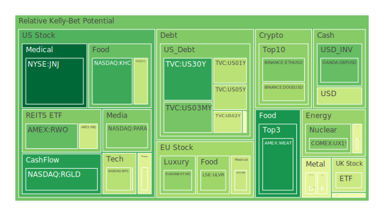
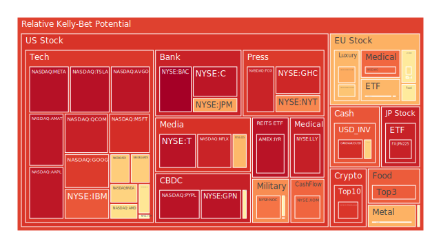
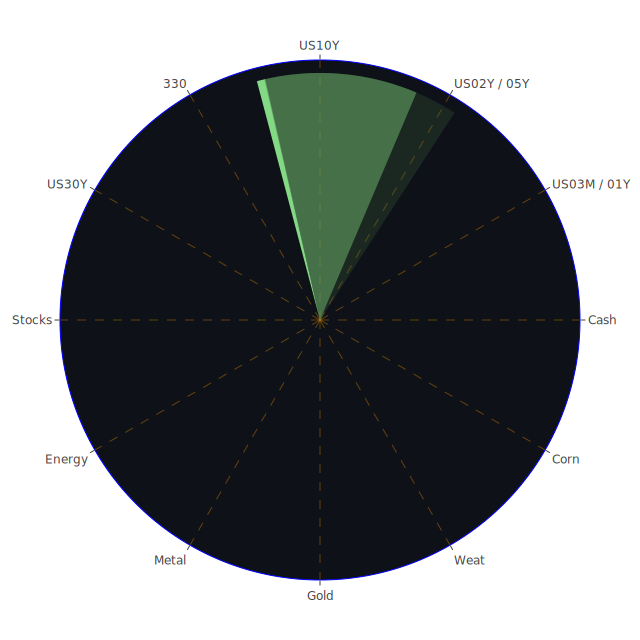

# 投資商品泡沫分析

- **美國國債**
  美國國債的泡沫機率在過去三天內顯示出相對穩定的趨勢，特別是30年期國債（TVC:US30Y）的泡沫機率從0.156841下降到0.155094，顯示出市場對長期國債的需求略有增加。這可能與近期的聯準會政策以及市場對未來經濟增長的預期有關。

- **美國科技股**
  科技股如微軟（NASDAQ:MSFT）和谷歌（NASDAQ:GOOG）的泡沫機率持續上升，分別達到0.904950和0.880430。這與新聞中提到的微軟股價創新高有關，顯示市場對科技股的熱情不減。然而，這也意味著這些股票的估值可能已經過高，投資者應該謹慎。

- **美國房地產指數**
  房地產指數（AMEX:VNQ）的泡沫機率在過去三天內略有下降，但仍然處於高位，顯示出市場對房地產的擔憂。這可能與高利率環境以及消費者信貸違約率上升有關。

- **加密貨幣**
  比特幣（BITSTAMP:BTCUSD）的泡沫機率上升至0.889821，顯示出市場對加密貨幣的投機情緒增強。這可能受到近期市場波動性增加以及對未來監管政策的不確定性影響。

- **金/銀/銅**
  黃金（OANDA:XAUUSD）的泡沫機率略有下降，顯示出市場對黃金的避險需求增加。這可能與近期地緣政治風險上升以及市場對美元的信心下降有關。

- **黃豆 / 小麥 / 玉米**
  小麥（AMEX:WEAT）的泡沫機率下降至0.119254，顯示出市場對農產品的需求增加。這可能受到全球糧食供應鏈不穩定以及氣候變遷影響。

- **石油/ 鈾期貨UX!**
  石油（TVC:USOIL）的泡沫機率保持穩定，顯示出市場對能源需求的持續關注。這可能與全球經濟復甦以及地緣政治風險上升有關。

- **各國外匯市場**
  英鎊兌美元（OANDA:GBPUSD）的泡沫機率下降，顯示出市場對英國經濟的信心增加。這可能與英國近期的經濟數據改善有關。

- **各國大盤指數**
  歐洲大盤指數（SPREADEX:GDAXI）的泡沫機率略有上升，顯示出市場對歐洲經濟的擔憂。這可能與近期的政治不穩定以及經濟增長放緩有關。

- **美國半導體股**
  英特爾（NASDAQ:INTC）的泡沫機率下降至0.350358，顯示出市場對半導體行業的信心增加。這可能與全球半導體需求增加以及供應鏈改善有關。

- **美國銀行股**
  摩根大通（NYSE:JPM）的泡沫機率上升至0.720154，顯示出市場對銀行業的擔憂。這可能與消費者信貸違約率上升以及利率環境不確定性有關。

- **美國軍工股**
  洛克希德馬丁（NYSE:LMT）的泡沫機率保持穩定，顯示出市場對軍工行業的穩定需求。這可能與全球地緣政治風險上升有關。

- **美國電子支付股**
  PayPal（NASDAQ:PYPL）的泡沫機率上升至0.956283，顯示出市場對電子支付行業的擔憂。這可能與競爭加劇以及監管環境不確定性有關。

- **美國藥商股**
  輝瑞（NYSE:MRK）的泡沫機率略有上升，顯示出市場對藥品行業的擔憂。這可能與全球健康危機以及藥品價格政策不確定性有關。

- **美國影視股**
  Netflix（NASDAQ:NFLX）的泡沫機率上升至0.925041，顯示出市場對影視行業的擔憂。這可能與競爭加劇以及消費者行為改變有關。

- **美國媒體股**
  紐約時報（NYSE:NYT）的泡沫機率上升至0.763074，顯示出市場對媒體行業的擔憂。這可能與廣告收入下降以及數位轉型挑戰有關。

- **石油防禦股**
  埃克森美孚（NYSE:XOM）的泡沫機率上升至0.815023，顯示出市場對石油行業的擔憂。這可能與油價波動以及環保政策影響有關。

- **金礦防禦股**
  Royal Gold（NASDAQ:RGLD）的泡沫機率下降至0.138501，顯示出市場對金礦行業的信心增加。這可能與黃金價格上升以及避險需求增加有關。

- **歐洲奢侈品股**
  歐洲奢侈品股的泡沫機率略有下降，顯示出市場對奢侈品行業的信心增加。這可能與消費者需求回升以及市場情緒改善有關。

- **歐洲汽車股**
  BMW（XETR:BMW）的泡沫機率略有下降，顯示出市場對汽車行業的信心增加。這可能與全球汽車需求增加以及供應鏈改善有關。

- **歐美食品股**
  可口可樂（NYSE:KO）的泡沫機率略有下降，顯示出市場對食品行業的信心增加。這可能與消費者需求回升以及市場情緒改善有關。

# 投資建議

1. **考慮賣出**：對於泡沫機率持續上升且遠大於0.5的商品，如微軟（NASDAQ:MSFT）和谷歌（NASDAQ:GOOG），建議投資者考慮獲利了結，避免未來可能的價格回調。

2. **考慮買入**：對於泡沫機率持續下降且遠小於0.5的商品，如Royal Gold（NASDAQ:RGLD）和英特爾（NASDAQ:INTC），建議投資者考慮建立投資部位，掌握低吸籌碼的時機。

3. **觀望**：對於泡沫機率在0.45至0.55之間的商品，建議投資者保持觀望，等待市場進一步明朗化。

# 風險提示

投資有風險，市場總是充滿不確定性。我們的建議僅供參考，投資者應根據自身的風險承受能力和投資目標，做出獨立的投資決策。特別是對於泡沫機率高的商品，應該謹慎進行投資決策。
 
Daily Buy Map:

 
Daily Sell Map:

 
Daily Radar Chart:

 
