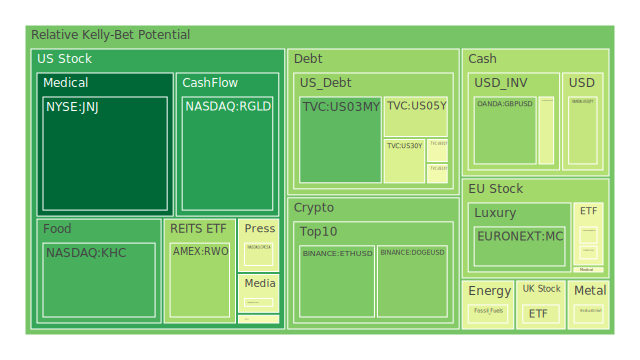
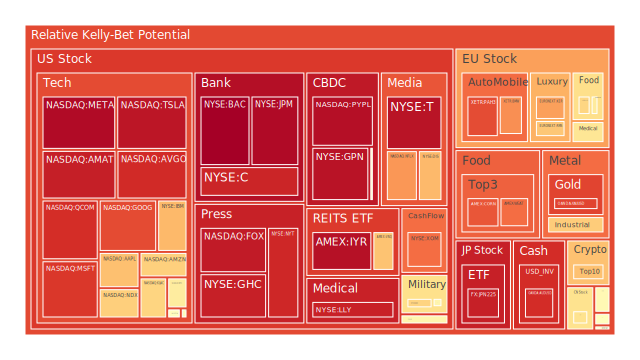
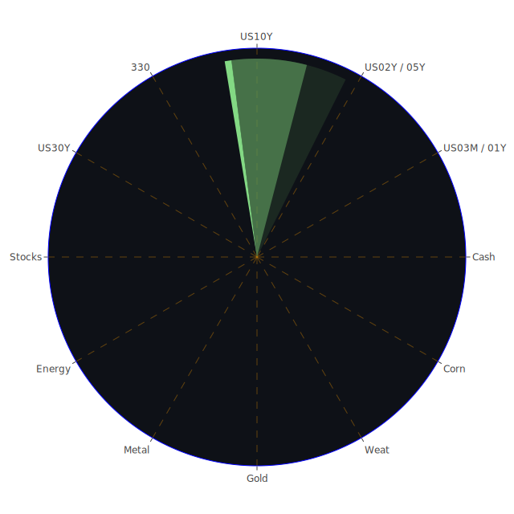

# 投資商品泡沫分析

- **美國國債**
  近期美國國債的泡沫機率顯示出穩定的趨勢，特別是30年期國債（TVC:US30Y）的泡沫機率從前期的0.210192上升至0.423375，顯示出市場對於長期債券的需求有所減少。這可能與近期FED的總資產下降和高收益債券利率的穩定有關。

- **美國科技股**
  科技股如微軟（NASDAQ:MSFT）和蘋果（NASDAQ:AAPL）的泡沫機率均高於0.9，顯示出市場對這些股票的過度樂觀情緒。然而，新聞中提到微軟因聘用前OpenAI CEO而股價創新高，這可能短期內支撐其股價。

- **美國房地產指數**
  房地產相關ETF（AMEX:IYR）的泡沫機率持續上升，達到0.962488，顯示出市場對房地產市場的擔憂。這可能與商業房地產拖欠率高有關。

- **加密貨幣**
  比特幣（BITSTAMP:BTCUSD）的泡沫機率從0.594912上升至0.670746，顯示出市場對其未來價格的擔憂。新聞中提到比特幣創新高，這可能是短期投機行為的結果。

- **金/銀/銅**
  黃金（OANDA:XAUUSD）的泡沫機率顯著上升至0.867656，這可能與近期美元需求增加和市場避險情緒上升有關。

- **黃豆 / 小麥 / 玉米**
  小麥（AMEX:WEAT）的泡沫機率從0.109683上升至0.803384，顯示出市場對農產品價格的擔憂。這可能與全球供應鏈問題和氣候變遷有關。

- **石油/ 鈾期貨UX!**
  石油（TVC:USOIL）的泡沫機率維持在0.445433，顯示出市場對油價的穩定預期。然而，新聞中提到Koch裁員可能影響油市情緒。

- **各國外匯市場**
  英鎊兌美元（OANDA:GBPUSD）的泡沫機率下降至0.294268，顯示出市場對英鎊的信心增加，這可能與英國經濟數據改善有關。

- **各國大盤指數**
  歐洲主要指數如DAX（SPREADEX:GDAXI）的泡沫機率略有下降，顯示出市場對歐洲經濟的信心有所恢復。

- **美國半導體股**
  Nvidia（NASDAQ:NVDA）的泡沫機率從0.797079下降至0.507919，顯示出市場對其未來增長的樂觀情緒，這可能與其AI芯片銷售大增有關。

- **美國銀行股**
  美國銀行（NYSE:BAC）的泡沫機率接近1.0，顯示出市場對銀行業未來的擔憂，這可能與高信用卡拖欠率有關。

- **美國軍工股**
  洛克希德·馬丁（NYSE:LMT）的泡沫機率保持穩定，顯示出市場對軍工股的信心。

- **美國電子支付股**
  PayPal（NASDAQ:PYPL）的泡沫機率接近1.0，顯示出市場對其未來盈利能力的擔憂。

- **美國藥商股**
  藥商如默克（NYSE:MRK）的泡沫機率略有上升，顯示出市場對其未來盈利的擔憂。

- **美國影視股**
  Netflix（NASDAQ:NFLX）的泡沫機率略有下降，顯示出市場對其未來增長的信心。

- **美國媒體股**
  媒體股如紐約時報（NYSE:NYT）的泡沫機率上升至0.916837，顯示出市場對傳統媒體未來的擔憂。

- **石油防禦股**
  石油防禦股如埃克森美孚（NYSE:XOM）的泡沫機率保持穩定，顯示出市場對油價的穩定預期。

- **金礦防禦股**
  金礦股如皇家黃金（NASDAQ:RGLD）的泡沫機率下降，顯示出市場對金價的樂觀情緒。

- **歐洲奢侈品股**
  歐洲奢侈品股如愛馬仕（EURONEXT:RMS）的泡沫機率下降，顯示出市場對奢侈品需求的信心。

- **歐洲汽車股**
  歐洲汽車股如BMW（XETR:BMW）的泡沫機率上升，顯示出市場對汽車行業未來的擔憂。

- **歐美食品股**
  食品股如可口可樂（NYSE:KO）的泡沫機率上升，顯示出市場對其未來盈利的擔憂。

# 投資建議

1. **考慮賣出**：對於泡沫機率高於0.9的科技股和銀行股，如微軟、蘋果和美國銀行，建議投資者謹慎行事，考慮獲利了結。
   
2. **考慮買入**：對於泡沫機率下降且低於0.5的黃金和英鎊，建議投資者可以考慮分批買入，特別是在市場避險情緒上升的情況下。

3. **觀望**：對於泡沫機率在0.45至0.55之間的商品，如石油和部分歐洲指數，建議投資者保持觀望，等待市場進一步明朗。

# 風險提示

投資有風險，市場總是充滿不確定性。我們的建議僅供參考，投資者應根據自身的風險承受能力和投資目標，做出獨立的投資決策。特別是對於泡沫機率高的商品，應該謹慎進行投資決策。
 
Daily Buy Map:

 
Daily Sell Map:

 
Daily Radar Chart:

 
