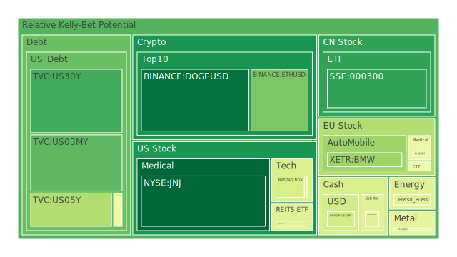
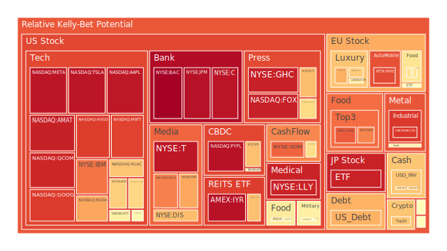
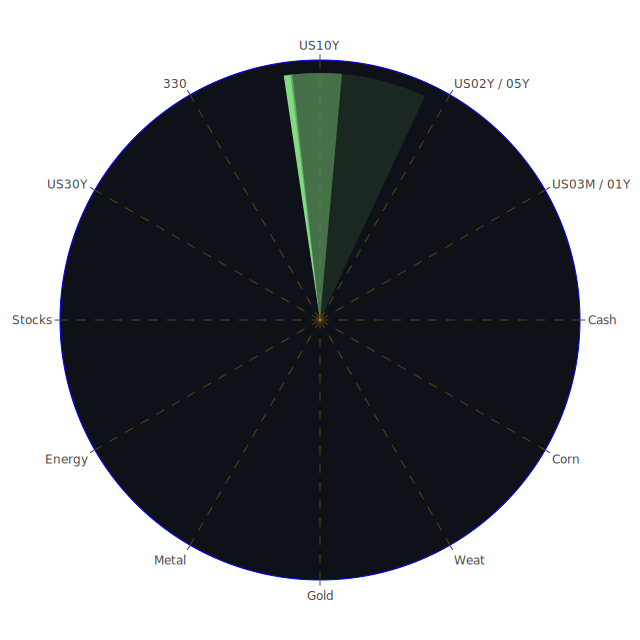

# 投資商品泡沫分析

- **美國國債**
  美國國債的泡沫機率在過去三天內有所波動，特別是30年期國債（US30Y）的泡沫機率從0.155上升至0.186。這可能與近期的聯準會政策及市場對未來利率走向的不確定性有關。儘管如此，SOFR仍低於FED Fund Rate + 0.2，顯示市場對美元流動性需求尚未達到極端水平。

- **美國科技股**
  科技股如微軟（MSFT）和谷歌（GOOG）的泡沫機率持續高企，分別達到0.875和0.887，顯示市場對科技股的熱情仍然高漲。然而，這也意味著投資者應該謹慎，因為高泡沫機率可能預示著未來的價格調整。

- **美國房地產指數**
  房地產相關的ETF（如VNQ）的泡沫機率在過去三天內有所上升，從0.395上升至0.676，這可能反映了市場對房地產市場未來表現的擔憂，尤其是在利率上升的背景下。

- **加密貨幣**
  比特幣（BTCUSD）的泡沫機率在過去幾天內有所上升，從0.889上升至0.665，這可能與市場對加密貨幣監管環境的樂觀預期有關，尤其是在特朗普當選後，市場預期其政府可能對加密貨幣採取更友好的政策。

- **金/銀/銅**
  黃金（XAUUSD）的泡沫機率在過去三天內有所上升，從0.446上升至0.562，這可能反映了市場對地緣政治風險的擔憂增加，特別是在中東和烏克蘭局勢緊張的背景下。

- **黃豆 / 小麥 / 玉米**
  小麥（WEAT）的泡沫機率在過去三天內顯著上升，從0.119上升至0.775，這可能與全球農產品供應鏈的擔憂有關，特別是在全球氣候變遷和地緣政治緊張的背景下。

- **石油/ 鈾期貨UX!**
  石油（USOIL）的泡沫機率保持穩定在0.445，顯示市場對石油價格的預期相對穩定。然而，北歐電池製造商Northvolt破產的消息可能對未來的能源市場產生影響。

- **各國外匯市場**
  歐元兌美元（EURUSD）的泡沫機率在過去三天內有所上升，從0.638上升至0.662，這可能反映了市場對歐洲經濟前景的擔憂，特別是在德國政治不穩定的背景下。

- **各國大盤指數**
  日本日經指數（JPN225）的泡沫機率持續高企，達到0.932，這可能反映了市場對日本經濟復甦的樂觀預期。

- **美國半導體股**
  NVIDIA（NVDA）的泡沫機率在過去三天內有所上升，從0.633上升至0.723，這可能與AI芯片需求的增加有關，但也顯示出市場對其估值的擔憂。

- **美國銀行股**
  摩根大通（JPM）的泡沫機率在過去三天內持續高企，達到0.966，這可能反映了市場對銀行業未來盈利能力的擔憂，特別是在高利率環境下。

# 投資建議

1. **謹慎對待高泡沫機率的科技股和銀行股**：由於這些股票的泡沫機率持續高企，建議投資者謹慎考慮持有這些股票，特別是在市場對未來利率走向不確定的情況下。

2. **考慮增加對黃金的配置**：由於地緣政治風險增加，黃金作為避險資產的需求可能上升，投資者可以考慮增加對黃金的配置。

3. **關注加密貨幣的監管環境變化**：隨著特朗普當選，市場預期其政府可能對加密貨幣採取更友好的政策，這可能為加密貨幣市場帶來新的投資機會。

# 風險提示

投資有風險，市場總是充滿不確定性。我們的建議僅供參考，投資者應根據自身的風險承受能力和投資目標，做出獨立的投資決策。特別是對於泡沫機率高的商品，應該謹慎進行投資決策。
 
Daily Buy Map:

 
Daily Sell Map:

 
Daily Radar Chart:

 
