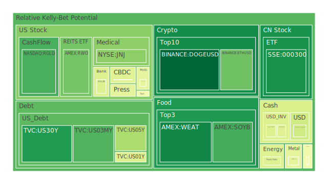
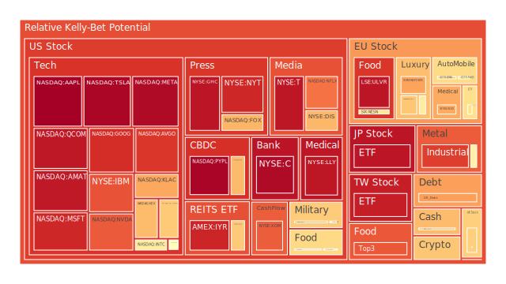
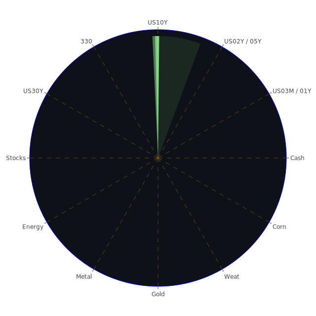

# 投資商品泡沫分析

- **美國國債**
  美國國債的泡沫機率在過去三天內呈現下降趨勢，特別是30年期國債的泡沫機率從0.423375下降到0.166635。這表明投資者對長期美國國債的信心有所增強，可能是因為市場對美國經濟的穩定性預期有所改善。此外，新聞中提到的美國經濟活動數據強勁，可能進一步支撐了這一趨勢。

- **美國科技股**
  科技股如微軟（MSFT）和谷歌（GOOG）的泡沫機率在高位徘徊，分別達到0.900269和0.888356。儘管微軟因為聘請前OpenAI CEO而股價創下新高，但整體市場對科技股的估值仍然偏高，建議投資者謹慎操作。

- **美國房地產指數**
  房地產指數（如VNQ）的泡沫機率略有上升，從0.652795上升到0.676343，這可能反映了市場對於房地產市場未來增長潛力的擔憂。特別是考慮到目前高企的抵押貸款利率，房地產市場的壓力可能會進一步加大。

- **加密貨幣**
  比特幣（BTCUSD）的泡沫機率略有下降，從0.670746下降到0.658231。這可能是因為市場對於特朗普政府可能推出的加密貨幣友好政策的樂觀情緒所致。然而，考慮到加密貨幣市場的高波動性，投資者仍需謹慎。

- **金/銀/銅**
  黃金（XAUUSD）的泡沫機率呈現上升趨勢，從0.562227上升到0.861840，這可能是因為市場對於經濟不確定性的擔憂增加，導致避險需求上升。

- **黃豆 / 小麥 / 玉米**
  小麥（WEAT）的泡沫機率顯著下降，從0.803384下降到0.126884，這可能是因為市場對於供應鏈問題的擔憂有所緩解。這是一個潛在的買入機會，特別是在價格低迷的情況下。

- **石油/ 鈾期貨UX!**
  石油（USOIL）的泡沫機率保持相對穩定，這可能反映了市場對於全球經濟增長和石油需求的預期相對穩定。

- **各國外匯市場**
  美元兌日元（USDJPY）的泡沫機率略有下降，這可能反映了市場對於美元的需求有所減少，特別是在美國經濟數據強勁的背景下。

- **各國大盤指數**
  各國大盤指數如FTSE和GDAXI的泡沫機率略有上升，這可能反映了市場對於全球經濟增長的擔憂。

- **美國半導體股**
  半導體股如NVIDIA（NVDA）的泡沫機率顯著上升，這可能是因為市場對於AI和半導體需求的預期有所增強。然而，考慮到泡沫機率的上升，投資者應謹慎。

- **美國銀行股**
  銀行股如摩根大通（JPM）的泡沫機率下降，這可能是因為市場對於銀行業務的信心有所增強。

- **美國軍工股**
  軍工股如洛克希德馬丁（LMT）的泡沫機率保持穩定，這可能反映了市場對於國防支出的預期相對穩定。

- **美國電子支付股**
  電子支付股如PayPal（PYPL）的泡沫機率保持在高位，這可能反映了市場對於電子支付行業的競爭加劇的擔憂。

- **美國藥商股**
  藥商股如默克（MRK）的泡沫機率略有下降，這可能反映了市場對於醫藥行業的信心有所增強。

- **美國影視股**
  影視股如迪士尼（DIS）的泡沫機率略有上升，這可能反映了市場對於影視行業未來增長潛力的擔憂。

- **美國媒體股**
  媒體股如康卡斯特（CMCSA）的泡沫機率略有下降，這可能反映了市場對於媒體行業的信心有所增強。

- **石油防禦股**
  石油防禦股如埃克森美孚（XOM）的泡沫機率略有下降，這可能反映了市場對於石油行業的信心有所增強。

- **金礦防禦股**
  金礦防禦股如皇家黃金（RGLD）的泡沫機率略有下降，這可能反映了市場對於金礦行業的信心有所增強。

- **歐洲奢侈品股**
  奢侈品股如LVMH（MC）的泡沫機率略有上升，這可能反映了市場對於奢侈品行業未來增長潛力的擔憂。

- **歐洲汽車股**
  汽車股如BMW的泡沫機率略有下降，這可能反映了市場對於汽車行業的信心有所增強。

- **歐美食品股**
  食品股如雀巢（NESN）的泡沫機率略有下降，這可能反映了市場對於食品行業的信心有所增強。

# 投資建議

根據泡沫機率的變化趨勢和新聞現況，我們建議投資者考慮以下策略：

1. **考慮買入**：小麥（WEAT）泡沫機率顯著下降，市場對於供應鏈問題的擔憂有所緩解，這是一個潛在的買入機會。

2. **謹慎操作**：對於泡沫機率高的科技股如微軟（MSFT）和谷歌（GOOG），建議投資者謹慎操作，避免在高位追高。

3. **觀望**：對於泡沫機率在0.45至0.55之間的商品，如某些美國國債和房地產指數，建議投資者保持觀望，不要有任何動作。

# 風險提示

投資有風險，市場總是充滿不確定性。我們的建議僅供參考，投資者應根據自身的風險承受能力和投資目標，做出獨立的投資決策。特別是對於泡沫機率高的商品，應該謹慎進行投資決策。
 
Daily Buy Map:

 
Daily Sell Map:

 
Daily Radar Chart:

 
