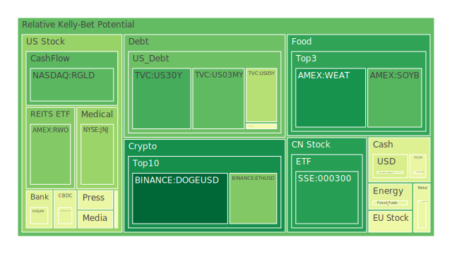
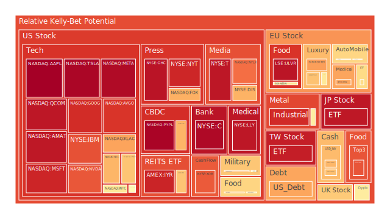
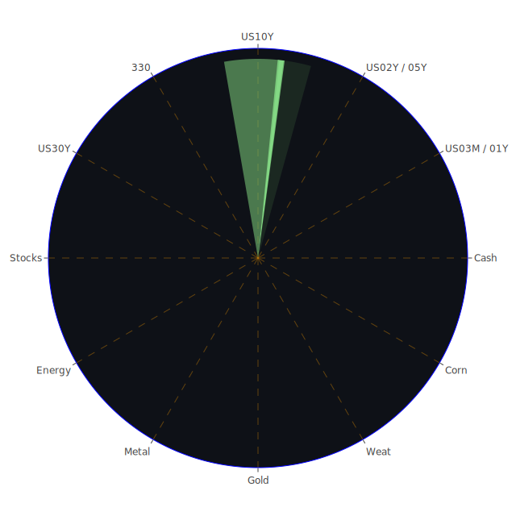

# 投資商品泡沫分析

- **美國國債**
  美國國債的泡沫機率在過去三天內略有下降，D1泡沫機率從0.186降至0.166。這可能與近期美國國債殖利率的變化有關，特別是30年期國債殖利率保持穩定，這顯示市場對長期利率的預期較為穩定。FED的數據顯示，儘管總資產下降，但美國國債的流通量仍然很高，這可能支撐了國債的需求。

- **美國科技股**
  科技股的泡沫機率普遍偏高，特別是微軟（MSFT）和蘋果（AAPL），其泡沫機率分別達到0.900和0.972。這可能與近期的新聞有關，微軟因聘請前OpenAI CEO而股價創新高，然而市場對於科技股的高估值仍需謹慎對待。

- **美國房地產指數**
  房地產指數的泡沫機率在0.652附近徘徊，顯示市場對房地產的預期較為中性。儘管固定抵押貸款利率上升，但房地產市場的需求仍然穩定。

- **加密貨幣**
  比特幣的泡沫機率略有下降至0.565，這可能受到市場對特朗普政府可能對加密貨幣採取友好政策的影響。新聞報導顯示，比特幣接近10萬美元大關，這可能進一步刺激市場情緒。

- **金/銀/銅**
  金價的泡沫機率在0.562附近，顯示市場對黃金的需求仍然穩定。銀的泡沫機率較高，達到0.890，這可能反映出市場對於貴金屬的投機性需求。

- **黃豆 / 小麥 / 玉米**
  小麥的泡沫機率顯著下降至0.126，這可能與全球供應鏈的改善有關。玉米的泡沫機率則較高，達到0.824，顯示市場對農產品價格的波動性預期。

- **石油/ 鈾期貨UX!**
  石油的泡沫機率在0.445附近，顯示市場對石油價格的預期較為穩定。近期的新聞顯示，巴西國營石油公司Petrobras宣布發放巨額股息，這可能對石油市場產生影響。

- **各國外匯市場**
  美元兌日元的泡沫機率在0.412，顯示市場對美元的需求仍然強勁。歐元兌美元的泡沫機率則較高，達到0.662，這可能反映出市場對歐元區經濟的不確定性。

- **各國大盤指數**
  全球股市普遍上漲，特別是加拿大股市在財政刺激措施的推動下創下新高。這可能反映出市場對經濟復甦的樂觀預期。

- **美國半導體股**
  半導體股的泡沫機率普遍偏高，特別是英特爾（INTC）和超微（AMD），這可能反映出市場對於科技行業的高需求。

- **美國銀行股**
  銀行股的泡沫機率較高，特別是摩根大通（JPM）和美國銀行（BAC），這可能與近期的經濟數據和市場對利率上升的預期有關。

- **美國軍工股**
  軍工股的泡沫機率在0.545附近，顯示市場對國防支出的預期較為穩定。

- **美國電子支付股**
  電子支付股的泡沫機率較高，特別是PayPal（PYPL），這可能反映出市場對於數字支付的需求增長。

- **美國藥商股**
  藥商股的泡沫機率在0.493附近，顯示市場對醫藥行業的預期較為中性。

- **美國影視股**
  影視股的泡沫機率較高，這可能與市場對於娛樂行業的高需求有關。

- **美國媒體股**
  媒體股的泡沫機率在0.898，顯示市場對於媒體行業的高需求。

- **石油防禦股**
  石油防禦股的泡沫機率在0.815，顯示市場對於能源行業的需求仍然強勁。

- **金礦防禦股**
  金礦防禦股的泡沫機率在0.562，顯示市場對於貴金屬的需求仍然穩定。

- **歐洲奢侈品股**
  奢侈品股的泡沫機率較高，這可能反映出市場對於奢侈品行業的高需求。

- **歐洲汽車股**
  汽車股的泡沫機率在0.643，顯示市場對於汽車行業的需求仍然穩定。

- **歐美食品股**
  食品股的泡沫機率在0.644，顯示市場對於食品行業的需求仍然穩定。

# 投資建議

根據泡沫機率的分析，我們建議投資者對於泡沫機率持續上升且遠大於0.5的商品，如科技股和銀行股，應考慮獲利了結，避免未來價格下跌的風險。對於泡沫機率持續下降且遠小於0.5的商品，如小麥和黃豆，可以考慮分批買入，掌握低吸籌碼的機會。

# 風險提示

投資有風險，市場總是充滿不確定性。我們的建議僅供參考，投資者應根據自身的風險承受能力和投資目標，做出獨立的投資決策。特別是對於泡沫機率高的商品，應該謹慎進行投資決策。
 
Daily Buy Map:

 
Daily Sell Map:

 
Daily Radar Chart:

 
