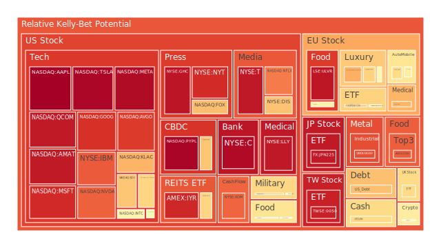
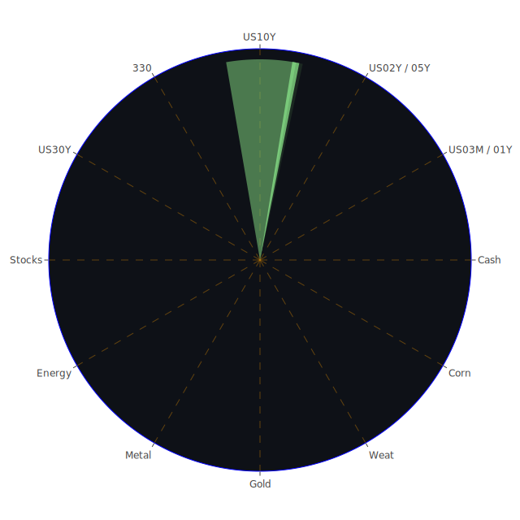

# 投資商品泡沫分析

在全球經濟環境複雜多變的背景下，各類資產的表現引人注目。本報告將從不同的資產類別進行分析，探討其泡沫風險，並提供觀察視角。

## 美國國債

近期，美國國債收益率出現波動。特別是10年期國債收益率維持在4.40%，相較於去年同期的3.84%，呈現上升趨勢。這反映了市場對未來利率水平和通脹預期的調整。短期國債如3個月期收益率下降至4.54%，顯示市場對短期利率可能維持低位的預期。值得注意的是，長短期收益率差（如30年期與3個月期）仍處於正值，這在歷史上被視為經濟前景的正面信號。然而，需警惕收益率曲線可能反映的經濟增長放緩風險。

## 美國科技股

納斯達克指數近期保持強勢，科技巨頭如微軟（NASDAQ:MSFT）、蘋果（NASDAQ:AAPL）等股價接近歷史高位。然而，泡沫風險指數顯示，這些股票的泡沫概率較高。例如，蘋果的PP80指數達到0.9728，表明投資者需警惕高估值可能帶來的回調風險。市場對於人工智慧等新技術的熱情推動了科技股的上漲，但也可能存在過度樂觀的情緒。

## 美國房地產指數

房地產投資信託（REITs）如VNQ表現平穩，PP80指數為0.9037。儘管美國房地產市場受到利率上升的影響，但需求仍然穩定。固定抵押貸款30年期利率上升至6.84%，對新購房者形成一定壓力。然而，房地產市場的供需關係和人口增長支持其長期價值。

## 加密貨幣

比特幣（BTCUSD）價格接近歷史高位，泡沫風險指數達到0.5986，顯示市場對其未來走勢存在分歧。以太坊（ETHUSD）也呈現類似趨勢。近期的宏觀經濟數據和對通脹的擔憂可能推動了加密貨幣的需求。然而，加密貨幣市場的高波動性和監管風險仍需謹慎對待。

## 金/銀/銅

黃金（XAUUSD）價格穩定在高位，泡沫指數為0.5622。銀（XAGUSD）的泡沫指數更高，達到0.8460。金銀比率的變化反映了市場對避險資產的需求。銅價（COPPER）受到全球經濟前景的影響，其泡沫指數適中。工業金屬的需求與全球製造業活動密切相關。

## 黃豆 / 小麥 / 玉米

農產品價格近期波動較小。黃豆（SOYB）的PP80指數為0.2094，小麥（WEAT）為0.1269，玉米（CORN）則較高，達到0.8246。氣候變化和全球供需情況將影響這些商品的價格走勢。投資者需關注農業生產數據和地緣政治因素對農產品市場的影響。

## 石油/ 鈾期貨

原油（USOIL）價格維持在70美元左右，泡沫指數為0.4454。地緣政治風險和產油國的政策對油價具有重要影響。鈾期貨（UX1!）的泡沫指數適中，核能的發展前景和環保議題可能推動其未來需求。

## 各國外匯市場

美元指數近期略有回落，歐元/美元（EURUSD）穩定在1.05附近，泡沫指數為0.6624。日元（USDJPY）兌美元匯率維持在153.93，泡沫指數為0.3898。澳元（AUDUSD）和英鎊（GBPUSD）的泡沫指數較高，需關注各國央行的貨幣政策和經濟數據對匯率的影響。

## 各國大盤指數

歐洲股市如德國DAX指數（GDAXI）的泡沫指數為0.6091，英國FTSE指數為0.6421。亞洲市場方面，中國滬深300指數（000300）泡沫指數為0.1507，顯示估值相對合理。日本日經225指數（JPN225）泡沫指數較高，達到0.9263。全球股市受益於經濟復蘇預期，但仍需警惕潛在風險。

## 美國半導體股

半導體行業受到人工智慧和物聯網需求的推動，相關股票如NVIDIA（NVDA）和AMD的泡沫指數分別為0.8207和0.5250。行業景氣度高，但也面臨供應鏈挑戰和競爭加劇的風險。

## 美國銀行股

銀行股如摩根大通（JPM）的泡沫指數為0.4403，顯示估值相對合理。利率走勢和貸款需求將直接影響銀行業的盈利能力。需要關注的是消費者信用狀況和貸款違約率的變化。

## 美國軍工股

軍工企業如洛克希德·馬丁（LMT）的泡沫指數為0.5451。地緣政治局勢升溫可能增加軍事開支，從而利好軍工企業。但需考慮國防預算的變化和技術研發投入。

## 美國電子支付股

電子支付行業持續發展，支付巨頭如PayPal（PYPL）的泡沫指數達到0.9642。電子商務和數字支付的普及推動了行業增長。但競爭加劇和監管加強可能對行業造成壓力。

## 美國藥商股

製藥企業如強生公司（JNJ）的泡沫指數為0.3055，相對較低。醫藥行業具有防禦性質，但研發投入大、專利到期和價格監管都是需要關注的因素。

## 美國影視股

媒體娛樂公司如迪士尼（DIS）的泡沫指數為0.6850。流媒體服務的競爭加劇，內容製作成本上升，可能影響盈利能力。觀眾需求和市場份額是關鍵指標。

## 美國媒體股

傳統媒體企業如紐約時報（NYT）的泡沫指數為0.8988。數字化轉型和訂閱模式的成功與否將決定其未來表現。廣告收入的穩定性也是重要考量。

## 石油防禦股

能源企業如埃克森美孚（XOM）的泡沫指數為0.8159。能源價格和環保政策將影響其業務。新能源趨勢可能對傳統能源企業帶來挑戰。

## 金礦防禦股

金礦企業如Royal Gold（RGLD）的泡沫指數為0.2160。金價的走勢和開採成本將直接影響該類企業的盈利。避險需求增加可能提升金礦企業的估值。

## 歐洲奢侈品股

奢侈品巨頭如LVMH（MC）的泡沫指數為0.5752。高端消費需求的恢復和新興市場的開拓對其業績影響重大。需關注消費者信心和全球經濟狀況。

## 歐洲汽車股

汽車製造商如賓士（XETR:MBG）的泡沫指數為0.5135。新能源車的發展和供應鏈壓力是行業關注的焦點。政策支持和技術創新將決定企業的競爭力。

## 歐美食品股

食品行業企業如雀巢（NESN）的泡沫指數為0.5862。必需消費品具有防禦性，但原材料成本上升和消費者偏好變化可能帶來挑戰。

# 投資建議

根據上述分析，建議投資者考慮資產配置的多元化，以平衡風險和收益。

**穩健型投資組合（40%）**

- **美國國債（15%）**：提供穩定的收益和較低的風險。
- **黃金（15%）**：作為避險資產，可對沖市場波動風險。
- **必需消費品股（10%）**：如食品和藥品行業，具有防禦性。

**成長型投資組合（40%）**

- **科技股（15%）**：關注具有創新能力的企業，但需警惕高估值風險。
- **半導體股（15%）**：受益於科技發展的長期趨勢。
- **新能源相關股（10%）**：把握能源轉型帶來的機會。

**高風險投資組合（20%）**

- **加密貨幣（10%）**：具備高收益潛力，但波動性大。
- **新興市場股（5%）**：關注經濟增長較快的地區，但需注意政策風險。
- **小型成長股（5%）**：可能帶來高回報，但流動性和風險較高。

# 風險提示

投資涉及風險，市場充滿不確定性。上述建議僅供參考，投資者應根據自身的風險承受能力和投資目標，審慎決策。特別需要注意的是，高泡沫風險的資產可能面臨估值回調的風險，需謹慎投資。

市場情緒、宏觀經濟數據、地緣政治事件和政策變化都可能對資產價格產生影響。投資者應密切關注市場動態，適時調整投資組合。

---

**總結**

當前市場環境複雜，多種因素交織影響資產價格。投資者需要在機遇與風險之間取得平衡，通過多元化投資降低風險，並尋找長期有價值的投資標的。謹慎行事，保持理性，是在不確定性中穩健前行的關鍵。
 
Daily Buy Map:

 
Daily Sell Map:

 
Daily Radar Chart:

 
