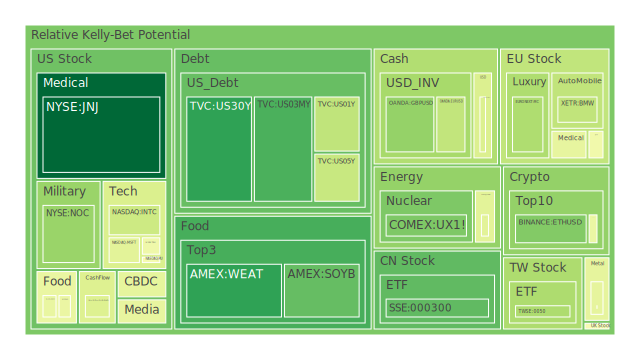
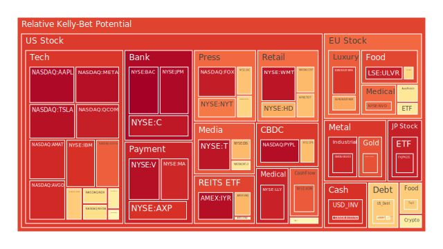
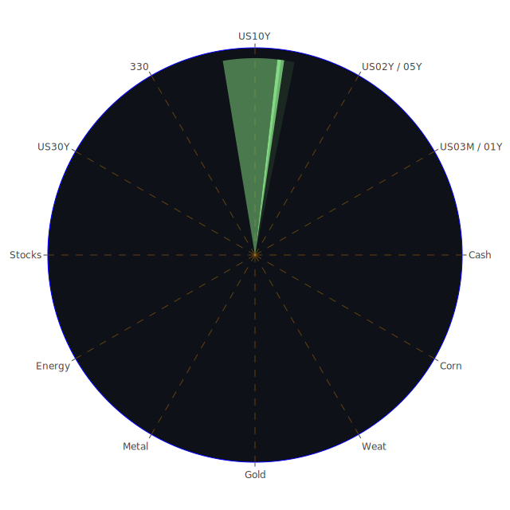

# 投資商品泡沫分析

## 美國國債

根據最新的數據，美國30年期國債收益率（US30Y）在2024年11月26日達到4.46%，較前一週的4.61%有所下降。短期國債收益率也呈現下降趨勢，如2年期國債收益率（US02Y）降至4.27%。收益率曲線的變化反映了市場對未來經濟走向的不確定性，以及投資者對避險資產的需求增加。從泡沫風險指標來看，US30Y在D1的泡沫指數為0.157861，D30為0.216135，處於較低水準，顯示美國國債市場整體風險可控，投資價值較高。

## 美國零售股

美國零售股近期受到消費者信心和支出模式轉變的影響。Target（TGT）的泡沫指數在D1為0.671673，D30為0.665347，暗示市場對零售業前景持謹慎態度。電商的崛起和消費者購物習慣的變化，給傳統零售商帶來挑戰。投資者需關注零售企業的數位化轉型和線上銷售增長。

## 美國科技股

科技股一直是市場焦點，領導著創新和增長。然而，高估值帶來的泡沫風險不容忽視。以微軟（MSFT）為例，D1泡沫指數為0.444986，D30為0.770578，顯示短期內存在一定風險。投資者應關注企業基本面和盈利能力，避免盲目追高。

## 美國房地產指數

隨著利率上升，美國房地產市場面臨挑戰。房地產ETF（VNQ）的D1泡沫指數為0.689818，D30為0.652602，顯示市場風險增加。高額的按揭貸款利率可能削弱購房需求，投資者需關注房地產市場供需關係的變化。

## 加密貨幣

比特幣（BTCUSD）價格波動劇烈，2024年11月26日的報價為93,466美元。D1泡沫指數為0.466267，D30為0.547734，顯示中等風險。加密貨幣市場受政策監管、技術發展和市場情緒影響，風險較高。投資者應當審慎評估風險承受能力。

## 金/銀/銅

貴金屬市場受到避險需求的推動。黃金（XAUUSD）價格上漲至2,620.33美元/盎司，D1泡沫指數高達0.847611，短期風險較高。白銀（XAGUSD）D1泡沫指數為0.923344，風險更高。銅價與全球經濟活動相關，D1泡沫指數為0.452814，風險相對較低。投資者需關注全球經濟復甦和貨幣政策的影響。

## 黃豆 / 小麥 / 玉米

農產品價格受供需基本面和氣候因素影響。小麥（WEAT）D1泡沫指數為0.158058，風險較低，但需注意全球供應鏈的變化。玉米（CORN）D1泡沫指數為0.648268，風險偏高。黃豆（SOYB）的D1泡沫指數為0.228019，風險適中。投資者應關注農業政策、氣候變遷和全球需求。

## 石油/鈾期貨

原油市場受到地緣政治和供需平衡的影響。WTI原油（USOIL）價格在68.39美元，D1泡沫指數為0.445433，風險中等。鈾期貨（UX1!）D1泡沫指數為0.264603，風險較低。能源轉型和環保政策可能影響未來的供需格局。

## 各國外匯市場

美元指數近期走弱，歐元兌美元（EURUSD）D1泡沫指數為0.376286，風險較低。英鎊兌美元（GBPUSD）D1泡沫指數為0.298470，顯示市場對英國經濟的信心。日元兌美元（USDJPY）D1泡沫指數為0.428681，日元貶值趨勢明顯。投資者需關注各國貨幣政策和經濟數據對匯率的影響。

## 各國大盤指數

全球股市表現分化。德國DAX指數（GDAXI）D1泡沫指數為0.578582，風險適中。法國CAC指數（FCHI）D1泡沫指數為0.479828，風險較低。日本日經225指數（JPN225）D1泡沫指數為0.934274，風險較高。中國上證300指數（000300）D1泡沫指數為0.221266，風險較低。各國經濟復甦進度和貨幣政策將影響股市走勢。

## 美國半導體股

半導體行業蓬勃發展，受益於5G、人工智慧和物聯網的推動。英特爾（INTC）D1泡沫指數為0.396383，風險較低。美光科技（MU）D1泡沫指數為0.489831，風險適中。投資者應關注芯片供應短缺的緩解情況和行業競爭格局。

## 美國銀行股

金融行業受到利率走勢和經濟復甦的影響。摩根大通（JPM）D1泡沫指數為0.978526，風險較高。美國銀行（BAC）D1泡沫指數為0.995743，短期風險突出。投資者需關注銀行的資產負債表質量和資本充足率。

## 美國軍工股

全球地緣政治風險增加，軍工股受益。洛克希德·馬丁（LMT）D1泡沫指數為0.545112，風險適中。諾斯洛普·格魯曼（NOC）D1泡沫指數為0.306375，風險較低。投資者可將軍工股作為防禦性資產配置。

## 美國電子支付股

電子支付行業持續增長，受電子商務和無現金支付趨勢推動。PayPal（PYPL）D1泡沫指數為0.967431，風險較高。Visa（V）D1泡沫指數為0.964143，顯示市場對其未來增長的高預期。投資者需關注競爭格局和技術創新。

## 美國藥商股

醫藥行業穩定成長。強生（JNJ）D1泡沫指數為0.035921，風險較低。默克（MRK）D1泡沫指數為0.456067，風險適中。投資者應關注新藥研發進展和專利保護情況。

## 美國影視股

隨著娛樂需求回升，影視股迎來機遇。迪士尼（DIS）D1泡沫指數為0.685091，風險適中。奈飛（NFLX）D1泡沫指數為0.592575，顯示市場對其訂閱模式的信心。投資者需關注內容製作和用戶增長。

## 美國媒體股

媒體行業正經歷數位化轉型。紐約時報（NYT）D1泡沫指數為0.788182，風險偏高。傳統媒體需適應新的消費習慣，投資者應關注其轉型策略。

## 石油防禦股

能源股受油價波動影響。埃克森美孚（XOM）D1泡沫指數為0.831951，風險較高。全球能源需求和環保政策將影響該行業前景。

## 金礦防禦股

金礦股作為避險資產受市場青睞。Royal Gold（RGLD）D1泡沫指數為0.431355，風險較低。黃金價格上漲將利好金礦企業的盈利。

## 歐洲奢侈品股

歐洲奢侈品行業受亞洲市場需求帶動。LVMH（MC）D1泡沫指數為0.340489，風險較低。投資者可關注該行業的全球擴張和品牌價值。

## 歐洲汽車股

電動汽車和自動駕駛技術推動汽車行業轉型。BMW（BMW）D1泡沫指數為0.373830，風險適中。投資者需關注企業的創新能力和市場佔有率。

## 歐美食品股

食品行業具有防禦性。雀巢（NESN）D1泡沫指數為0.625537，風險適中。聯合利華（ULVR）D1泡沫指數為0.932927，風險較高。消費者偏好的變化和產品創新是關鍵。

# 宏觀經濟傳導路徑分析

全球經濟正面臨多重挑戰。美國聯準會的資產負債表縮減，市場流動性下降，顯示貨幣政策趨於緊縮。長短期國債收益率倒掛，可能預示經濟衰退風險增加。

通貨膨脹仍是主要關切，CPI年增率維持在2.6%。能源價格波動和供應鏈瓶頸可能推升通脹壓力。各國央行的貨幣政策走向對全球資本流動和匯率影響重大。

地緣政治風險，如中東局勢緊張，可能影響能源供應和全球市場信心。投資者需密切關注政策變化和全球經濟數據，調整投資策略。

# 微觀經濟傳導路徑分析

在企業層面，科技行業的高估值可能導致資金從風險資產流向避險資產。半導體供應鏈問題可能影響相關產業的生產和盈利。

消費者行為的改變，如線上購物和居家辦公，影響零售和商業地產的需求。能源行業受環保政策和技術創新影響，傳統能源企業需適應轉型。

匯率波動將影響進出口企業的成本和收益。農產品價格上漲可能推高食品企業的成本，壓縮利潤率。投資者應關注企業財務健康和競爭優勢。

# 投資建議

基於以上分析，建議投資者進行多元化和風險平衡的資產配置。

## 穩健型（50%）

- **美國國債**（20%）：收益穩定，降低資產組合風險。
- **黃金**（15%）：對沖通脹和市場不確定性。
- **歐洲奢侈品股**（15%）：行業前景穩定，抗經濟波動。

## 成長型（30%）

- **美國科技股**（10%）：具有長期增長潛力，如微軟、蘋果。
- **美國半導體股**（10%）：受益於科技需求增長。
- **醫藥股**（10%）：穩定增長，防禦性強。

## 高風險型（20%）

- **加密貨幣**（10%）：高收益潛力，同時波動性大。
- **新興市場股票**（5%）：經濟增長潛力大，但風險高。
- **能源期貨**（5%）：受市場供需和地緣政治影響，波動性高。

# 風險提示

投資有風險，市場總是充滿不確定性。高估值資產可能面臨價格調整，全球經濟和政治事件可能導致市場波動。投資者應根據自身的風險承受能力，謹慎選擇投資標的。

加密貨幣市場波動劇烈，需警惕價格急劇下跌的風險。股市可能受到經濟衰退預期的影響而調整。匯率波動可能影響外幣資產的價值。

建議投資者保持資產配置的多元化，定期檢視投資組合，並與專業財務顧問討論，以做出明智的投資決策。
 
Daily Buy Map:

 
Daily Sell Map:

 
Daily Radar Chart:

 
