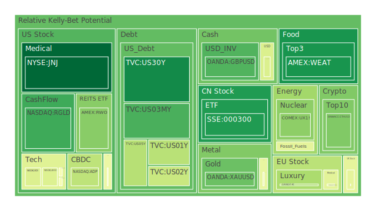
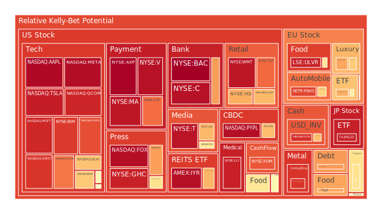
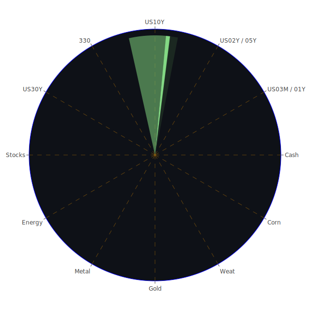

# 投資商品泡沫分析

## 美國國債

近期，美國國債收益率出現了明顯的波動。根據數據顯示，30年期國債（US30Y）的收益率在11月25日為4.6%，11月26日下降至4.48%，11月27日持平於4.48%。同時，10年期（US10Y）和5年期（US05Y）國債收益率也呈現出下降趨勢。這種趨勢反映了市場對於未來經濟增長和通脹的預期下降。

此外，收益率曲線的倒掛情況有所改善。11月27日，10年期與3個月期國債的利差為-0.22%，較上週的-0.13%有所擴大，但相比去年同期的-1.19%已有所改善。這表明市場對於短期經濟前景的擔憂有所緩解。

從泡沫風險角度看，短期國債的泡沫風險較高。例如，2年期國債（US02Y）的D1指標從11月25日的0.722602上升至11月27日的0.383978，反映出短期國債市場的投機性交易增加，需謹慎對待。

## 美國科技股

美國科技股近期表現強勁。微軟（MSFT）、蘋果（AAPL）和亞馬遜（AMZN）等巨頭的股價持續上漲。以蘋果為例，其股價在11月25日為230.38美元，11月27日上升至235.57美元。此外，微軟因聘請前OpenAI CEO Sam Altman，引發市場熱情，股價創下歷史新高。

然而，需要注意的是，科技股的泡沫風險正在增加。數據顯示，蘋果的D1指標在11月25日為0.972830，11月27日上升至0.977187，接近1的高風險區域。投資者需警惕過度投機帶來的風險。

## 美國房地產指數

美國房地產市場出現趨緩跡象。房地產ETF（VNQ）的股價從11月25日的96.43美元上升至11月27日的98.16美元，漲幅有限。而D1指標從0.652795上升至0.690044，顯示泡沫風險有所增加。

同時，30年期固定抵押貸款利率在11月27日達到6.84%，高於上月的7.22%。雖然利率有所下降，但依然處於較高水平，可能抑制房地產市場的需求。

## 加密貨幣

比特幣和以太坊等加密貨幣價格近期波動較大。比特幣價格在11月25日為97,885美元，11月27日下降至92,233美元。同時，比特幣的D1指標從0.598602下降至0.622477，顯示市場投機情緒依然濃厚。

需要關注的是，加密貨幣市場受到宏觀經濟和監管政策的雙重影響。近期，多個國家的監管措施可能對市場產生負面影響，投資者需謹慎行事。

## 金/銀/銅

貴金屬市場近期表現平穩。黃金價格在11月27日為2,624.71美元/盎司，高於上月的2,620.33美元/盎司。銀的價格也有所上漲。然而，金銀的泡沫風險指標D1均較高，投資者需警惕市場過熱的風險。

銅價呈現震盪走勢，反映出市場對全球經濟前景的複雜看法。金銅比率在11月27日達到649.08，高於去年同期的503.09，顯示市場對避險資產的需求增加。

## 黃豆 / 小麥 / 玉米

農產品價格近期受到多重因素影響。小麥ETF（WEAT）的價格從11月25日的4.92美元下降至11月27日的4.86美元。黃豆ETF（SOYB）和玉米ETF（CORN）的價格也呈現小幅波動。

農產品的泡沫風險指標相對較低，但需關注全球氣候變化和地緣政治因素對供應的影響，可能導致價格劇烈波動。

## 石油/鈾期貨

原油價格近期持續下跌。WTI原油價格從11月25日的70.95美元下降至11月27日的68.50美元。鈾期貨價格則保持穩定。

石油市場的泡沫風險有所降低，但需關注中東地區的政治局勢和主要產油國的政策變動。

## 各國外匯市場

美元指數近期呈現走弱趨勢。歐元/美元匯率在11月27日達到1.05，顯示歐元走強。英鎊/美元匯率也有所上升，達到1.26。

外匯市場的波動主要受到各國貨幣政策和經濟數據的影響。投資者需密切關注央行的政策動向。

## 各國大盤指數

全球股市近期表現分化。美國納斯達克指數在11月27日達到20,863點，創下新高。相反，歐洲和亞洲市場表現相對疲軟。

投資者需關注全球經濟增長前景和地緣政治風險對股市的影響。

## 美國半導體股

半導體股票近期表現強勁。英特爾（INTC）、英偉達（NVDA）等公司的股價持續上漲，反映出市場對於5G和AI技術的樂觀預期。

然而，半導體行業的泡沫風險正在積累。英偉達的D1指標從11月25日的0.820687上升至11月27日的0.788371，需警惕過熱風險。

## 美國銀行股

銀行股近期受到市場關注。摩根大通（JPM）股價在11月27日達到250.45美元。美國銀行（BAC）的D1指標接近1，顯示泡沫風險極高。

銀行業需關注利率走勢和貸款市場的風險。

## 美國軍工股

軍工股表現穩定。洛克希德馬丁（LMT）和雷神科技（RTX）的股價保持高位。地緣政治緊張局勢可能繼續支撐軍工股的需求。

## 美國電子支付股

電子支付公司如PayPal（PYPL）的股價持續上漲，但其D1指標在高位，顯示出市場風險。

## 美國藥商股

制藥公司如默克（MRK）和禮來（LLY）的股價有所上漲，反映出市場對醫藥研發的信心。然而，需關注藥品價格監管政策帶來的風險。

## 美國影視股

迪士尼（DIS）和網飛（NFLX）的股價波動加劇。特別是迪士尼，受市場情緒影響，股價波動明顯。

## 美國媒體股

傳統媒體公司如紐約時報（NYT）的股價有所上漲，但需警惕數位化轉型帶來的挑戰。

## 石油防禦股

石油相關防禦性股票如埃克森美孚（XOM）的股價保持穩定，反映出市場對能源行業的關注。

## 金礦防禦股

金礦企業的股價隨著金價波動。投資者可將其作為避險資產關注。

## 歐洲奢侈品股

歐洲奢侈品牌如LVMH（MC.PA）的股價近期有所上漲，但需關注全球經濟增長放緩對奢侈品需求的影響。

## 歐洲汽車股

德國汽車企業如BMW的股價波動較大，受全球供應鏈和新能源車市場變化影響。

## 歐美食品股

食品企業如雀巢（NESN）的股價保持穩定，但也需關注成本上升和消費需求變化。

# 宏觀經濟傳導路徑分析

近期，美國聯邦儲備銀行的數據顯示，EFFR交易量上升，聯準會總資產下降，反向回購（RRP）減少，顯示流動性收緊的趨勢。同時，高收益債券利率處於相對低位，市場風險偏好上升。

美國國債收益率曲線趨於平坦，短期利率下降，長期利率也有所回落，反映出市場對未來經濟增長的擔憂。加上近期的宏觀經濟數據，如CPI同比上漲2.6%，通脹壓力依然存在。

全球經濟方面，地緣政治風險上升，如中東局勢緊張，對能源市場和全球供應鏈產生影響。

# 微觀經濟傳導路徑分析

企業層面，科技公司持續投入研發，推動新技術的應用。然而，部分企業的高估值引發市場對於泡沫風險的擔憂。

消費者層面，通脹壓力可能影響消費者的購買力，進而影響零售和消費品企業的業績。

金融機構需要關注貸款質量和風險管理，特別是在信用卡和商業房地產方面的違約率上升。

# 投資建議

根據以上分析，建議投資者採取以下策略：

1. **穩健配置（50%）**：將資產配置於低風險的美國國債和黃金等避險資產。美國長期國債收益率下降，價格有望上漲。黃金作為傳統的避險資產，仍具備投資價值。

2. **成長配置（30%）**：關注科技和醫藥行業的優質公司，如微軟、蘋果和默克等。這些公司具備穩健的基本面和長期成長潛力。

3. **高風險配置（20%）**：對於風險承受能力較高的投資者，可考慮配置部分資產於加密貨幣和新興市場股票。然而，需控制倉位，防範市場波動帶來的風險。

# 風險提示

投資市場充滿不確定性，以上建議僅供參考。投資者應根據自身的風險承受能力和投資目標，謹慎決策。特別是對於泡沫風險較高的資產，如部分科技股和加密貨幣，需保持警惕，避免因市場波動造成資產損失。

---

投資有風險，入市需謹慎。
 
Daily Buy Map:

 
Daily Sell Map:

 
Daily Radar Chart:

 
