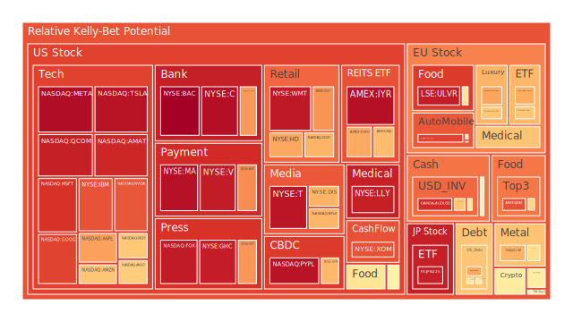

# 投資商品泡沫分析

## **美國國債**

近期美國國債市場呈現出複雜的動態。根據資料顯示，美國30年期國債（TVC:US30Y）的收益率在過去一年內從4.00%上升至4.44%。這種收益率的上升通常反映了市場對未來通貨膨脹和利率上升的預期。然而，短期國債如1年期（TVC:US01Y）和2年期（TVC:US02Y）收益率也呈現上升趨勢，但與長期國債相比，升幅較小，這導致收益率曲線趨平甚至倒掛。這種現象通常被視為經濟衰退的預兆。然而，考慮到聯邦儲備局的總資產減少和EFFR交易量的高水平，意味著流動性正在收緊，這可能進一步推高長期收益率。投資者應該關注這種收益率曲線的變化，因為它可能預示著未來經濟的不確定性。

## **美國零售股**

美國零售業近期面臨挑戰。以沃爾瑪（NYSE:WMT）為例，儘管其泡沫指數（PP80和PP100）高達91.98和91.88，但增長速度（D1至D30）卻顯示出放緩趨勢。此外，塔吉特（NYSE:TGT）的數據也顯示出類似的趨勢。這可能與消費者信心下降和通貨膨脹壓力有關。儘管零售業往往在經濟衰退中具有防禦性質，但目前的數據顯示，投資者應該謹慎對待該行業的投資。

## **美國科技股**

美國科技股持續領導市場走勢。微軟（NASDAQ:MSFT）、蘋果（NASDAQ:AAPL）和谷歌（NASDAQ:GOOG）的泡沫指數都處於高位，且增長速度穩定。微軟近期收購了OpenAI的CEO，同時股票價格達到歷史新高，反映出市場對人工智慧和科技創新的持續信心。然而，需要注意的是，高估值可能隱藏風險，投資者應該謹慎評估。

## **美國房地產指數**

美國房地產市場顯示出一定的穩定性。房地產ETF（AMEX:VNQ）和其他房地產相關資產的泡沫指數較高，但增長速度呈現平穩。固定抵押貸款30年利率維持在6.81%，略高於上月，可能對房地產市場的活動產生一定的壓力。然而，總體而言，房地產市場仍然受到供需基本面的支持。

## **加密貨幣**

比特幣（BITSTAMP:BTCUSD）和以太坊（BINANCE:ETHUSD）的價格保持高位，比特幣達到93,466美元，以太坊達到3,414美元。泡沫指數顯示出市場對加密貨幣的熱情。然而，需要注意的是，加密貨幣市場的波動性極高，且近期受到監管政策和市場情緒的影響。投資者在參與加密貨幣市場時應該謹慎，並注意風險管理。

## **金/銀/銅**

黃金價格持續走高，黃金/白銀比率和黃金/銅比率均處於高位。這可能反映出市場對避險資產的需求增加。考慮到全球經濟不確定性和地緣政治風險，貴金屬可能繼續受到投資者青睞。

## **黃豆 / 小麥 / 玉米**

農產品市場表現各異。黃豆（AMEX:SOYB）和小麥（AMEX:WEAT）的價格相對穩定，但玉米（AMEX:CORN）的泡沫指數較高，且價格呈現上升趨勢。這可能與全球供應鏈問題和天氣因素有關。

## **石油/ 鈾期貨UX!**

石油價格略有回升，但整體仍處於相對低位。石油期貨（TVC:USOIL）的泡沫指數顯示市場對石油的需求仍然疲軟。鈾期貨（COMEX:UX1!）的價格則顯示出增長，這可能與全球對清潔能源需求增加有關。

## **各國外匯市場**

美元指數近期有所走弱，歐元（OANDA:EURUSD）和英鎊（OANDA:GBPUSD）對美元匯率均有所上升。日元（OANDA:USDJPY）對美元貶值，反映出日本央行的寬鬆貨幣政策持續影響。

## **各國大盤指數**

全球股市出現分化。美國納斯達克指數（NASDAQ:NDX）和日本日經225指數（FX:JPN225）持續走高。歐洲股市則較為平穩。中國滬深300指數（SSE:000300）顯示出一定的增長，但仍受經濟數據和監管政策的影響。

## **美國半導體股**

半導體行業表現強勁。英特爾（NASDAQ:INTC）、英偉達（NASDAQ:NVDA）和美光（NASDAQ:MU）的泡沫指數處於高位，反映出市場對半導體需求的樂觀預期。然而，需要關注供應鏈的持續挑戰和地緣政治風險。

## **美國銀行股**

銀行股呈現穩定增長。摩根大通（NYSE:JPM）和美國銀行（NYSE:BAC）的泡沫指數接近1，顯示市場對銀行業的信心。然而，需要警惕潛在的信用風險和經濟放緩對銀行業的影響。

## **美國軍工股**

軍工企業如洛克希德馬丁（NYSE:LMT）和諾斯羅普·格魯曼（NYSE:NOC）泡沫指數較高。全球地緣政治緊張局勢可能推動該行業的需求。然而，投資者應該關注政府預算和政策變化對軍工企業的影響。

## **美國電子支付股**

電子支付行業呈現增長勢頭。Visa（NYSE:V）和PayPal（NASDAQ:PYPL）的泡沫指數均處於高位，反映出數字支付的普及和消費者行為的轉變。

## **美國藥商股**

制藥公司如禮來（NYSE:LLY）和默克（NYSE:MRK）表現穩健。新藥研發進展和疫情影響持續支持該行業的增長。然而，研發風險和政策變化可能帶來不確定性。

## **美國影視股**

影視娛樂公司如Netflix（NASDAQ:NFLX）和迪士尼（NYSE:DIS）泡沫指數較高。隨著流媒體服務的競爭加劇和內容成本的增加，投資者應該關注該行業的盈利能力和市場份額變化。

## **美國媒體股**

傳統媒體公司如紐約時報（NYSE:NYT）顯示出穩定增長。數字化轉型和新興媒體平台的出現可能對傳統媒體構成挑戰，但也帶來新的機遇。

## **石油防禦股**

石油行業防禦性股票如埃克森美孚（NYSE:XOM）泡沫指數高企。儘管全球向可再生能源轉型，但石油仍然是主要能源來源。投資者應該關注油價波動和政策變化對該行業的影響。

## **金礦防禦股**

金礦企業如Royal Gold（NASDAQ:RGLD）泡沫指數較高。黃金作為避險資產，其價格上漲可能帶動金礦企業的盈利。然而，生產成本和地緣政治風險需要考慮。

## **歐洲奢侈品股**

歐洲奢侈品公司如路威酩軒（EURONEXT:MC）和開雲集團（EURONEXT:KER）顯示出強勁表現。中國市場的需求復甦和全球經濟增長支持了奢侈品行業。然而，市場飽和和競爭加劇可能帶來挑戰。

## **歐洲汽車股**

德國汽車製造商如寶馬（XETR:BMW）和戴姆勒（XETR:MBG）增長穩定。電動汽車轉型和全球市場需求是該行業的關鍵驅動因素。投資者應該關注技術革新和政策變化。

## **歐美食品股**

食品企業如雀巢（SIX:NESN）和聯合利華（LSE:ULVR）表現穩健。消費者對健康和可持續產品的需求增加可能推動該行業的增長。

# 宏觀經濟傳導路徑分析

全球經濟正面臨多重挑戰。美國聯邦儲備局縮表和EFFR交易量的高水平，顯示資金流動性收緊。高收益債券利率上升，銀行資本外流，這可能導致信貸緊縮和投資放緩。同時，地緣政治風險增加，影響能源和商品價格。

美國實施的關稅政策可能對全球供應鏈產生影響，提高進口成本，進一步推高通貨膨脹。歐洲和亞洲市場也受到影響，經濟增長可能放緩。

貨幣政策方面，各國央行面臨兩難：一方面需要控制通貨膨脹，另一方面需要支持經濟增長。利率調整將直接影響消費、投資和匯率，進而影響進出口和國際資本流動。

# 微觀經濟傳導路徑分析

企業層面，供應鏈中斷和成本上升可能壓縮利潤率。科技企業可能受益於數位轉型和新技術的應用，但也面臨估值過高的風險。零售和消費品企業需要適應消費者行為的變化，關注線上和線下渠道的融合。

銀行業需要管理信貸風險和資本充足率，特別是在經濟放緩的背景下。能源和原材料企業需要關注價格波動和環境政策的影響。

投資者需要關注企業的盈利能力、債務水平和現金流，以及市場競爭和行業趨勢。

# 投資建議

**穩健型投資組合（50%）**

1. **美國國債（20%）**：美國國債作為避險資產，可在市場不確定性中提供穩定收益。
2. **黃金（15%）**：黃金作為通貨膨脹對沖工具，可在貨幣貶值時保值。
3. **大型消費品企業（15%）**：投資於如雀巢、聯合利華等穩定的消費品公司，提供穩定的股息和增長。

**成長型投資組合（30%）**

1. **科技股（15%）**：如微軟、蘋果，受益於科技創新和數位化轉型。
2. **半導體行業（10%）**：如英偉達，受益於高性能計算和人工智慧需求。
3. **醫藥股（5%）**：如禮來，受益於醫藥研發和健康需求增長。

**高風險型投資組合（20%）**

1. **加密貨幣（10%）**：比特幣和以太坊，具有高波動性，但潛在收益高。
2. **新興市場股票（5%）**：投資於具有高增長潛力的新興市場。
3. **能源企業（5%）**：如鈾期貨和新能源企業，受益於能源轉型，但波動性高。

# 風險提示

投資有風險，市場總是充滿不確定性。我們的建議僅供參考，投資者應根據自身的風險承受能力和投資目標，做出獨立的投資決策。注意市場的波動性，做好資產配置和風險管理，謹慎投資。
 
Daily Buy Map:

 
Daily Sell Map:

 
Daily Radar Chart:

 
