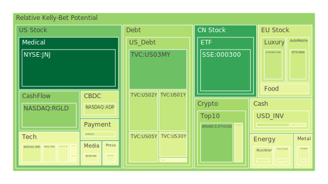
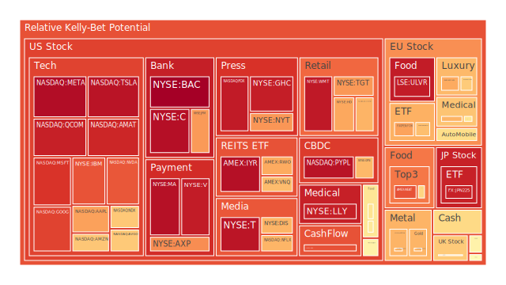
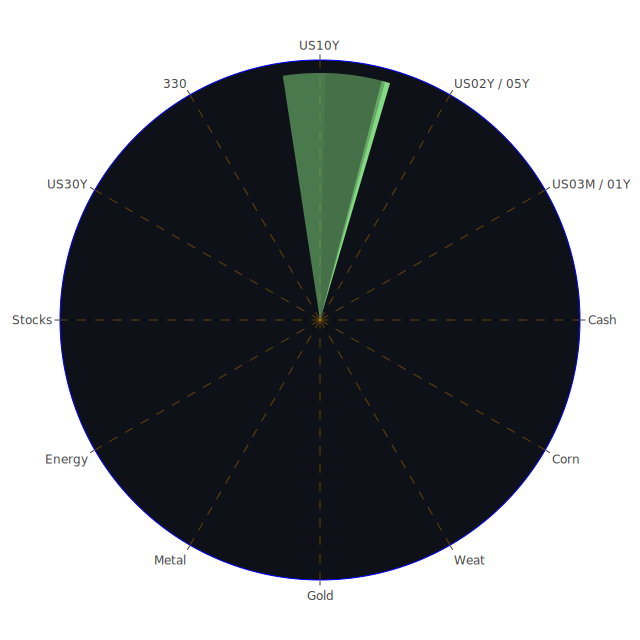

# 投資商品泡沫分析

在當前的全球經濟環境下，各類資產的市場表現各異。以下將針對多個關鍵投資類別進行分析，探討其泡沫風險及潛在的投資機會。

# 美國國債

近期，美國國債收益率呈現波動。特別是短期國債，如2年期和5年期國債收益率下降至4.23%和4.12%。這反映出市場對未來經濟增長和通脹的擔憂。長期國債收益率如30年期也有所下滑，至4.43%。收益率曲線的倒掛程度有所緩解，但仍顯示對經濟衰退的預期。投資者應密切關注美聯儲的貨幣政策走向，特別是利率決策，因其將直接影響國債的收益率走勢。

# 美國零售股

零售股近期表現疲弱，反映出消費者信心的下降和消費支出的減少。沃爾瑪（WMT）和塔吉特（TGT）的泡沫風險指數較高，需要謹慎對待。儘管節假日臨近，但通脹壓力和經濟不確定性可能限制消費者的購買力。

# 美國科技股

科技股持續受到市場關注。微軟（MSFT）和蘋果（AAPL）的泡沫風險指數接近90%，顯示市場對其估值的高度期待。奈飛（NFLX）和亞馬遜（AMZN）也展現出強勁的增長勢頭。然而，高估值伴隨著高風險，投資者應關注科技行業的競爭格局和政策變化對其業績的影響。

# 美國房地產指數

房地產市場面臨挑戰。固定30年期房貸利率升至6.81%，提高了購房成本。房地產類股如VNQ和IYR的泡沫風險指數較高，但市場需求可能受到高利率的壓制。投資者需警惕潛在的價格調整風險。

# 加密貨幣

比特幣（BTCUSD）和以太坊（ETHUSD）價格波動劇烈。比特幣價格接近95,000美元，但泡沫風險指數較高。市場情緒受監管政策和市場需求影響。投資者應謹慎對待，避免追高。

# 金/銀/銅

黃金價格穩定在2,645美元附近，成為避險資產的首選。銀價和銅價也呈現上漲趨勢。金銀銅比率的變化表明市場對經濟前景的不同預期。黃金與石油、銅的價格比率上升，可能預示著經濟增長放緩。

# 黃豆 / 小麥 / 玉米

農產品價格受到供應和需求雙重影響。黃豆（SOYB）、小麥（WEAT）和玉米（CORN）的價格波動顯示市場對糧食供應的擔憂。全球氣候變化和地緣政治因素可能進一步影響農產品價格。

# 石油/ 鈾期貨UX!

石油價格維持在68美元左右，市場對供需平衡的預期較為穩定。然而，地緣政治風險和產油國的政策變化可能帶來價格波動。鈾期貨（UX!）價格上升，表明市場對核能需求的增長預期。

# 各國外匯市場

美元指數走弱，反映出市場對美國經濟前景的擔憂。歐元/美元（EURUSD）和澳元/美元（AUDUSD）呈現上升趨勢。日元兌美元（USDJPY）匯率接近152，日元持續貶值。投資者應關注各國央行的貨幣政策差異。

# 各國大盤指數

全球主要股指表現分化。美國納斯達克指數（NDX）受科技股帶動持續上漲。英國富時指數（FTSE）和德國DAX指數（GDAXI）保持穩定。中國滬深300指數（000300）有所回升，但經濟增長放緩的風險仍需關注。

# 美國半導體股

半導體行業持續受益於科技需求增長。美光（MU）、英特爾（INTC）和高通（QCOM）的泡沫風險指數較高，但業績增長預期強勁。未來可能受到供應鏈壓力和政策變化的影響。

# 美國銀行股

銀行股如摩根大通（JPM）和美國銀行（BAC）表現穩定。利率走勢和經濟前景將直接影響銀行業的盈利能力。投資者應關注貸款增長和資產質量的變化。

# 美國軍工股

軍工股如洛克希德馬丁（LMT）和諾斯洛普格拉曼（NOC）受地緣政治緊張局勢影響，需求有所增長。然而，泡沫風險指數較高，需警惕政策和預算變化帶來的風險。

# 美國電子支付股

電子支付行業持續增長。Visa（V）和萬事達卡（MA）的泡沫風險指數接近94%，受益於全球電子支付普及。然而，市場競爭加劇和監管風險需引起關注。

# 美國藥商股

製藥企業如輝瑞（PFE）和默克（MRK）表現穩定。疫情後市場對醫藥的需求持續。投資者應關注研發進展和藥品定價政策的影響。

# 美國影視股

影視娛樂行業復甦緩慢。迪士尼（DIS）和奈飛（NFLX）面臨市場競爭和內容支出壓力。泡沫風險指數較高，需關注行業整合和消費者偏好變化。

# 美國媒體股

傳統媒體股如紐約時報（NYT）在數位轉型中尋求增長。廣告收入和訂閱模式的變化將影響其未來表現。

# 石油防禦股

能源股如埃克森美孚（XOM）受益於能源需求的回升。然而，全球向可再生能源轉型的趨勢可能限制傳統能源企業的增長。

# 金礦防禦股

金礦企業如巴里克黃金（GOLD）受金價走勢影響。當前金價穩定，上漲空間可能有限。投資者應關注生產成本和地緣政治風險。

# 歐洲奢侈品股

歐洲奢侈品企業如LVMH（MC）和開雲集團（KER）受消費者需求影響，特別是來自亞洲市場的需求。泡沫風險指數較高，需警惕經濟放緩對消費支出的影響。

# 歐洲汽車股

汽車製造商如戴姆勒（MBG）和寶馬（BMW）面臨電動化轉型的挑戰。政策支持和市場需求將決定其未來增長。

# 歐美食品股

食品行業受益於穩定的消費需求。雀巢（NESN）和卡夫亨氏（KHC）的泡沫風險指數較高，但增長潛力相對穩健。原材料價格和供應鏈管理是關鍵因素。

# 宏觀經濟傳導路徑分析

全球經濟正面臨多重挑戰。美聯儲的貨幣政策、通脹壓力、地緣政治緊張局勢，以及供應鏈中斷等因素綜合影響市場情緒和資產價格。

美聯儲縮減資產負債表的趨勢帶來流動性收緊的風險。短期利率的下降可能反映出市場對經濟增長放緩的預期。同時，全球通脹壓力持續，能源和原材料價格上漲，加劇了企業成本。

地緣政治風險如中美關係、俄烏衝突等，對能源供應和國際貿易構成威脅。這些因素可能導致市場避險情緒上升，資金流向黃金等安全資產。

# 微觀經濟傳導路徑分析

企業層面，供應鏈中斷和成本上升影響盈利能力。科技和製造業企業可能面臨芯片短缺和原材料價格上漲的挑戰。服務業則受制於消費者信心和支出意願的下降。

消費者層面，通脹壓力可能降低可支配收入，影響消費支出特別是非必需品。這對零售、奢侈品和娛樂行業構成不利影響。

金融市場層面，投資者風險偏好下降，資金可能從高風險資產流向穩健資產。匯率波動也可能影響跨國企業的盈利表現。

# 投資建議

基於上述分析，我們建議投資者在當前環境下採取多元化的投資策略，平衡穩健性和成長性，並適當考慮高風險高回報的機會。

# 穩健型（50%）

- **美國國債**：在經濟不確定性下，長期國債提供相對穩定的收益。

- **金礦防禦股**（如RGLD）：作為避險資產的替代，金礦股可能受益於金價上漲。

- **美國大型藥商股**（如JNJ、MRK）：醫療保健行業需求穩定，具有防禦性。

# 成長型（30%）

- **美國科技股**（如AAPL、MSFT）：科技行業仍具有長期增長潛力，但需關注估值水平。

- **美國半導體股**（如NVDA、AMAT）：受益於數位化和電動車需求增長。

- **歐洲奢侈品股**（如MC、KER）：在全球消費升級趨勢下，奢侈品市場需求穩定。

# 高風險型（20%）

- **加密貨幣**（如BTCUSD、ETHUSD）：波動性高，可能帶來高回報，但風險極大。

- **能源相關股票**（如XOM、SOYB）：受地緣政治和市場需求影響，價格波動較大。

- **新興市場資產**（如中國A股、TWSE:0050）：潛在回報高，但需警惕政策風險和經濟放緩。

# 風險提示

投資有風險，市場總是充滿不確定性。以上建議僅供參考，投資者應根據自身的風險承受能力和投資目標，做出獨立的投資決策。特別是在當前全球經濟環境多變的情況下，投資者需保持警惕，密切關注市場動態和相關資訊。
 
Daily Buy Map:

 
Daily Sell Map:

 
Daily Radar Chart:

 
