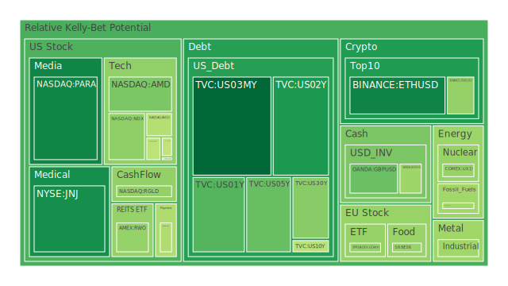
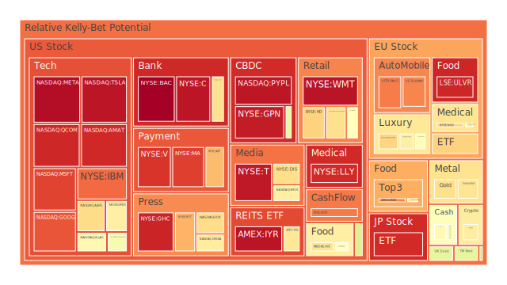
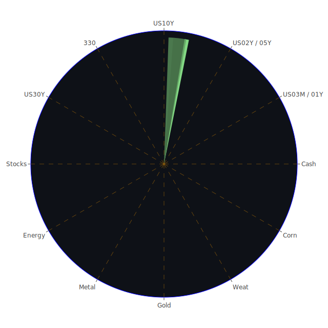

# 投資商品泡沫分析

## 美國國債

近期，美國國債市場出現了明顯的收益率波動。根據資料，1年期國債收益率從上週的4.40%下降至4.30%，較上月的4.26%略有上升，然而仍低於去年同期的5.45%。5年期國債收益率也從上週的4.30%下降至4.05%，與上月的3.99%相比略有升高。10年期國債收益率維持在4.18%，較上週的4.43%和上月的4.20%略有下降。

從泡沫風險指標來看，短期國債的風險相對較低。例如，1年期國債（US01Y）的D1值為0.355321，顯示短期內出現泡沫的風險較小。然而，長期國債如30年期國債（US30Y）的D1值達到0.415697，D7值為0.286938，顯示長期國債可能存在較高的泡沫風險。

聯準會近期的政策走向對國債市場產生了重要影響。自2024年9月以來，聯準會發表了6次鷹派言論，沒有任何鴿派言論，使市場預期貨幣政策可能繼續緊縮，進而影響國債收益率的走勢。投資者應密切關注聯準會的政策動向和經濟數據的變化。

## 美國零售股

以亞馬遜（AMZN）為代表的美國零售股，其泡沫風險指標D1達到0.646318，顯示出較高的短期泡沫風險。隨著消費者信心指數的波動和購買力的變化，零售業可能面臨挑戰。特別是在通貨膨脹壓力下，消費者支出可能受到抑制，對零售企業的盈利能力產生影響。

## 美國科技股

科技股方面，蘋果公司（AAPL）的D1值為0.689535，微軟（MSFT）的D1更高，達到0.894703，接近1，顯示出極高的泡沫風險。科技行業的高估值和市場預期的脆弱性，使得該板塊可能面臨較大的調整風險。投資者需謹慎評估科技股的投資價值，注意市場可能的波動。

## 美國房地產指數

房地產市場方面，房地產投資信託基金（VNQ）的D1值為0.668089，泡沫風險處於較高水平。加上30年期固定抵押貸款利率升至6.81%，較上週的6.44%和上月的7.09%有所上升，增加了購房者的負擔。高利率環境可能抑制房地產市場的需求，進而影響相關投資標的的表現。

## 加密貨幣

比特幣（BTCUSD）的D1值為0.653700，顯示出中高水平的泡沫風險。以太坊（ETHUSD）的D1值為0.263186，風險相對較低。然而，加密貨幣市場的高波動性和不確定性使得投資風險依然較大。近期市場對於區塊鏈技術的應用和監管環境的變化，都可能對加密貨幣價格產生重大影響。

## 金/銀/銅

黃金價格持續上升，金油比（GOLD OIL RATIO）為38.91，較上週的38.10有所上升，反映出市場避險情緒的增強。銀的D1值為0.670875，泡沫風險較高。銅的泡沫風險指標D1值為0.444780，相對較低。貴金屬和基本金屬市場受全球經濟增長預期和供需關係的影響，價格波動較大。

## 黃豆 / 小麥 / 玉米

農產品方面，黃豆（SOYB）的D1值為0.502229，風險中等；小麥（WEAT）的D1值為0.819007，風險較高；玉米（CORN）的D1值為0.639867，風險處於中高水平。全球氣候變化、供應鏈中斷和地緣政治風險可能影響農產品的供應，進而影響價格。

## 石油/ 鈾期貨

石油（USOIL）的D1值為0.445433，風險中等。近期油價受供需關係和地緣政治因素影響，波動較大。鈾期貨（UX1!）的D1值為0.433603，風險較低。能源市場的不確定性使得相關投資需要謹慎。

## 各國外匯市場

外匯市場方面，美元指數近期有所回落。美元兌日圓（USDJPY）的D1值為0.551839，風險中等。英鎊兌美元（GBPUSD）的D1值為0.378942，風險較低。全球經濟復蘇的不平衡性可能導致匯率波動，投資者需關注貨幣政策和經濟數據的變化。

## 各國大盤指數

德國DAX指數（GDAXI）的D1值為0.432363，風險中等。法國CAC 40指數（FCHI）的D1值為0.705097，風險較高。亞洲市場方面，中國滬深300指數（000300）的D1值為0.511223，風險中等。全球股市受經濟增長預期、貨幣政策和地緣政治事件的影響，波動性可能加大。

## 美國半導體股

半導體行業中，英偉達（NVDA）的D1值為0.586072，風險較高；超微（AMD）的D1值為0.399143，風險中等。半導體需求的持續增長和供應鏈瓶頸的緩解，可能為該行業帶來機遇。然而，市場競爭加劇和技術變革也帶來挑戰。

## 美國銀行股

摩根大通（JPM）的D1值為0.678455，風險較高；美國銀行（BAC）的D1值高達0.996321，接近1，風險極高。銀行業可能受到利率變動、貸款需求和信貸風險的影響。投資者應關注銀行資產質量和監管政策的變化。

## 美國軍工股

洛克希德·馬丁（LMT）的D1值為0.545112，風險中等偏高；諾斯羅普·格魯門（NOC）的D1值為0.501926，風險中等。地緣政治緊張局勢可能推動軍工股的需求，但也需關注政府預算和國防政策的變化。

## 美國電子支付股

Visa（V）的D1值為0.913167，風險極高；萬事達（MA）的D1值為0.899510，風險極高。電子支付行業受消費者支出和數字化支付趨勢的影響，但高估值可能帶來調整風險。

## 美國藥商股

強生（JNJ）的D1值為0.279833，風險較低；默克（MRK）的D1值為0.570032，風險中等。醫藥行業受醫療需求和研發進展的推動，防禦性較強，投資者可關注。

## 美國影視股

奈飛（NFLX）的D1值為0.646238，風險較高；迪士尼（DIS）的D1值為0.684011，風險較高。隨著娛樂消費模式的轉變和競爭加劇，影視股可能面臨市場挑戰。

## 美國媒體股

福克斯（FOX）的D1值為0.687361，風險較高；紐約時報（NYT）的D1值為0.753889，風險高。媒體行業受到數位化轉型和廣告收入變化的影響，投資者需注意行業趨勢。

## 石油防禦股

埃克森美孚（XOM）的D1值為0.826662，風險很高。能源需求的不確定性和環保政策的推進，可能影響石油企業的前景。

## 金礦防禦股

皇家黃金（RGLD）的D1值為0.428297，風險中等。金價的上漲可能提升金礦企業的盈利，但也需關注開採成本和地緣政治風險。

## 歐洲奢侈品股

路威酩軒（MC）的D1值為0.615499，愛馬仕（RMS）的D1值為0.647356，風險均較高。奢侈品行業受全球經濟增長和消費者信心影響，市場需求可能波動。

## 歐洲汽車股

寶馬（BMW）的D1值為0.811071，風險很高。汽車行業正面臨電動化轉型和供應鏈挑戰，投資者需關注企業的應對策略。

## 歐美食品股

雀巢（NESN）的D1值為0.435161，風險較低。食品行業具有防禦性特徵，在經濟不確定性下可能表現穩健。

# 宏觀經濟傳導路徑分析

全球經濟正處於多重挑戰之中。聯準會關鍵經濟數據顯示，聯準會總資產下降，反向回購（RRP）規模縮減，顯示市場流動性可能緊縮。EFFR交易量上升，表明聯邦基金利率市場活躍度提高。

利率方面，短期國債收益率下降，長期國債收益率也有所回落。30年期抵押貸款利率升至6.81%，可能對房地產市場產生壓力。收益率曲線部分倒掛，顯示投資者對經濟前景的擔憂。

通貨膨脹率（CPIYOY）為2.60%，接近聯準會的目標。然而，聯準會近期的鷹派言論暗示可能繼續緊縮貨幣政策，進一步加劇市場的不確定性。

新聞方面，全球政治經濟事件頻發。加拿大反壟斷機構起訴谷歌，可能影響科技企業的估值。巴西的稅收改革引發金融市場波動。地緣政治風險上升，對國際貿易和投資產生影響。

# 微觀經濟傳導路徑分析

企業層面，科技企業面臨反壟斷調查和市場競爭的壓力，可能影響盈利能力。銀行業受到利率走勢和信貸風險的影響，資產質量需重點關注。消費品企業在通貨膨脹環境下可能面臨成本上升和需求減弱的挑戰。

供應鏈方面，物流瓶頸和原材料價格波動可能影響製造業和零售業的運營。能源價格的不穩定性對各行業生產成本產生連鎖反應。

# 投資建議

根據上述分析，投資者在當前環境下可考慮以下資產配置，以平衡風險和收益：

## 穩健型（40%）

- **黃金**：作為傳統的避險資產，黃金可對衝市場波動和通貨膨脹風險。
- **短期國債**：收益穩定，風險較低，可保護資本安全。
- **防禦性消費品股票**：如強生（JNJ）、雀巢（NESN），這類企業業務穩定，受經濟周期影響較小。

## 成長型（30%）

- **半導體行業**：如超微（AMD），受益於科技發展和需求增長，具有長期增長潛力。
- **新能源相關股票**：隨著全球對可再生能源的重視，相關行業有望持續發展。
- **新興市場大盤指數**：分散投資風險，捕捉成長機遇。

## 高風險型（30%）

- **加密貨幣**：如比特幣（BTCUSD），具有高波動性，適合風險承受能力較高的投資者。
- **科技股**：如蘋果（AAPL），雖有估值較高的風險，但仍有創新驅動的成長空間。
- **高增長潛力股票**：關注具有創新能力和市場前景的中小型企業。

投資者應根據自身的財務狀況和風險偏好，制定適合的投資策略，並隨時調整資產配置。

# 風險提示

投資有風險，市場總是充滿不確定性。我們的建議僅供參考，投資者應根據自身的風險承受能力和投資目標，做出獨立的投資決策。
 
Daily Buy Map:

 
Daily Sell Map:

 
Daily Radar Chart:

 
