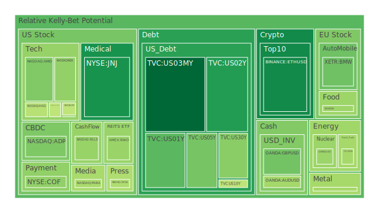
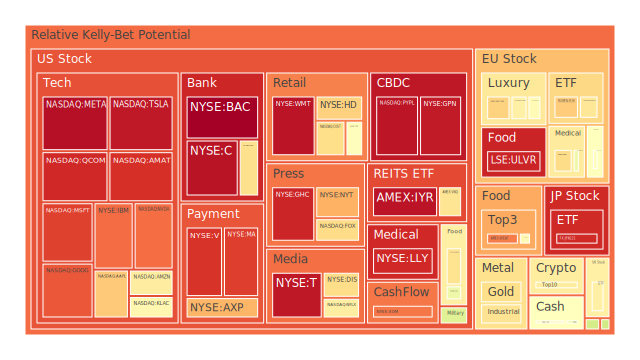
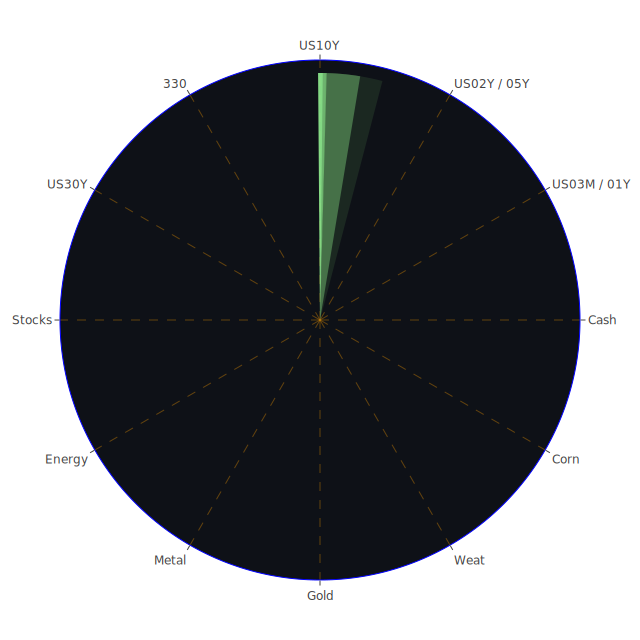

# 投資商品泡沫分析

## **美國國債**

近期數據顯示，美國國債收益率出現了明顯的變化。短期國債方面，1年期國債收益率（US01Y）下降至4.30%，2年期國債收益率（US02Y）降至4.16%。中長期國債方面，5年期（US05Y）、10年期（US10Y）和30年期（US30Y）收益率分別為4.05%、4.18%和4.37%。這種收益率曲線的走勢反映了市場對未來經濟增長和通脹預期的調整。

泡沫機率指標方面，短期國債的PP80和PP100值約為0.3至0.4，顯示市場對短期債券的需求有所增加，可能反映出投資者對避險資產的偏好增強。同時，長期國債的泡沫機率相對較高，PP80和PP100值在0.4至0.5之間，表明市場對長期經濟前景的不確定性有所提升。

從歷史經驗來看，當經濟增長放緩或出現不確定性時，投資者往往轉向國債等安全資產。當前的全球經濟環境、地緣政治風險以及美聯儲的貨幣政策走向，都可能是影響國債市場的重要因素。

## **美國零售股**

美國零售股如沃爾瑪（WMT）和塔吉特（TGT）的泡沫機率指標較高，PP80和PP100值接近或超過0.9。這可能反映出市場對零售業近期表現的期待，但同時也暗示著估值過高的風險。

近期消費者支出增長放緩，加上通脹壓力和供應鏈問題，可能對零售業績造成影響。投資者需關注消費者信心指數和零售銷售數據，以評估零售股的投資價值。

## **美國科技股**

科技巨頭如蘋果（AAPL）、微軟（MSFT）、谷歌（GOOG）等公司的泡沫機率指標均處於高位，PP80和PP100值在0.8至0.9之間。這顯示市場對科技股的熱情持續高漲，但也需警惕估值過高的風險。

在數字化轉型和科技創新的帶動下，科技企業的業績表現穩健。然而，監管風險、供應鏈限制和全球經濟變動可能對其未來增長帶來挑戰。

## **美國房地產指數**

房地產相關的ETF，如VNQ，其泡沫機率指標接近0.7，表明市場對房地產行業的警惕性增加。隨著固定抵押貸款30年利率上升至6.81%，購房成本上升可能導致房地產市場需求減弱。

此外，商業地產方面，由於遠程辦公的普及和零售行業的變化，可能面臨較大的調整壓力。投資者需關注房地產市場的供需趨勢和資金流動情況。

## **加密貨幣**

比特幣（BTCUSD）和以太坊（ETHUSD）的價格近期有所上升，但泡沫機率指標處於中等水平，約為0.4至0.6。加密貨幣市場的波動性依然較高，受市場情緒、監管政策和技術發展等多重因素影響。

歷史上，加密貨幣市場經常出現劇烈波動。投資者在參與該市場時需保持謹慎，關注市場風險和潛在的監管變化。

## **金/銀/銅**

貴金屬方面，黃金（XAUUSD）和白銀（XAGUSD）的泡沫機率指標約為0.6至0.7，顯示市場對避險資產的需求有所增強。在通脹預期上升和市場不確定性加大的背景下，投資者往往增持黃金等貴金屬。

工業金屬方面，銅（COPPER）的泡沫機率約為0.4至0.6，表明市場對全球經濟增長和工業需求的預期較為穩定。銅價通常被視為經濟健康狀況的晴雨表。

## **黃豆 / 小麥 / 玉米**

農產品市場出現分化。玉米（CORN）的泡沫機率較高，接近0.7，可能受益於生物燃料需求和全球供應限制。黃豆（SOYB）和小麥（WEAT）的泡沫機率相對較低，但仍需關注天氣因素、地緣政治事件和全球供需變化。

農產品價格的波動對相關農業企業和新興市場經濟體有著重要影響。

## **石油/鈾期貨**

原油（USOIL）的泡沫機率約為0.44，表現出市場對能源需求和供應的平衡預期。地緣政治風險、OPEC+的生產政策和全球經濟增長是影響油價的關鍵因素。

鈾期貨（UX1!）的泡沫機率約為0.43。隨著全球對清潔能源的關注度提高，核能可能重新受到重視，進而影響鈾的需求和價格。

## **各國外匯市場**

主要貨幣對如歐元兌美元（EURUSD）、英鎊兌美元（GBPUSD）、澳元兌美元（AUDUSD）和美元兌日元（USDJPY）等的泡沫機率各異。澳元兌美元的泡沫機率較高，接近0.7，或受大宗商品價格上漲的影響。

美元指數的走勢反映了市場對美聯儲貨幣政策和美國經濟前景的預期。投資者需關注貨幣政策變化和經濟數據發布。

## **各國大盤指數**

全球主要股指如納斯達克指數（NDX）、道瓊斯工業指數、德國DAX指數（GDAXI）、英國富時100指數（FTSE）和法國CAC 40指數（FCHI）的泡沫機率普遍較高，約為0.6至0.7。

這反映了全球股市估值處於歷史高位，投資者對於未來經濟增長的樂觀預期。但同時，市場也面臨潛在的調整風險，如利率上升、通脹壓力和地緣政治不確定性。

## **美國半導體股**

半導體行業龍頭企業如英偉達（NVDA）、台積電（TSM）、美光科技（MU）等，其泡沫機率指標接近或超過0.5。半導體需求持續強勁，受益於人工智能、物聯網和電動汽車等領域的快速發展。

然而，供應鏈瓶頸和地緣政治風險可能對行業增長帶來挑戰。投資者需關注產能擴張和市場競爭格局的變化。

## **美國銀行股**

主要銀行如摩根大通（JPM）、花旗集團（C）和美國銀行（BAC）的泡沫機率指標均超過0.9，顯示市場對銀行業的樂觀態度。然而，隨著利率走勢的不確定性和經濟周期的變動，銀行業的盈利能力可能面臨壓力。

貸款需求、資產質量和監管政策都是影響銀行業的重要因素。投資者需密切關注銀行的財務報告和宏觀經濟指標。

## **美國軍工股**

洛克希德·馬丁（LMT）、諾斯羅普·格魯曼（NOC）等軍工企業的泡沫機率約為0.5。全球地緣政治緊張局勢可能推動軍費開支的增加，從而利好軍工行業。

然而，軍工企業也面臨預算削減、合同延遲和國際競爭等風險。投資者應關注政府政策和國防預算的變化。

## **美國電子支付股**

電子支付領域的領軍企業如維薩（V）、萬事達卡（MA）和PayPal（PYPL），其泡沫機率指標均超過0.9。隨著數字經濟的發展，電子支付市場持續擴大。

然而，競爭加劇、費率調整和監管風險可能對企業業績產生影響。投資者需評估企業的市場份額和技術創新能力。

## **美國藥商股**

醫藥行業的代表企業如強生（JNJ）和默克（MRK），泡沫機率指標相對較低，約為0.2至0.5。醫藥行業具有防禦性特徵，在經濟波動時期表現相對穩定。

新藥研發進展、專利保護和政策環境是影響醫藥企業的重要因素。投資者應關注研發管線和市場營銷策略。

## **美國影視股**

娛樂行業的巨頭如迪士尼（DIS）和奈飛（NFLX），其泡沫機率約為0.6至0.7。隨著流媒體市場的競爭加劇，內容製作和客戶增長成為關鍵。

疫情後的影院重啟和觀眾觀影習慣的改變，對傳統影視企業帶來挑戰和機遇。投資者應關注企業的內容戰略和全球擴張計劃。

## **美國媒體股**

媒體企業如紐約時報（NYT）和康卡斯特（CMCSA），泡沫機率指標約為0.5至0.7。數字化轉型和廣告收入模式的變革，對傳統媒體提出了新的要求。

訂閱制模式的成功與否、內容質量和用戶體驗是企業能否持續增長的關鍵。投資者需關注行業趨勢和企業創新能力。

## **石油防禦股**

石油巨頭如埃克森美孚（XOM），泡沫機率約為0.8。全球能源轉型和油價波動對傳統石油企業帶來挑戰。

在可再生能源興起的背景下，石油企業需要調整戰略，投資清潔能源項目，以實現可持續發展。

## **金礦防禦股**

金礦企業如Royal Gold（RGLD），泡沫機率約為0.4。金價的走勢直接影響金礦企業的盈利能力。

在全球經濟不確定性加大的情況下，金礦股可能受益於避險需求的上升。投資者應關注生產成本和資源儲量。

## **歐洲奢侈品股**

歐洲奢侈品企業如路威酩軒（MC）和開雲集團（KER），泡沫機率約為0.6至0.7。消費者需求的恢復和新興市場的開拓為奢侈品行業帶來增長動力。

然而，全球經濟放緩和地緣政治風險可能影響高端消費。投資者需密切關注市場動態和品牌策略。

## **歐洲汽車股**

德國汽車企業如寶馬（BMW）和奔馳集團（MBG），泡沫機率指標約為0.5至0.8。電動化和智能化的趨勢推動汽車行業進行深刻變革。

競爭加劇、供應鏈挑戰和政策變化可能對企業帶來風險。投資者應關注企業的技術研發和市場佈局。

## **歐美食品股**

食品飲料行業的領導企業如雀巢（NESN）和可口可樂（KO），泡沫機率約為0.4至0.6。健康飲食和消費升級的趨勢為企業帶來新的增長機會。

原材料價格波動、食品安全和市場競爭是行業面臨的挑戰。投資者需關注企業的創新能力和市場策略。

# 宏觀經濟傳導路徑分析

從宏觀層面看，全球經濟正面臨多重挑戰。美聯儲的貨幣政策走向、美國國債收益率的變化、銀行業的資金流動，以及通脹和經濟增長預期，都是影響市場的重要因素。

美聯儲總資產的下降和EFFR交易量的上升，表明貨幣政策收緊的趨勢。RRP的下降和FHLB借款的高水平，顯示市場流動性緊張。這些因素可能對資產價格和市場情緒產生影響。

同時，全球債務水平高企，貨幣市場基金資產總額較高，顯示資金對安全資產的需求增加。地緣政治風險和貿易摩擦也可能影響全球經濟的穩定性。

# 微觀經濟傳導路徑分析

在微觀層面，供應鏈中斷、成本上升和需求變化對企業的經營產生直接影響。科技行業面臨晶片短缺和研發投入增加的壓力。零售業需要適應消費者行為的改變和電商競爭。

能源行業需平衡傳統化石燃料與新能源的發展。醫藥行業關注研發進展和政策監管。金融行業則需應對利率變化和信貸風險。

企業需靈活應對市場變化，通過創新和戰略調整來獲得競爭優勢。

# 投資建議

根據上述分析，建議投資者根據自身風險承受能力，考慮以下資產配置：

## **穩健型（40%）**

1. **美國國債（15%）**：收益穩定，具有避險特性。

2. **醫藥行業股票（15%）**：如強生（JNJ）、默克（MRK），防禦性強。

3. **貴金屬（10%）**：黃金和白銀，對衝通脹和市場風險。

## **成長型（40%）**

1. **科技巨頭（15%）**：如蘋果（AAPL）、微軟（MSFT），領先的技術和市場地位。

2. **半導體行業（15%）**：如英偉達（NVDA）、台積電（TSM），受益於科技趨勢。

3. **新能源相關股票（10%）**：抓住全球能源轉型的機遇。

## **高風險型（20%）**

1. **加密貨幣（10%）**：如比特幣（BTC）、以太坊（ETH），高波動性，高潛在收益。

2. **新興市場股票（5%）**：高增長潛力，但需警惕風險。

3. **農產品期貨（5%）**：如玉米（CORN）、黃豆（SOYB），價格受供需影響大。

# 風險提示

投資有風險，市場總是充滿不確定性。我們的建議僅供參考，投資者應根據自身的風險承受能力和投資目標，做出獨立的投資決策。

市場可能受到宏觀經濟政策、地緣政治事件、行業趨勢和企業財務狀況等多種因素的影響。投資者需密切關注市場動態，及時調整投資策略，分散風險。

---

以上報告旨在提供市場分析和觀察視角，幫助投資者更好地理解當前的投資環境。但請注意，過去的表現並不能保證未來的結果，市場行情可能隨時發生變化。
 
Daily Buy Map:

 
Daily Sell Map:

 
Daily Radar Chart:

 
