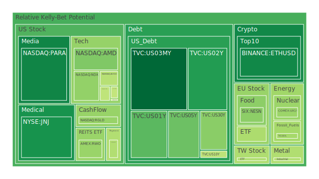
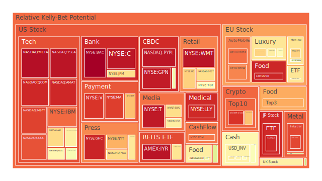
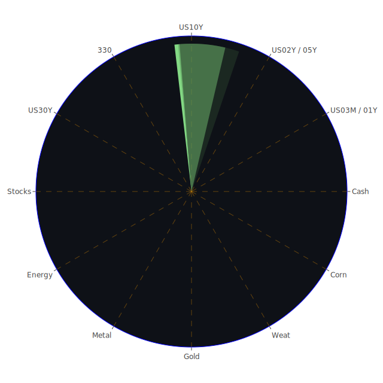

# 投資商品泡沫分析

- **美國國債**

近期，美國國債收益率呈現波動。短期國債如1年期和2年期收益率分別在4.3%和4.16%，而長期國債如10年期和30年期收益率則分別為4.18%和4.37%。收益率曲線倒掛，特別是10年期與3個月期的收益率差為-0.32，顯示市場對未來經濟前景的不確定性增加。泡沫指數顯示，長期國債的風險相對較低，但仍需關注美聯儲的貨幣政策變化。

- **美國零售股**

美國零售業在假日季節通常表現強勁。根據最新數據，黑色星期五的銷售額同比增長3.4%，線上購物創下新紀錄。然而，消費者信心仍受通脹和利率上升的影響。塔吉特（TGT）的泡沫指數D1為0.607896，顯示出一定的風險。投資者應關注未來消費者支出的走勢。

- **美國科技股**

科技股持續引領市場走高。微軟（MSFT）、蘋果（AAPL）和亞馬遜（AMZN）等巨頭的股價屢創新高。特斯拉（TSLA）的泡沫指數D1達到0.961787，暗示可能存在過熱風險。投資者應警惕估值過高帶來的潛在回調風險。

- **美國房地產指數**

房地產市場受益於相對穩定的抵押貸款利率。30年固定抵押貸款利率為6.81%，略有下降。房地產ETF（VNQ）的泡沫指數D1為0.668089，風險適中。然而，經濟不確定性可能影響未來的房地產需求。

- **加密貨幣**

比特幣（BTCUSD）和以太坊（ETHUSD）價格持續上漲。比特幣價格接近97,000美元，泡沫指數D1為0.653700。以太坊價格接近3,700美元，泡沫指數D1為0.265332。市場情緒積極，但高波動性和潛在監管風險需謹慎對待。

- **金/銀/銅**

貴金屬價格保持穩定。黃金價格約為2,645美元，銀價約為30.7美元。黃金的泡沫指數D1為0.683210，銀為0.670875。銅價約為4.11美元，泡沫指數D1為0.446279。通脹壓力和地緣政治風險可能推動金屬價格上漲。

- **黃豆 / 小麥 / 玉米**

農產品價格受到全球供需的影響。玉米（CORN）價格為17.77美元，泡沫指數D1為0.618463。黃豆（SOYB）和小麥（WEAT）的價格也保持穩定。氣候變化和農業政策可能影響未來價格走勢。

- **石油/鈾期貨UX!**

石油價格穩定在每桶68美元左右，泡沫指數D1為0.445433。鈾期貨（UX1!）價格為76.92美元，泡沫指數D1為0.433603。全球能源需求的復甦和地緣政治因素可能導致價格波動。

- **各國外匯市場**

美元指數略有下降，歐元/美元（EURUSD）匯率為1.06，泡沫指數D1為0.622721。英鎊/美元（GBPUSD）匯率為1.27。日元/美元（USDJPY）匯率為151.12，日元有所走強。貨幣市場受央行政策和經濟數據影響較大。

- **各國大盤指數**

全球股市普遍上漲。納斯達克指數（NDX）泡沫指數D1為0.422192，風險相對較低。英國富時100指數（FTSE）和德國DAX指數（GDAXI）也有不錯的表現。投資者情緒積極，但需警惕潛在的市場回調。

- **美國半導體股**

半導體行業持續受益於科技需求。英特爾（INTC）、台積電（TSM）等股票表現穩健。然後，部分公司的泡沫指數較高，如高通（QCOM）D1為0.933061，需關注供應鏈和市場競爭。

- **美國銀行股**

金融板塊表現穩定。摩根大通（JPM）泡沫指數D1為0.678455，波動性較低。然後，需關注利率變化和貸款市場的風險。

- **美國軍工股**

軍工企業如洛克希德·馬丁（LMT）和雷神科技（RTX）泡沫指數保持在中等水平。地緣政治緊張局勢可能帶來業績增長，但同時也伴隨風險。

- **美國電子支付股**

電子支付行業快速發展。PayPal（PYPL）泡沫指數D1為0.959617，接近頂部區域。市場競爭加劇和監管風險需密切關注。

- **美國藥商股**

醫藥股表現穩定。強生（JNJ）泡沫指數D1為0.279833，風險較低。默克（MRK）和輝瑞（PFE）等公司業績穩健，長期投資價值較高。

- **美國影視股**

娛樂行業正在復甦。迪士尼（DIS）泡沫指數D1為0.684011，風險適中。流媒體業務和內容創新是關注焦點。

- **美國媒體股**

媒體股如康卡斯特（CMCSA）泡沫指數D1為0.653975，風險較低。廣告收入和訂閱模式的轉變是主要挑戰。

- **石油防禦股**

能源防禦股受益於穩定的油價。埃克森美孚（XOM）泡沫指數D1為0.826662，風險中等。環保政策和新能源的競爭需要關注。

- **金礦防禦股**

金礦企業如Royal Gold（RGLD）泡沫指數D1為0.428297，風險較低。金價走勢將直接影響其業績。

- **歐洲奢侈品股**

歐洲奢侈品市場需求強勁。LVMH（MC）泡沫指數D1為0.615499，風險適中。中國市場的消費趨勢值得關注。

- **歐洲汽車股**

德國汽車股如BMW（BMW）、Daimler（MBG）泡沫指數較高，需關注新能源車的轉型進程和全球供應鏈挑戰。

- **歐美食品股**

食品行業相對防禦性強。雀巢（NESN）泡沫指數D1為0.435161，風險較低。健康趨勢和市場擴張是主要驅動力。

# 宏觀經濟傳導路徑分析

全球經濟正處於不確定性中。通脹壓力和央行政策成為關鍵。美聯儲的利率決策將直接影響債券市場和匯率。同時，地緣政治風險可能引發能源價格波動，進而影響全球供應鏈和通脹。

# 微觀經濟傳導路徑分析

企業盈利能力受到成本上升和需求變化的影響。科技企業需平衡研發投入和市場競爭。消費品企業需適應消費者偏好的轉變。供應鏈中斷可能影響生產和交付，特別是在半導體和汽車行業。

# 資產類別間傳導路徑分析

資產之間存在相互影響。美元匯率變動將影響大宗商品價格和新興市場資產。股市和債市之間的資金流動反映了投資者風險偏好的轉變。避險資產如黃金在市場動盪時可能受到追捧。

# 投資建議

基於以上分析，提出以下投資組合建議：

- **穩健型（40%）**

  - 美國國債（15%）：收益穩定，風險較低。
  - 貴金屬黃金（10%）：對沖通脹和市場風險。
  - 藥商股（15%）：如強生（JNJ），業績穩健。

- **成長型（35%）**

  - 美國科技股（15%）：如微軟（MSFT）、蘋果（AAPL），具有長期增長潛力。
  - 歐洲奢侈品股（10%）：受益於全球消費升級。
  - 半導體股（10%）：如台積電（TSM），技術領先。

- **高風險型（25%）**

  - 加密貨幣（10%）：如比特幣（BTC），高波動性但潛在高回報。
  - 新興市場股票（10%）：潛在增長空間大。
  - 能源股（5%）：如埃克森美孚（XOM），受益於油價上漲。

# 風險提示

投資有風險，市場總是充滿不確定性。我們的建議僅供參考，投資者應根據自身的風險承受能力和投資目標，做出獨立的投資決策。
 
Daily Buy Map:

 
Daily Sell Map:

 
Daily Radar Chart:

 B13B6:B14
