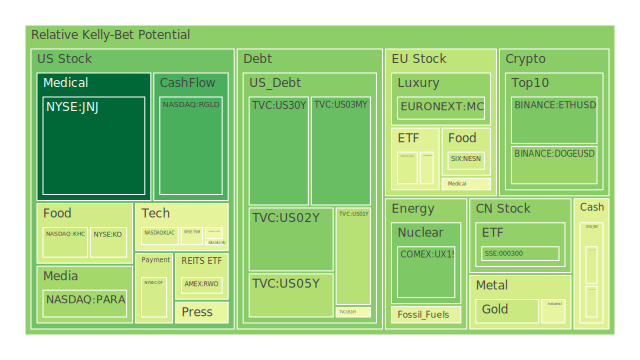
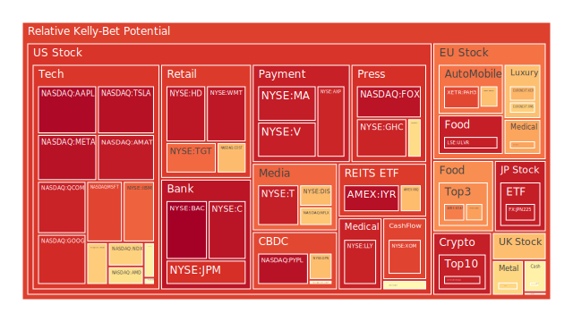
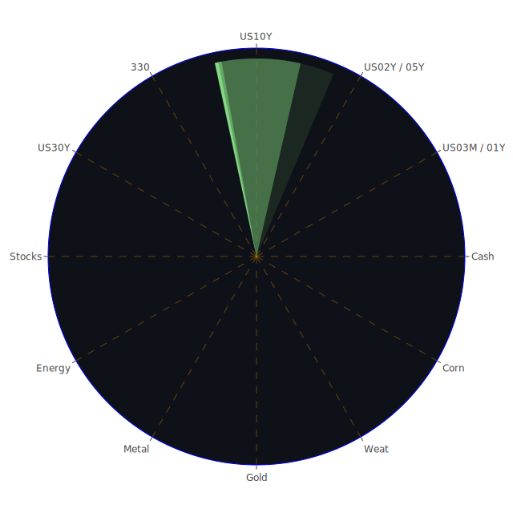

# 投資商品泡沫分析

## 美國國債

近期觀察美國國債收益率曲線，可以發現長短期利率呈現微妙的變化。10年期國債收益率從去年同期的3.97%上升至目前的4.20%，而30年期國債收益率也從4.01%攀升至4.37%。然而，短期國債收益率卻呈現下降趨勢，1年期國債收益率從5.40%下降至4.29%，2年期從4.86%降至4.19%。這種長期利率上升、短期利率下降的情況，暗示市場對未來經濟增長的預期有所調整。

同時，美國國債的泡沫風險指數有所提高。從資料中可見，10年期國債的D1風險指數為0.481763，較前期有所上升。這顯示投資者對美國國債的風險評估正在提高，可能與市場對美國債務水平和政府財政狀況的擔憂有關。

## 美國零售股

美國零售業近期受到消費者信心和購買力影響。大型零售商如Target的股價呈現下滑趨勢，PP100價格為132.31，D1風險指數達到0.607896，14天平均風險指數更高達0.785591。這反映市場對零售業的未來發展持謹慎態度，或許是因為消費者支出放緩以及電商競爭加劇所致。

## 美國科技股

科技股方面，以微軟、蘋果為代表的巨頭股價持續創新高。微軟的PP100價格為424.45，D1風險指數為0.894703，蘋果的PP100價格為235.45，D1風險指數更高達0.980763。這顯示科技巨頭的估值處於高位，存在一定的泡沫風險。近期微軟收購OpenAI的CEO Sam Altman，更使公司股價達到歷史新高，市場對於人工智慧領域的前景充滿期待，但高估值也暗藏風險。

## 美國房地產指數

美國房地產市場受利率影響明顯。固定房貸30年利率從去年同期的2.71%飆升至目前的6.81%，對房地產市場形成壓力。房地產ETF的PP100價格為98.79，D1風險指數為0.668723，顯示市場對房地產前景保持謹慎。高利率可能抑制購房需求，進而影響房地產企業的業績。

## 加密貨幣

比特幣的PP100價格為96917.43，D1風險指數為0.668982，以太幣的PP100價格為3700.86，D1風險指數為0.265332。加密貨幣市場近期波動較大，價格處於高位，但風險指數也相對較高。近期影響因素包括市場對於區塊鏈技術的應用前景，以及監管政策的不確定性。

## 金/銀/銅

黃金價格保持穩定，XAUUSD的PP100價格為2645.40，D1風險指數為0.683210。銀價也呈現上升趨勢，XAGUSD的PP100價格為30.70，D1風險指數為0.670875。銅價則相對平穩，風險指數較低。金銀價格的上漲可能與投資者尋求避險有關，而銅作為經濟活動的指標，其價格穩定反映市場對經濟前景持觀望態度。

## 黃豆 / 小麥 / 玉米

農產品價格有所波動。黃豆（SOYB）的PP100價格為21.24，D1風險指數為0.502229；小麥（WEAT）的PP100價格為4.80，D1風險指數為0.819007；玉米（CORN）的PP100價格為17.77，D1風險指數為0.618463。小麥的風險指數較高，可能與全球供應鏈問題和地緣政治因素有關。

## 石油/鈾期貨

原油價格保持在相對低位，USOIL的PP100價格為68.47，D1風險指數為0.445433。鈾期貨（UX1!）的PP100價格為76.92，D1風險指數為0.433603。能源市場受地緣政治影響較大，近期供需基本平衡，但未來仍存在不確定性。

## 各國外匯市場

美元指數近期有所走強，歐元兌美元（EURUSD）的PP100價格為1.06，D1風險指數為0.622721。英鎊兌美元（GBPUSD）的風險指數為0.382334。日圓兌美元（USDJPY）則保持相對穩定。外匯市場受美國利率政策和全球經濟前景影響，美元作為避險貨幣的需求增加。

## 各國大盤指數

美國納斯達克指數（NDX）持續上漲，PP100價格為20866.44，D1風險指數為0.422192。歐洲股市表現相對平穩，法國CAC指數（FCHI）的D1風險指數為0.456319。中國上證300指數（000300）PP100價格為3916.58，D1風險指數為0.511223。全球股市面臨經濟增長放緩和地緣政治風險的挑戰。

## 美國半導體股

半導體行業受到市場熱捧。英特爾（INTC）的PP100價格為23.93，D1風險指數為0.484274；超微（AMD）的PP100價格為136.27，D1風險指數為0.399143；輝達（NVDA）的PP100價格為136.23，D1風險指數為0.837810。高估值反映市場對於半導體需求和技術革新的期望，但也須警惕泡沫風險。

## 美國銀行股

銀行股方面，摩根大通（JPM）的PP100價格為250.32，D1風險指數為0.678455；美國銀行（BAC）的D1風險指數接近1，達到0.995567，顯示風險極高。這可能與金融市場的不確定性和經濟前景有關。

## 美國軍工股

軍工股如洛克希德馬丁（LMT）、諾斯洛普格拉曼（NOC）保持相對穩定，PP100價格分別為529.41和489.65，D1風險指數為0.545112和0.501926。全球地緣政治緊張局勢可能推動軍工股的需求，但也需關注相關風險。

## 美國電子支付股

電子支付巨頭如Visa（V）的PP100價格為315.86，D1風險指數為0.913167；萬事達（MA）的PP100價格為533.65，D1風險指數為0.899510；PayPal的D1風險指數也相對較高。這反映數字支付行業的高增長與高風險並存的狀態。

## 美國藥商股

強生（JNJ）的PP100價格為154.74，D1風險指數為0.279833；默克（MRK）的D1風險指數為0.570032。藥品行業受疫情後續影響，市場對其未來盈利能力持觀望態度。

## 美國影視股

Netflix的PP100價格為888.22，D1風險指數為0.646238；迪士尼（DIS）的D1風險指數為0.684011。隨著消費者娛樂方式的多元化，傳統影視公司的市場份額面臨挑戰。

## 美國媒體股

大型媒體公司如Comcast的D1風險指數為0.459566，市場風險適中。媒體行業正處於數字轉型的關鍵時期，需要適應新的商業模式。

## 石油防禦股

埃克森美孚（XOM）的PP100價格為118.53，D1風險指數為0.826662。石油股受油價波動影響較大，近期油價穩定使得石油股風險有所降低，但長期仍需關注能源轉型的影響。

## 金礦防禦股

作為避險資產，金礦公司的表現值得關注。RGLD的PP100價格為145.85，D1風險指數為0.428297，風險水平適中。

## 歐洲奢侈品股

法國奢侈品巨頭LVMH的PP100價格為596.67，D1風險指數為0.615499；愛馬仕（RMS）的D1風險指數為0.639697。中國市場需求的波動對奢侈品行業造成影響，需密切關注消費趨勢。

## 歐洲汽車股

德國汽車巨頭如BMW的PP100價格為68.62，D1風險指數為0.378396；Mercedes-Benz的風險指數穩定在0.513459。汽車行業正面臨電動化轉型的挑戰，投資風險較大。

## 歐美食品股

雀巢（NESN）的PP100價格為76.47，D1風險指數為0.435497；可口可樂（KO）的風險指數為0.567511。消費品行業受經濟周期影響小，風險相對較低。

# 宏觀經濟傳導路徑分析

美國聯準會的貨幣政策對全球市場影響深遠。近期FED總資產下降，加上美國國債收益率曲線的變化，暗示市場對未來經濟增長的預期正在調整。高利率環境下，企業融資成本上升，可能抑制投資和消費。

全球地緣政治風險加劇，如中東局勢緊張，引發市場避險情緒。黃金和黃金礦業股受益，金價上漲。同時，供應鏈問題和通脹壓力仍然存在，對全球經濟復甦帶來不確定性。

# 微觀經濟傳導路徑分析

企業層面，科技公司持續投資於人工智慧和新興技術，如微軟收購OpenAI CEO事件，帶動科技股熱度。然而，高估值也帶來泡沫風險。

消費者行為的改變，如線上購物的增長，對零售業產生重大影響。傳統零售商需要適應數位化轉型，以維持競爭力。

能源行業面臨可再生能源的挑戰，石油公司需要轉型，以應對長期的能源結構變化。

# 資產類別間傳導路徑分析

資產類別之間存在密切的聯動性。利率上升對房地產和高債務行業造成壓力，投資者可能轉向避險資產如黃金。股票市場的波動也可能影響投資者的資產配置，從高風險資產轉向穩健資產。

同時，外匯市場的變動會影響進出口企業的盈利能力，進而影響相關行業的股價表現。

# 投資建議

根據以上分析，建議投資者在當前環境下採取多元化的投資策略，配置穩健、成長和高風險資產，以達到風險對沖的效果。

**穩健型配置（40%）：**

1. **黃金（XAUUSD）**：作為傳統的避險資產，黃金在市場不確定性增強時具有抗跌性。

2. **美國國債**：長期國債收益率上升，可以鎖定較高的收益率，同時風險相對較低。

3. **消費必需品股票（如可口可樂KO）**：受經濟波動影響較小，提供穩定的股息收益。

**成長型配置（35%）：**

1. **科技巨頭股票（如微軟MSFT、蘋果AAPL）**：具有強勁的創新能力和市場份額，但需關注高估值風險。

2. **半導體股票（如英特爾INTC、超微AMD）**：受益於科技發展趨勢，但行業競爭激烈。

3. **新能源相關股票**：隨著全球能源轉型，新能源行業具有長期增長潛力。

**高風險型配置（25%）：**

1. **加密貨幣（如比特幣BTCUSD、以太幣ETHUSD）**：價格波動大，風險高，但潛在收益也高。

2. **新興市場股票**：具有高增長潛力，但同時面臨政策和市場風險。

3. **小型生技公司股票**：可能有突破性發展，但失敗風險也高。

# 風險提示

投資有風險，市場總是充滿不確定性。我們的建議僅供參考，投資者應根據自身的風險承受能力和投資目標，做出獨立的投資決策。

請特別注意高泡沫風險的投資標的，如高估值的科技股和加密貨幣市場，需謹慎評估風險後再行投入。
 
Daily Buy Map:

 
Daily Sell Map:

 
Daily Radar Chart:

 
