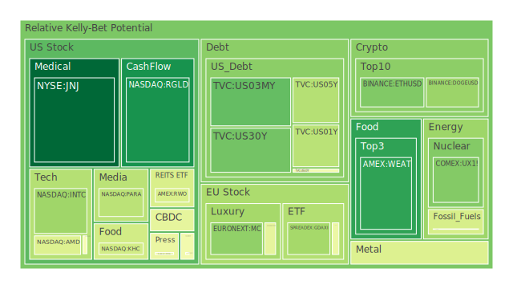
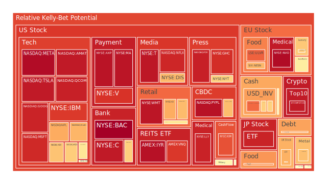
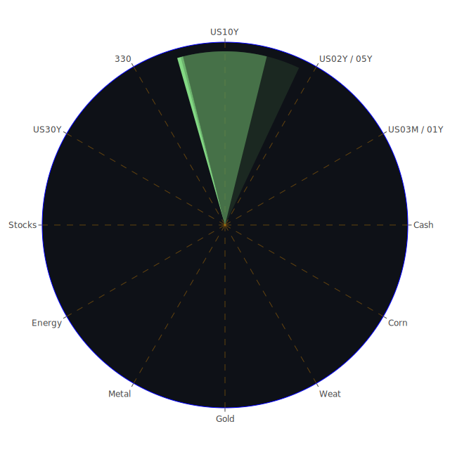

# 投資商品泡沫分析

- **美國國債**

  美國國債收益率近期出現波動，特別是短期國債如2年期和5年期國債的收益率略有下降。根據資料，2年期國債收益率為4.18%，較上週的4.26%有所下降。這可能反映了市場對未來利率走勢的不確定性。此外，美聯儲總資產下降趨勢加劇，顯示流動性收緊的跡象。投資者應關注美聯儲的政策動向，因為這將直接影響國債市場的走勢。

- **美國零售股**

  美國零售業近期受到多重因素影響。根據資料，沃爾瑪（NYSE:WMT）的泡沫指數持續處於較高水平，D1為0.955497。另一方面，美國零售銷售數據顯示消費者支出增長放緩，可能受制於高通脹和利率上升的影響。此外，網絡購物的興起和消費習慣的改變也對傳統零售商構成挑戰。投資者在考慮零售股時，需謹慎評估風險。

- **美國科技股**

  科技股持續領漲市場，蘋果（NASDAQ:AAPL）、微軟（NASDAQ:MSFT）等龍頭企業的股價屢創新高。資料顯示，蘋果的泡沫指數D1達到0.980763，表明市場對其預期較高。同時，人工智慧和雲計算等領域的快速發展為科技企業帶來新的增長點。然而，高估值也暗示潛在風險，一旦市場情緒轉變，科技股可能面臨較大調整。

- **美國房地產指數**

  美國房地產市場近期出現分化。房價在部分地區仍保持增長，但整體漲勢放緩。資料顯示，美國房地產ETF（AMEX:VNQ）的泡沫指數D1為0.890279，略有下降。高利率環境下，貸款成本上升可能抑制購房需求。同時，商業房地產領域的空置率上升，投資者需關注市場供需變化。

- **加密貨幣**

  比特幣（BTCUSD）價格維持在高位，近期報價約為97,312美元。泡沫指數D1為0.914481，顯示市場對其熱情高漲。然而，加密貨幣市場波動性較大，受監管政策和市場情緒影響明顯。近期關於加密貨幣監管的新聞頻繁出現，投資者需保持警惕。

- **金/銀/銅**

  黃金價格穩定在每盎司2,647.5美元左右，泡沫指數D1為0.533188，表明其作為避險資產的吸引力仍在。白銀價格也有所上漲，D1達到0.887830。銅價則保持在每磅4.12美元，泡沫指數相對較低。全球經濟前景的不確定性可能推動貴金屬價格進一步上升。

- **黃豆 / 小麥 / 玉米**

  農產品價格受到氣候和供需影響。小麥（AMEX:WEAT）的泡沫指數D1為0.819007，表明價格可能處於高位。玉米（AMEX:CORN）和黃豆價格相對穩定。需關注氣候變化對農業產出的影響，以及全球糧食需求的變化。

- **石油/ 鈾期貨UX!**

  國際油價近期有所回升，但仍受供需關係影響。布倫特原油（TVC:USOIL）價格在每桶68美元左右，泡沫指數D1為0.445433。鈾期貨（COMEX:UX1!）價格保持在每磅77美元左右，隨著對清潔能源的關注度提高，鈾可能迎來需求增長。

- **各國外匯市場**

  美元指數保持強勢，歐元（EURUSD）和英鎊（GBPUSD）匯率相對平穩。日圓（USDJPY）貶值至150附近，泡沫指數D1為0.592655。需關注各國央行的貨幣政策，以及經濟數據對匯率的影響。

- **各國大盤指數**

  全球股市表現不一。美國納斯達克指數（NASDAQ:NDX）持續上漲，泡沫指數D1為0.422192。歐洲股市方面，德國DAX指數（GDAXI）和法國CAC指數（FCHI）也有所上漲。亞洲市場則相對疲弱，中國滬深300指數（SSE:000300）波動較大。投資者需關注全球經濟復甦進程。

- **美國半導體股**

  半導體行業持續受益於技術需求增長。英特爾（NASDAQ:INTC）、超微（NASDAQ:AMD）等公司的泡沫指數較高，表明市場對其預期樂觀。然而，供應鏈瓶頸和地緣政治風險可能影響行業發展。

- **美國銀行股**

  美國銀行業受益於利率走高。摩根大通（NYSE:JPM）的泡沫指數D1為0.678455。高利率環境下，銀行的利息收入增加，但需警惕貸款拖欠率上升的風險。

- **美國軍工股**

  全球地緣政治緊張局勢推動軍工股上漲。洛克希德馬丁公司（NYSE:LMT）、諾斯羅普·格魯曼公司（NYSE:NOC）的泡沫指數均較高。各國國防開支增加可能為軍工企業帶來新的業務機會。

- **美國電子支付股**

  電子支付行業持續增長。Visa（NYSE:V）和萬事達（NYSE:MA）的泡沫指數均超過0.9，顯示市場對電子支付前景看好。數位化和無現金支付的趨勢將繼續推動行業發展。

- **美國藥商股**

  醫藥行業穩定增長。默克公司（NYSE:MRK）的泡沫指數D1為0.570032。人口老齡化和醫療需求增加為醫藥企業提供了良好的市場環境。

- **美國影視股**

  流媒體興起帶來影視行業新機遇。奈飛（NASDAQ:NFLX）的泡沫指數D1為0.646238。內容創新和全球市場拓展將是影視企業的關鍵發展方向。

- **美國媒體股**

  媒體行業面臨傳統廣告收入下滑的挑戰。同時，數位化轉型和新興媒體的競爭加劇。投資者需關注企業的轉型策略和市場份額。

- **石油防禦股**

  能源行業在全球能源轉型背景下面臨挑戰。傳統石油企業如埃克森美孚（NYSE:XOM）的泡沫指數D1為0.826662。可再生能源的發展可能對傳統能源企業產生影響。

- **金礦防禦股**

  金礦企業受益於金價上漲。RGLD（NASDAQ:RGLD）的泡沫指數D1為0.428297。作為避險資產，黃金需求可能持續增加。

- **歐洲奢侈品股**

  歐洲奢侈品市場穩定增長。LVMH（EURONEXT:MC）的泡沫指數D1為0.615499。亞太市場需求強勁，為奢侈品企業提供增長動力。

- **歐洲汽車股**

  德國汽車製造商如BMW（XETR:BMW）的泡沫指數D1為0.513459。電動化和自動駕駛技術的發展將影響汽車行業的未來。

- **歐美食品股**

  消費品行業穩定。雀巢公司（SIX:NESN）的泡沫指數D1為0.415439。健康和有機食品的需求增加，企業需適應市場趨勢。

# 宏觀經濟傳導路徑分析

全球經濟正處於複雜的宏觀環境中。美聯儲的貨幣政策、通脹走勢和地緣政治因素共同影響市場。美聯儲總資產下降，顯示緊縮政策的影響。利率走高對房地產和消費行業帶來壓力。同時，政府債務水平較高，需關注政府的財政政策。

# 微觀經濟傳導路徑分析

企業層面，供應鏈問題和成本上升影響盈利能力。科技和醫藥企業受益於技術進步和需求增長。消費者行為的改變，如線上購物和數位支付，影響零售和金融行業。企業需適應新環境，調整業務策略。

# 資產類別間傳導路徑分析

不同資產之間存在相互影響。利率上升可能導致債券價格下降，進而影響股市表現。避險情緒上升時，投資者可能轉向黃金等避險資產。匯率波動影響進出口企業的盈利能力。需綜合考慮多種因素，進行投資組合的配置。

# 投資建議

根據市場情況，提出以下投資組合：

- **穩健型（50%）**

  - 美國國債（20%）：作為避險資產，提供穩定收益。
  - 黃金（15%）：對沖市場風險，保值增值。
  - 高信用評級的企業債券（15%）：獲取固定收益。

- **成長型（30%）**

  - 科技股（15%）：關注人工智慧和雲計算領域的龍頭企業。
  - 醫藥股（10%）：受益於人口老齡化和醫療需求增長。
  - 可再生能源股（5%）：抓住能源轉型的機遇。

- **高風險型（20%）**

  - 加密貨幣（10%）：在嚴格控制風險的前提下，獲取高收益。
  - 新興市場股市（5%）：尋找高增長前景的市場。
  - 創新型科技企業（5%）：投資有潛力的初創企業。

# 風險提示

投資有風險，市場總是充滿不確定性。我們的建議僅供參考，投資者應根據自身的風險承受能力和投資目標，做出獨立的投資決策。
 
Daily Buy Map:

 
Daily Sell Map:

 
Daily Radar Chart:

 
