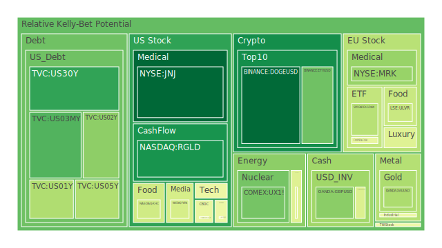
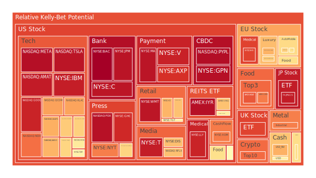
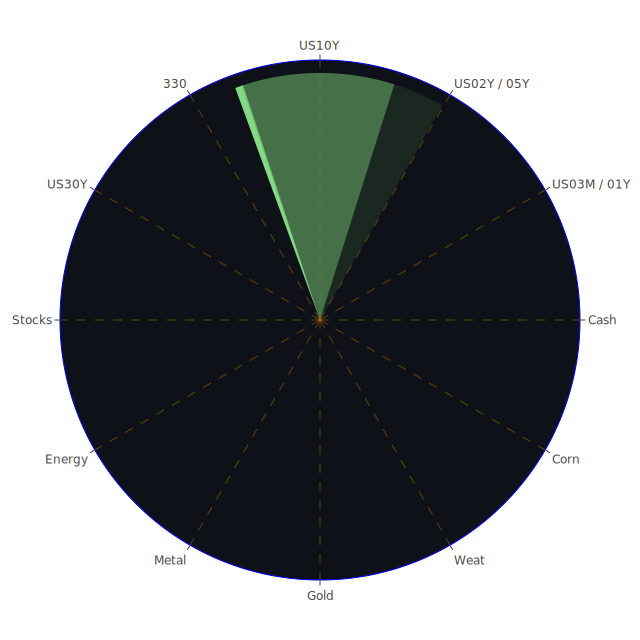

# 投資商品泡沫分析

## **美國國債**

近期觀察美國國債市場，可以發現長短期利率出現倒掛現象。根據資料顯示，10年期國債收益率為4.18%，而3個月期國債收益率為4.46%。這種短期利率高於長期利率的情況，通常被視為經濟衰退的預警信號。此外，聯邦準備理事會（Fed）的總資產持續下降，而存款準備金則處於相對高位，顯示銀行體系的流動性減少。

新聞報導指出，Fed主席表示可能在未來的會議上考慮再次降息，這可能進一步壓低長期利率。同時，債務佔GDP比例持續上升，可能對投資者造成憂慮。然而，歷史上，美國國債一直被視為避險資產，特別是在市場不確定性增加時。

綜合經濟學、社會學和心理學的觀點，投資者可能在面對市場動盪時轉向國債。但需注意的是，當前國債市場的泡沫風險正在增加，需謹慎評估。

## **美國零售股**

美國零售業近期受到多重挑戰。一方面，消費者信心指數下降，另一方面，線上購物的競爭加劇。根據新聞報導，某些大型零售商的財報不及預期，加上供應鏈問題，導致庫存過剩。

歷史上，零售業在經濟下行周期中表現往往較為疲弱。博弈論觀點下，零售商需在價格、品質和服務上尋求平衡，以吸引消費者。然而，當市場需求下降時，即使採取積極策略，收益仍可能受到影響。

因此，投資者需關注零售業的整體環境，慎防潛在的投資風險。

## **美國科技股**

科技股近期表現強勁，主要受益於對人工智慧（AI）和雲計算的需求增加。根據資料，像微軟（Microsoft）和Salesforce等公司發布了優於預期的財報，帶動股價上漲。

然而，市場對科技股的高估值也引發了泡沫風險的擔憂。心理學上，投資者可能因為恐懼錯過（FOMO）的情緒而追高，但這增加了市場調整的可能性。

回顧2000年的科網泡沫，我們需警惕高估值帶來的風險，建議投資者在投資科技股時保持謹慎。

## **美國房地產指數**

房地產市場受到利率變動的直接影響。當前30年固定抵押貸款利率達到6.81%，較去年大幅上升。高利率可能抑制房屋購買需求，進而影響房地產市場。

歷史上，利率上升往往導致房地產市場降溫。此外，供給過剩和經濟衰退也是房價下跌的原因。社會學角度看，房屋是民眾的重要資產，市場波動可能對家庭財富產生重大影響。

因此，房地產市場可能面臨調整風險，投資者需密切關注市場動態。

## **加密貨幣**

比特幣價格近期波動劇烈，價格達到98,601美元。雖然加密貨幣被視為新興資產，但其高波動性和監管風險引發關注。新聞報導指出，某加密貨幣交易所負責人因涉嫌詐欺被捕，這對市場信心造成打擊。

從經濟學角度，加密貨幣缺乏內在價值支撐，價格主要由供需決定。心理學上，投資者容易受到市場情緒影響，導致價格劇烈波動。

建議投資者謹慎對待加密貨幣投資，注意風險控制。

## **金/銀/銅**

貴金屬價格近期受到市場避險情緒的推動。黃金價格達到2,649美元，金/油比達到38.56，處於較高水平。這反映了投資者對全球經濟前景的不確定性。

歷史上，黃金在經濟動盪時期表現強勁。然而，需注意的是，貴金屬價格也會受到利率和美元指數的影響。博弈論上，當多數投資者湧入避險資產，可能推高價格，但也增加了回調風險。

建議投資者平衡配置貴金屬資產，避免過度集中。

## **黃豆 / 小麥 / 玉米**

農產品價格受天氣、供需和政策等多重因素影響。近期玉米價格小幅下跌，而小麥價格持穩。新聞指出，全球氣候變化可能影響農作物產量，進而影響價格。

經濟學上，農產品具有週期性，投資者需關注供給和需求的變化。社會學角度，糧食價格波動可能影響民生和通脹。

因此，投資農產品需考慮多種因素，謹慎評估風險。

## **石油/ 鈾期貨**

油價近期在每桶68美元左右波動。受到全球經濟增長放緩和供應過剩的影響，油價面臨下行壓力。然而，中東地緣政治風險可能導致供應中斷，支撐油價。

鈾期貨價格穩定在77美元附近。隨著全球對清潔能源的需求增加，核能可能重新受到關注。

投資石油和鈾需關注宏觀經濟和政策變化，平衡風險與收益。

## **各國外匯市場**

美元指數近期走強，主要原因是美國經濟數據優於預期。然而，歐元受到法國政治危機的影響而走弱。韓元則受總統宣布戒嚴令的影響而波動。

心理學上，外匯市場容易受到情緒和消息面的影響。投資者需密切關注全球政治和經濟動態。

## **各國大盤指數**

全球股市表現分化。美國股市屢創新高，主要受科技股帶動。歐洲股市受到政治不確定性的拖累。亞洲股市則受地緣政治和經濟數據影響。

投資者需關注各國經濟基本面和政策變化，進行全球資產配置。

## **美國半導體股**

半導體行業近期受到高度關注。儘管需求強勁，但供應瓶頸仍存。新聞報導指出，某些芯片公司下調了盈利預期，因為訂單減少和競爭加劇。

歷史上，半導體行業具有週期性，需注意市場供需變化。

## **美國銀行股**

銀行股受到利率環境和經濟前景的影響。隨著利率上升，銀行利差可能擴大，利好收益。然而，經濟衰退風險可能導致貸款損失增加。

投資者需權衡潛在收益和風險，關注銀行資產質量。

## **美國軍工股**

地緣政治緊張局勢可能推動軍工股上漲。政府增加國防預算，有利於軍工企業的業績。然而，政策變化和國際關係改善可能對該行業造成影響。

## **美國電子支付股**

電子支付行業持續增長，受益於電子商務和數字化趨勢。然而，競爭加劇和監管風險可能對行業造成挑戰。

投資者需關注企業的市場份額和技術創新能力。

## **美國藥商股**

醫藥行業受益於研發突破和人口老齡化。然而，政策變化和藥價壓力可能對企業盈利產生影響。

## **美國影視股**

影視行業受到疫情影響，但隨著經濟重啟，票房和廣告收入可能回升。然而，流媒體競爭加劇，需要關注企業的策略和內容品質。

## **美國媒體股**

媒體行業正面臨數字化轉型的挑戰。廣告收入模式轉變，需適應新的消費者行為。

## **石油防禦股**

石油防禦股可能受益於地緣政治風險和能源需求。然而，全球向清潔能源轉型可能對該行業帶來長期挑戰。

## **金礦防禦股**

金礦股通常被視為避險資產，當市場不確定性增加時，可能受到投資者青睞。

## **歐洲奢侈品股**

奢侈品行業受經濟周期和消費者信心影響。近期歐洲政治不穩定可能對消費需求產生影響。

## **歐洲汽車股**

汽車行業正面臨電動化和自動化轉型。投資者需關注企業的研發投入和市場策略。

## **歐美食品股**

食品行業相對穩定，受經濟波動影響較小。然而，原材料價格變化和消費者偏好轉變可能影響盈利。

# 宏觀經濟傳導路徑分析

全球經濟正處於多重挑戰之中。利率上升、美國國債收益率曲線倒掛、地緣政治風險增加，都可能引發經濟放緩。政府政策和央行決策對市場影響巨大。

貨幣政策的收緊可能抑制投資和消費，進一步影響企業盈利。國際貿易摩擦和供應鏈中斷也對全球經濟造成壓力。

# 微觀經濟傳導路徑分析

個別企業需面對市場需求變化、成本上升和競爭加劇的挑戰。科技進步可能帶來機遇，但也可能導致市場格局重組。

消費者行為的轉變，如線上購物的興起，對傳統零售業造成衝擊。企業需適應新的商業模式，才能保持競爭力。

# 資產類別間傳導路徑分析

市場資金可能在不同資產間流動，如當股市風險增加時，資金可能流向債券或黃金等避險資產。匯率變動也會影響跨國投資和企業盈利。

不同資產之間存在相關性，投資者需關注資產配置的多元化，以降低投資組合的波動性。

# 投資建議

基於上述分析，建議投資者根據自身風險承受能力，選擇合適的投資組合。

## **穩健型投資組合（40%）**

- **美國國債**：作為避險資產，可降低組合風險。
- **金礦防禦股**：在市場不確定性增加時，具有防禦性。
- **歐美食品股**：行業穩定，受經濟波動影響較小。

## **成長型投資組合（40%）**

- **美國科技股**：具備長期增長潛力，但需注意估值風險。
- **美國電子支付股**：受益於數字化趨勢，市場前景廣闊。
- **歐洲汽車股**：關注電動化和自動化帶來的機遇。

## **高風險型投資組合（20%）**

- **加密貨幣**：高波動性，但可能帶來高回報。
- **石油/鈾期貨**：受地緣政治影響，價格波動大。
- **美國半導體股**：行業週期性強，需承擔市場風險。

# 風險提示

投資有風險，市場總是充滿不確定性。我們的建議僅供參考，投資者應根據自身的風險承受能力和投資目標，做出獨立的投資決策。特別是對於泡沫風險高的投資商品，需高度警惕，避免盲目追高。
 
Daily Buy Map:

 
Daily Sell Map:

 
Daily Radar Chart:

 
