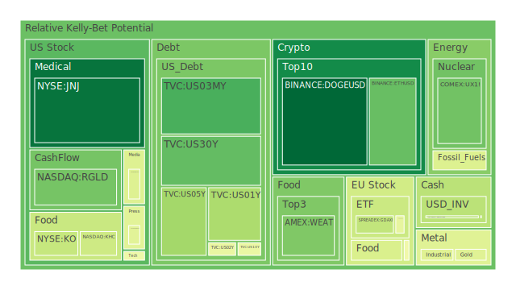
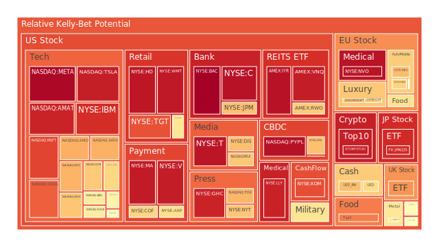
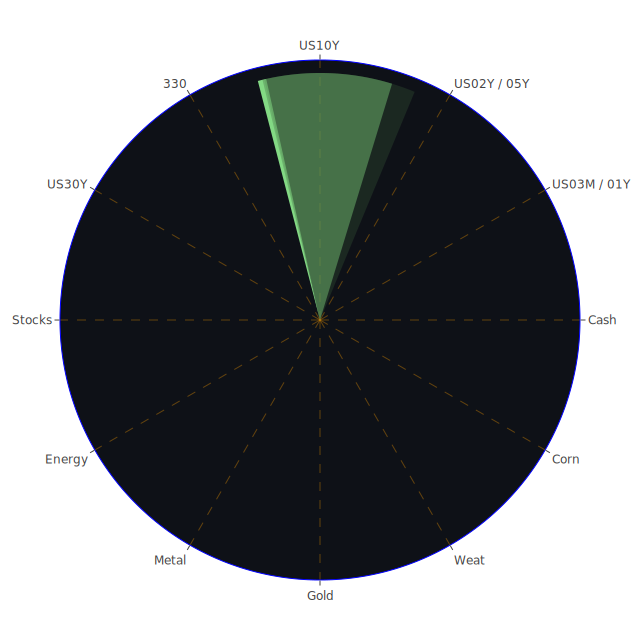

# 投資商品泡沫分析

## 美國國債

近期美國國債市場呈現出一種複雜的情勢。一方面，長期國債收益率的下降反映出市場對經濟前景的擔憂。根據最新數據，美國10年期國債收益率下降至4.18%，相比上週的4.25%有所回落。這種趨勢可能源於市場對未來經濟增長放緩的預期，以及對美聯儲貨幣政策走向的不確定性。

同時，美國聯邦政府的總債務水平不斷攀升，債務佔GDP的比例持續上升，這引發了對美國財政可持續性的擔憂。歷史上，債務高企常常導致國債市場的波動，例如在2008年金融危機期間，市場對美國債務的擔憂導致國債收益率大幅波動。

從經濟學角度來看，國債收益率的下降可能意味着投資者轉向避險資產，對未來經濟增長的信心減弱。博弈論告訴我們，在不確定性增加的情況下，市場參與者傾向於選擇安全資產，這可能進一步推高國債價格，壓低收益率。

## 美國零售股

美國零售股近期表現參差不齊。以Target為例，因為在Pride商品推出後遭受輿論反彈，股價受到壓力。法院也裁定Target需面對股東的訴訟，這增加了其未來的不確定性。從心理學角度，消費者情緒和品牌形象對零售股的影響巨大。歷史上，企業形象受損常常導致銷售下滑，股價下跌。

然而，一些零售企業如Costco則受益於穩健的商業模式和會員制的忠誠度，第三季度業績表現優異，並上調了全年預期。從社會學角度，消費者行為的轉變，如更注重價值和品質，可能使得像Costco這樣的企業受益。

## 美國科技股

科技股近期再次成為市場焦點。Salesforce和Marvell等公司的強勁業績推動了整個板塊的上漲。Salesforce的雲服務需求強勁，Marvell受益於AI需求的增長。這種情況類似於2000年的科技泡沫，但現在企業有實際的收益支撐。

然而，需要警惕的是，科技股的高估值可能隱含著泡沫風險。心理學上，投資者的過度樂觀可能導致資產價格偏離基本面。博弈論提示我們，當大多數人都看好某個板塊時，逆向操作可能更為謹慎。

## 美國房地產指數

美國房地產市場呈現出複雜的態勢。30年固定抵押貸款利率上升至6.69%，相比去年2.71%的水平，有顯著提升。高利率抑制了購房需求，房地產交易量下降。

然而，部分地區的房價仍然堅挺，這可能來源於供給不足和建築成本上升。歷史上，高利率環境下房地產市場通常會放緩，如上世紀80年代初的情況。從經濟學角度，高利率提高了購房成本，抑制需求，可能導致房價回調。

## 加密貨幣

比特幣近期突破10萬美元大關，引發市場熱議。這一里程碑被視為加密貨幣成熟的標誌。市場對於特朗普回歸白宮的預期，以及他對加密貨幣友好的政策，推動了比特幣價格的上漲。

然而，需要警惕的是，加密貨幣市場的高波動性和潛在監管風險。歷史上，加密貨幣多次經歷大幅度的價格波動。心理學上，投資者的從眾行為可能加劇市場波動。博弈論提示我們，在價格快速上漲後，市場可能存在獲利了結的風險。

## 金/銀/銅

黃金價格近期保持穩定，Gold/Oil比率維持在38.48，Gold/Copper比率在627.55。黃金作為避險資產，受益於市場的不確定性。銀和銅的價格則更多受到工業需求的影響。

從經濟學角度，全球經濟增長放緩可能抑制工業金屬的需求，壓低價格。歷史上，在經濟衰退期間，銅的價格通常會下跌。黃金則可能因為避險需求增加而上漲。

## 黃豆 / 小麥 / 玉米

農產品價格近期出現波動。美國農業部的數據顯示，全球糧食供應存在不確定性。氣候變化和地緣政治風險可能影響農產品的供給。

從歷史角度看，糧食價格的波動對通脹有直接影響。經濟學上，供需失衡將導致價格波動。博弈論提示，各國可能通過貿易政策影響全球糧食市場。

## 石油/ 鈾期貨UX!

油價近期有所下滑，WTI原油價格在70美元附近波動。OPEC+延期增產計劃，市場對未來需求的擔憂高企。從經濟學角度，全球經濟增長放緩預期壓低了石油需求。

鈾期貨價格則受到核能需求的影響。隨著各國重視清潔能源，核能可能再次受到關注，推動鈾價格上漲。但需要注意核能的安全性和社會接受度。

## 各國外匯市場

近期美元保持強勢，美元指數在高位徘徊。歐元受到法國政府倒台的影響，走勢疲軟。南韓因總統宣佈戒嚴令，韓元出現波動。

經濟學上，貨幣匯率反映了一國經濟基本面和政治穩定性。博弈論提示，貨幣戰爭可能引發貿易緊張，進一步影響匯率。

## 各國大盤指數

全球股市表現分化。美股在科技股帶動下創歷史新高。歐洲股市受政治不確定性影響，表現相對疲軟。亞洲股市則受地緣政治和經濟增長影響，走勢各異。

歷史上，股市的表現與經濟基本面高度相關。心理學上，投資者情緒對市場走勢有重大影響。

## 美國半導體股

半導體股近期受到AI需求的強勁推動。Marvell和NVIDIA等公司業績亮眼，股價上漲。然而，高估值和供應鏈風險仍需警惕。

從經濟學角度，技術進步推動產業升級，但市場競爭加劇可能壓縮利潤。博弈論提示，企業需要在創新和成本控制間取得平衡。

## 美國銀行股

銀行股近期表現穩健。美聯儲的政策走向和利率水平直接影響銀行利潤。高利率環境下，銀行的淨利息收益增加。

然而，需要關注的是潛在的貸款違約風險。根據數據，信用卡和房地產違約率處於較高水平。歷史上，當經濟增長放緩時，銀行資產質量可能惡化。

## 美國軍工股

軍工股在全球局勢緊張的背景下備受關注。地緣政治風險提升，各國增加國防支出，可能推動軍工企業的訂單增長。

然而，政治風險和政策變化也可能對軍工股造成影響。歷史上，軍費削減政策曾導致軍工企業業績下滑。

## 美國電子支付股

電子支付行業持續增長。PayPal等公司受益於電子商務的普及。OpenAI與Anduril合作升級反無人機技術，顯示人工智能在安全領域的應用前景。

從社會學角度，消費者行為的轉變推動了電子支付的發展。經濟學上，規模經濟和網絡效應增強了市場的集中度。

## 美國藥商股

制藥企業如Eli Lilly進行大規模投資，擴建工廠以滿足市場需求。肥胖藥物和糖尿病藥物的需求增長為企業帶來了新機遇。

然而，監管風險和研發失敗風險仍需考慮。歷史上，藥物研發的高成本和高風險曾導致企業巨額虧損。

## 美國影視股

娛樂行業正面臨挑戰。傳統媒體公司如迪士尼受到流媒體競爭和內容成本上升的壓力。Netflix等流媒體公司雖然用戶增長，但面臨著內容投資的巨大壓力。

心理學上，觀眾口味的變化和內容消費習慣的轉變對行業影響深遠。

## 美國媒體股

媒體行業受到廣告市場波動的影響。社交媒體公司如Meta受益於廣告收入的增長，但也面臨監管挑戰和用戶數據隱私問題。

從社會學角度，信息傳播方式的變革對媒體行業帶來深遠影響。

## 石油防禦股

能源企業在能源轉型的背景下面臨挑戰。傳統石油企業需要應對可再生能源的競爭。同時，全球經濟增長放緩可能影響石油需求。

從經濟學角度，供需變化將直接影響石油價格和相關企業的盈利能力。

## 金礦防禦股

黃金礦業企業受益於金價的上漲。避險需求增加推動金價走高，企業盈利能力提升。然而，需要注意的是開採成本和政策風險。

歷史上，金礦企業的股價與金價有高度相關性，但也受到自身運營效率和管理能力的影響。

## 歐洲奢侈品股

歐洲奢侈品企業如LVMH受益於消費需求的增長。儘管全球經濟存在不確定性，但高端消費市場仍然表現強勁。

從社會學角度，消費升級和品牌忠誠度推動奢侈品市場的增長。

## 歐洲汽車股

歐洲汽車企業正面臨電動化和智能化的挑戰。政策推動和市場需求促使企業加快轉型。然而，高昂的研發投入和市場競爭加劇了壓力。

歷史上，技術變革常常導致行業洗牌，企業需要適應新的市場環境。

## 歐美食品股

食品行業保持穩定增長。消費者對健康和有機食品的需求增加，為企業帶來新機遇。同時，成本上升和供應鏈挑戰需要企業有效管理。

從經濟學角度，食品行業具有一定的防禦性，但也需要關注市場趨勢和消費者喜好。

# 宏觀經濟傳導路徑分析

全球經濟正處於複雜的轉折點。地緣政治風險增加，例如南韓總統宣佈戒嚴令，引發市場波動。美聯儲的貨幣政策走向引發市場關注。貨幣市場利率和國債收益率的變化直接影響投資者的預期。

經濟學上，貨幣政策傳導路徑通過影響市場利率，進而影響投資和消費決策。高利率環境抑制經濟增長，可能導致股市下跌。同時，全球供應鏈的挑戰和貿易政策的不確定性也影響著商品市場和匯率。

# 微觀經濟傳導路徑分析

企業層面，需求變化和成本上升對盈利能力有直接影響。科技企業受益於技術進步和市場需求，但也面臨著競爭和監管風險。零售企業需要適應消費者行為的轉變，管理品牌形象和產品策略。

個人投資者的心理和決策行為也影響著市場走勢。從眾行為和情緒傳染可能導致市場波動加劇。

# 資產類別間傳導路徑分析

不同資產之間存在複雜的關聯性。股票市場與債券市場常常呈現負相關關係。當經濟前景不確定時，投資者可能從股票轉向債券。

黃金作為避險資產，與股市和美元指數存在反向關係。貨幣市場的波動也影響著股票和債券市場。

商品市場如石油和金屬價格的變化，反映了全球經濟的供需狀況，進而影響相關行業的企業業績和股價。

# 投資建議

在當前市場環境下，建議投資者採取多元化的資產配置，以分散風險。

**穩健型配置（40%）：**

1. **美國國債（15%）**：提供穩定收益，對沖市場波動。

2. **大型制藥企業股票（15%）**：如Eli Lilly，受益於醫療需求，具有防禦性。

3. **黃金（10%）**：作為避險資產，對沖通脹和貨幣風險。

**成長型配置（35%）：**

1. **科技股（15%）**：如Microsoft和Salesforce，受益於數位化和雲服務需求。

2. **半導體股（10%）**：如NVIDIA，受益於AI和自動化趨勢。

3. **電子支付股（10%）**：如PayPal，受益於電商和數位支付增長。

**高風險型配置（25%）：**

1. **加密貨幣（10%）**：如比特幣，具有高收益潛力，但波動性大。

2. **新興市場股票（10%）**：受益於經濟成長，但存在政治和匯率風險。

3. **原油期貨（5%）**：油價可能因供需變化出現波動，具有高風險高收益特性。

# 風險提示

投資具有風險，市場總是充滿不確定性。近期市場波動加劇，地緣政治風險、貨幣政策變化和經濟增長放緩都可能影響資產價格。

特別需要關注高泡沫風險的投資產品，如部分科技股和加密貨幣。高估值可能隱含著價格回調的風險。

投資者應根據自身的風險承受能力和投資目標，謹慎決策，避免盲目跟風，保持投資組合的多元化和靈活性。
 
Daily Buy Map:

 
Daily Sell Map:

 
Daily Radar Chart:

 
