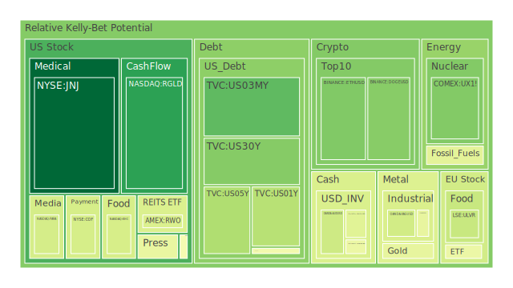
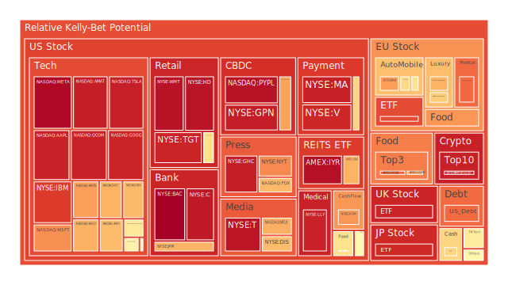
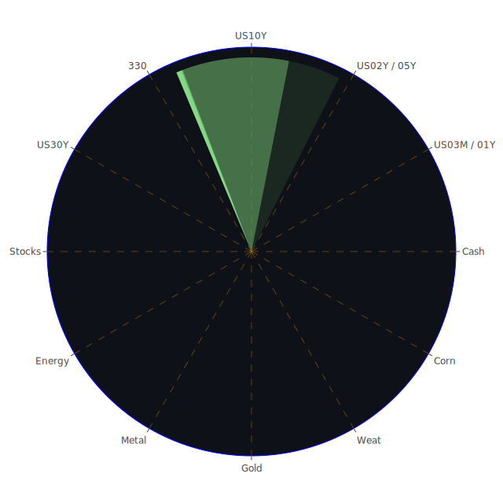

# 投資商品泡沫分析

在當前全球經濟環境下，市場充滿了各種不確定性和風險因素。透過對不同資產類別的分析，我們可以更清晰地了解市場動態，從而制定更為穩健的投資策略。以下將針對各主要投資商品進行深入分析，並探討其潛在風險與機會。

# 美國國債

**現狀分析：**

近期，美國國債收益率出現波動，特別是短期與長期債券之間的收益率曲線呈現倒掛。根據資料，美國1年期國債收益率為4.20%，較上週的4.34%有所下降；而30年期國債收益率為4.34%，也較上週的4.43%下滑。長短期收益率之差持續縮小，顯示市場對未來經濟增長的憂慮。

**歷史相似場景：**

在歷史上，收益率曲線倒掛常被視為經濟衰退的前兆。例如，2007年前夕，美國國債收益率曲線也曾出現倒掛，隨後引發全球金融危機。

**觀察視角：**

- *經濟學角度*：收益率曲線倒掛反映市場預期未來經濟增長放緩，投資者轉向避險資產。
- *博弈論角度*：市場參與者預期其他投資者將購買長期債券，導致長期收益率下降。
- *心理學角度*：投資者的風險偏好降低，恐慌情緒升溫。

**投資建議：**

考慮到國債的避險屬性，投資者可適度配置長期美國國債，以對沖其他高風險資產的波動。但需警惕收益率進一步下降帶來的價格風險。

# 美國零售股

**現狀分析：**

近期，美國零售股表現不一。以Target為例，受到法律訴訟和市場情緒影響，其股價波動較大。新聞顯示，Target需要面對股東針對Pride商品的訴訟，這對其品牌形象和財務狀況造成一定壓力。

**歷史相似場景：**

過去，零售業者經常因為市場趨勢或社會事件而受到影響。例如，電商興起對傳統零售商構成巨大挑戰，迫使其轉型。

**觀察視角：**

- *社會學角度*：消費者行為和社會價值觀的變化對零售業有著深遠影響。
- *心理學角度*：消費者對品牌的認知和情感連結影響購買決策。
- *經濟學角度*：通貨膨脹和消費信心指數影響消費支出。

**投資建議：**

對於美國零售股，投資者應該慎重評估企業的市場定位和適應能力。選擇具有強大品牌和創新能力的公司，可能在競爭中保持優勢。

# 美國科技股

**現狀分析：**

美國科技股在近日持續上漲，指數屢創新高。新聞報導指出，科技股受益於積極的市場情緒和良好的企業財報。例如，Salesforce公佈了優於預期的業績，推動整體科技板塊上漲。

**歷史相似場景：**

科技股的高速增長讓人聯想到上世紀90年代的互聯網泡沫。然而，當前的科技企業在盈利和業務模式上更具穩定性。

**觀察視角：**

- *經濟學角度*：科技創新驅動生產力提高，帶來經濟增長。
- *博弈論角度*：投資者追逐高增長機會，形成積極的市場氛圍。
- *心理學角度*：FOMO（錯失恐懼）推動投資者進場。

**投資建議：**

科技股雖具吸引力，但估值偏高，存在一定泡沫風險。投資者應謹慎選股，關注具備核心競爭力和可持續增長的企業。

# 美國房地產指數

**現狀分析：**

美國房地產市場出現降溫跡象。30年期固定抵押貸款利率上升至6.69%，較去年同期的2.67%大幅提高。高利率環境抑制了房地產需求。

**歷史相似場景：**

回顧2008年金融危機，房地產市場泡沫破裂引發全球經濟衰退。當前市場情況雖有不同，但高房價和高利率可能對市場構成壓力。

**觀察視角：**

- *經濟學角度*：利率上升增加購房成本，抑制需求。
- *心理學角度*：消費者對未來經濟不確定性的擔憂，降低購房意願。
- *社會學角度*：住房可負擔性問題影響社會穩定。

**投資建議：**

對於房地產投資，應慎重考慮市場風險。可能更適合關注房地產投資信託基金（REITs）或其他間接投資方式，以分散風險。

# 加密貨幣

**現狀分析：**

比特幣價格突破10萬美元大關，市場情緒高昂。新聞報導指出，加密貨幣受益於投資者對傳統資產的避險需求，以及對創新科技的興趣。

**歷史相似場景：**

2017年，比特幣曾經歷快速上漲後又大幅回調，凸顯加密貨幣市場的高波動性。

**觀察視角：**

- *博弈論角度*：投資者預期其他人將推高價格，形成自我實現的預言。
- *心理學角度*：對於高收益的渴望和對新興科技的興奮，驅動投資行為。
- *經濟學角度*：加密貨幣作為數位黃金，被視為對抗通脹的工具。

**投資建議：**

加密貨幣具有高風險和高波動性。投資者應該謹慎，僅投入可承受的資金，並做好風險管理。

# 金/銀/銅

**現狀分析：**

黃金價格維持高位，金價與油價比率上升至39.25。這反映投資者對避險資產的需求增加。白銀和銅價格也受到市場關注。

**歷史相似場景：**

在經濟不確定性增強時，黃金等貴金屬通常表現較佳。例如，2008年金融危機期間，黃金價格上漲。

**觀察視角：**

- *經濟學角度*：貴金屬被視為對抗通脹和貨幣貶值的工具。
- *心理學角度*：恐慌情緒提升避險需求。
- *博弈論角度*：市場預期共識推動資金流入。

**投資建議：**

貴金屬可作為投資組合的避險工具，適度配置有助於分散風險。

# 黃豆 / 小麥 / 玉米

**現狀分析：**

農產品價格受到全球供需影響。近期，黃豆和玉米價格有所波動。供應鏈中斷和氣候變遷影響農業生產。

**歷史相似場景：**

歷史上，糧食價格常因氣候災害或地緣政治因素而劇烈波動。

**觀察視角：**

- *經濟學角度*：供需不平衡導致價格波動。
- *社會學角度*：食品價格影響社會穩定和民眾生活。
- *博弈論角度*：市場投機行為加劇價格波動。

**投資建議：**

農產品投資需考慮天氣和政策風險。適合具備專業知識的投資者。

# 石油/ 鈾期貨

**現狀分析：**

油價近期下跌，WTI原油價格降至68美元左右。市場對全球經濟增長放緩導致需求減少的擔憂增加。鈾期貨價格相對穩定。

**歷史相似場景：**

2014年，全球油價暴跌，主要因供應過剩和需求放緩。

**觀察視角：**

- *經濟學角度*：供需基本面和地緣政治影響油價。
- *博弈論角度*：主要產油國之間的策略博弈影響供給。

**投資建議：**

對於能源資產，應關注全球經濟走勢和地緣政治風險。適度配置能源類股或相關ETF，可作為多元化的一部分。

# 各國外匯市場

**現狀分析：**

美元指數近期走強，美元兌其他主要貨幣有所升值。例如，歐元兌美元匯率維持在1.06左右。美元的強勢反映了美國經濟相對穩健。

**歷史相似場景：**

美元強勢周期通常伴隨著新興市場資金外流，可能引發金融風險。

**觀察視角：**

- *經濟學角度*：利差與經濟基本面決定匯率走勢。
- *博弈論角度*：央行政策和市場預期形成匯率博弈。
- *心理學角度*：避險情緒推動資金流向美元。

**投資建議：**

外匯市場波動性高，適合專業投資者操作。對於一般投資者，可透過多元貨幣基金間接參與。

# 各國大盤指數

**現狀分析：**

全球主要股市表現分化。美國股市屢創新高，而歐洲和亞洲股市表現相對平淡。風險資產的吸引力依然存在，但需警惕潛在風險。

**歷史相似場景：**

資產價格泡沫往往在樂觀情緒高漲時形成，需警惕市場過熱。

**觀察視角：**

- *經濟學角度*：宏觀經濟數據與企業盈利決定股市走勢。
- *心理學角度*：市場情緒對短期波動影響較大。
- *博弈論角度*：投資者之間的競合關係影響資金流向。

**投資建議：**

建議採取全球多元化配置，降低單一市場風險。

# 美國半導體股

**現狀分析：**

半導體產業持續受惠於科技需求的增長。新聞報導指出，企業在AI和數據中心方面的投入增加，推動了半導體需求。

**歷史相似場景：**

科技革命時期，半導體股曾經歷過高速增長與回調。

**觀察視角：**

- *經濟學角度*：技術進步驅動產業發展。
- *博弈論角度*：企業之間的競爭與合作影響市場份額。
- *心理學角度*：市場對新技術的預期推高估值。

**投資建議：**

半導體行業前景樂觀，但需關注供應鏈風險和市場競爭。選擇具備技術領先優勢的企業。

# 美國銀行股

**現狀分析：**

銀行業受到利率變動和經濟前景的影響。近期利率下降可能壓縮銀行的利差收入。

**歷史相似場景：**

在經濟放緩或利率下降周期，銀行業績往往受到影響。

**觀察視角：**

- *經濟學角度*：利率水平和經濟活動影響銀行盈利。
- *博弈論角度*：金融機構之間的競爭加劇。
- *社會學角度*：信用風險和不良貸款需要關注。

**投資建議：**

投資銀行股需審慎，選擇資產質量良好、風險控制能力強的銀行。

# 美國軍工股

**現狀分析：**

全球地緣政治不確定性增加，軍工企業可能受益於國防開支的提高。

**歷史相似場景：**

歷史上，地緣政治緊張時期，軍工股表現相對穩定。

**觀察視角：**

- *經濟學角度*：政府採購和國防預算影響企業收入。
- *博弈論角度*：國與國之間的軍備競賽。
- *心理學角度*：安全需求提升社會對軍事的支持。

**投資建議：**

軍工股可作為防禦性資產配置的一部分，但需關注政策變化和倫理風險。

# 美國電子支付股

**現狀分析：**

隨著電子商務和無現金支付的普及，電子支付企業如PayPal等業績亮眼。

**歷史相似場景：**

移動支付革命帶動了相關企業的快速成長。

**觀察視角：**

- *經濟學角度*：科技進步帶動產業升級。
- *心理學角度*：消費者習慣的改變促進市場需求。
- *博弈論角度*：平台之間的生態系統競爭。

**投資建議：**

電子支付行業前景看好，可適度增持相關優質標的。

# 美國藥商股

**現狀分析：**

醫藥行業受益於人口老齡化和健康需求增加。近期，有企業擴大生產以滿足市場需求。

**歷史相似場景：**

疫情期間，醫藥股表現突出，顯示出其防禦性特質。

**觀察視角：**

- *經濟學角度*：研發投入與市場回報的平衡。
- *社會學角度*：公共衛生事件影響需求。
- *心理學角度*：對健康的重視提升消費意願。

**投資建議：**

醫藥股具備長期投資價值，可作為穩健型配置。

# 美國影視股

**現狀分析：**

隨著流媒體的普及，傳統影視企業面臨競爭壓力。投資者需關注企業的轉型能力。

**歷史相似場景：**

數位化革命對傳統媒體的衝擊，曾導致行業巨變。

**觀察視角：**

- *經濟學角度*：商業模式的轉變影響盈利能力。
- *心理學角度*：消費者娛樂習慣的改變。
- *博弈論角度*：內容製作與發行渠道的博弈。

**投資建議：**

需謹慎選擇具有創新能力和內容優勢的企業。

# 美國媒體股

**現狀分析：**

媒體行業受廣告收入和用戶訂閱影響。數位廣告市場競爭加劇。

**歷史相似場景：**

過去，技術變革對媒體行業帶來了巨大挑戰和機遇。

**觀察視角：**

- *經濟學角度*：廣告市場景氣度影響收入。
- *博弈論角度*：平台之間爭奪用戶時間和注意力。
- *心理學角度*：資訊過載時代下，內容品質的重要性。

**投資建議：**

投資媒體股需關注企業在數位化轉型方面的進展。

# 石油防禦股

**現狀分析：**

能源需求的波動對石油企業產生影響。油價下行可能壓低企業盈利。

**歷史相似場景：**

油價大幅波動時，石油企業的股票價格往往隨之變化。

**觀察視角：**

- *經濟學角度*：成本控制和效率提升是關鍵。
- *博弈論角度*：市場份額與價格戰的考量。
- *心理學角度*：投資者對於傳統能源與新能源的偏好轉變。

**投資建議：**

可適度配置具有穩健財務狀況的石油企業，注意風險管理。

# 金礦防禦股

**現狀分析：**

金礦企業受益於金價上漲，避險需求提升。

**歷史相似場景：**

經濟動盪時期，金礦股往往表現出色。

**觀察視角：**

- *經濟學角度*：生產成本與黃金價格之間的利潤空間。
- *博弈論角度*：市場預期對金價的影響。
- *心理學角度*：避險情緒推動投資需求。

**投資建議：**

金礦股可作為避險資產的一部分，但需關注公司經營風險。

# 歐洲奢侈品股

**現狀分析：**

歐洲奢侈品市場持續增長，尤其在亞洲市場需求強勁。企業業績表現不俗。

**歷史相似場景：**

全球經濟增長時，奢侈品消費往往上升。

**觀察視角：**

- *經濟學角度*：高淨值人群的消費能力影響銷售。
- *心理學角度*：品牌效應和炫耀性消費。
- *社會學角度*：文化影響購買行為。

**投資建議：**

奢侈品股具有成長潛力，可適度配置。

# 歐洲汽車股

**現狀分析：**

歐洲汽車製造商面臨電動化轉型和市場競爭。

**歷史相似場景：**

技術革命時期，傳統企業需要適應變化以保持競爭力。

**觀察視角：**

- *經濟學角度*：研發投入和市場需求的匹配。
- *博弈論角度*：產業鏈合作與競爭。
- *心理學角度*：消費者對新能源車的接受度。

**投資建議：**

選擇具備電動化領先技術的企業，有助於把握行業趨勢。

# 歐美食品股

**現狀分析：**

食品行業相對穩定，具備防禦性。企業持續關注健康和可持續發展。

**歷史相似場景：**

經濟衰退時期，食品行業受影響較小。

**觀察視角：**

- *經濟學角度*：必需消費品的需求相對穩定。
- *社會學角度*：消費者健康意識提高。
- *心理學角度*：品牌忠誠度影響市場份額。

**投資建議：**

食品股適合穩健型投資者，提供穩定的現金流。

# 宏觀經濟傳導路徑分析

全球經濟增長放緩、通貨膨脹壓力和地緣政治風險是當前宏觀層面的主要議題。這些因素透過影響消費者信心、企業投資和政府政策，進一步傳導至各資產市場。

# 微觀經濟傳導路徑分析

企業的財務狀況、行業競爭和技術創新等微觀因素，直接影響其業績表現和股票價格。投資者需關注企業基本面，以判斷其投資價值。

# 資產類別間傳導路徑分析

不同資產之間存在著替代和互補關係。例如，當股市下跌時，投資者可能轉向債券或黃金等避險資產。了解這些關聯性，有助於構建更為平衡的投資組合。

# 投資建議

在當前環境下，建議投資者採取多元化策略，分散風險。同時，根據風險承受能力，進行資產配置。

- **穩健型（50%）**：美國國債、黃金、食品股
- **成長型（30%）**：科技股、電子支付股、醫藥股
- **高風險型（20%）**：加密貨幣、半導體股、奢侈品股

# 風險提示

投資有風險，市場總是充滿不確定性。我們的建議僅供參考，投資者應根據自身的風險承受能力和投資目標，做出獨立的投資決策。
 
Daily Buy Map:

 
Daily Sell Map:

 
Daily Radar Chart:

 
