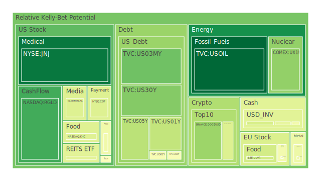
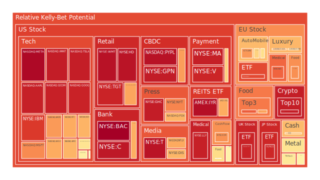
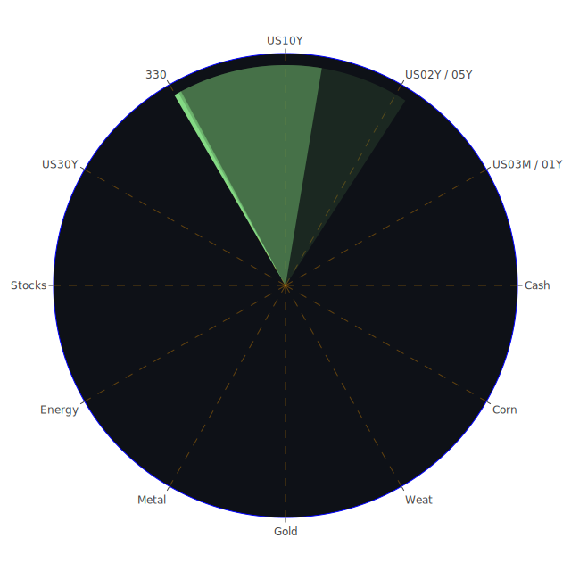

# 投資商品泡沫分析

## 美國國債

近期，美國國債利率出現波動，特別是在短期與長期利率之間。根據資料顯示，兩年期美國國債收益率持續在4%以上，而十年期國債收益率也維持在4.16%左右。這種收益率曲線的形狀暗示市場對未來經濟的不確定性增加。歷史上，當短期利率高於長期利率時，往往預示著經濟衰退的可能性增加。經濟學家認為，這種現象反映了投資者對未來經濟增長的悲觀預期。

從社會學角度來看，全球投資者對美國經濟政策的不確定性感到擔憂，特別是在美聯儲可能調整貨幣政策的背景下。心理學上，投資者的風險偏好降低，更傾向於資金的安全性，導致對國債的需求上升。博弈論角度，市場參與者觀察他人行為，選擇跟風購買國債，以避免個人損失。

## 美國零售股

美國零售股近期表現不一。像沃爾瑪（NYSE:WMT）等零售巨頭的泡沫分數高達0.95以上，顯示出投資者對其未來發展持樂觀態度。然而，這種高泡沫分數也暗示著股價可能被高估的風險。歷史上，零售業在經濟繁榮期表現出色，但在經濟下行時容易受到消費者信心下降的影響。

經濟學上，消費者支出的變化直接影響零售業績。社會學角度，消費行為受疫情後的社會心理影響，消費者可能更注重儲蓄而非消費。心理學上，通貨膨脹預期可能導致消費者提前購買，短期內提升零售業績。博弈論分析，零售商之間的競爭加劇，價格戰可能削弱利潤。

## 美國科技股

美國科技股持續受到市場關注。蘋果（NASDAQ:AAPL）、微軟（NASDAQ:MSFT）等科技巨頭的泡沫分數接近0.93或更高，顯示出投資過熱的跡象。歷史上，科技股在科技創新浪潮中往往表現突出，但同時也伴隨著高風險。

經濟學上，科技行業的高成長性吸引資本湧入，但也可能導致資源錯配。社會學角度，數位化轉型加速推動科技企業發展。心理學上，投資者對科技創新的憧憬可能導致投資決策過於樂觀。博弈論角度，科技企業之間的競爭激烈，新技術的出現可能迅速改變市場格局。

## 美國房地產指數

美國房地產指數近期呈現高位震盪。房地產ETF（AMEX:VNQ）的泡沫分數達到0.94以上，反映出市場對房地產投資的熱情。然而，歷史經驗顯示，房地產市場過熱時容易出現泡沫破裂的風險。

經濟學上，低利率環境刺激房地產市場，但一旦利率上升，可能對市場造成衝擊。社會學角度，城市化進程和人口增長推動住房需求。心理學上，對房價持續上漲的預期可能導致投資者忽視風險。博弈論分析，投資者之間的攀比心理可能推高房價。

## 加密貨幣

比特幣（BITSTAMP:BTCUSD）價格突破10萬美元，泡沫分數達到0.93以上。這種現象引發了市場對加密貨幣泡沫的擔憂。歷史上，加密貨幣價格的劇烈波動常常伴隨著市場情緒的極端化。

經濟學上，加密貨幣缺乏內在價值支撐，其價格主要由市場供需決定。社會學角度，加密貨幣的興起反映了對傳統金融體系的不信任。心理學上，投資者的追漲心理可能推動價格進一步上升。博弈論分析，市場參與者試圖在他人之前獲利出場，加劇了價格波動。

## 金/銀/銅

黃金（XAUUSD）、白銀（XAGUSD）和銅價格近期都有所上漲。黃金的泡沫分數約為0.54，銀為0.60，銅為0.45。歷史上，這些貴金屬在避險情緒升溫時受到青睞。

經濟學上，通貨膨脹預期和美元走弱推動貴金屬價格上漲。社會學角度，全球政治不確定性增加投資者避險需求。心理學上，對於經濟衰退的恐懼可能促使資金流向貴金屬。博弈論分析，投資者預期他人會購買貴金屬，因此提前布局。

## 黃豆 / 小麥 / 玉米

農產品如黃豆（AMEX:SOYB）、小麥（AMEX:WEAT）和玉米（AMEX:CORN）的泡沫分數分別為0.50、0.82和0.71。近期的氣候變化和地緣政治因素影響了農產品供應。

經濟學上，供需失衡導致價格波動。社會學角度，全球人口增長提高了對農產品的需求。心理學上，對於糧食短缺的擔憂可能推動價格上漲。博弈論分析，投資者可能預期價格上升，提前買入以獲取利潤。

## 石油/ 鈾期貨UX!

石油價格（TVC:USOIL）穩定在68美元左右，泡沫分數約為0.44，而鈾期貨（COMEX:UX1!）的泡沫分數約為0.26。近期的新聞顯示，OPEC+延遲增加產量計劃，加上地緣政治因素，影響石油供應。

經濟學上，供需變化直接影響能源價格。社會學角度，全球經濟復甦提升能源需求。心理學上，投資者對能源供應的不確定性感到擔憂。博弈論分析，主要產油國的策略影響市場預期。

## 各國外匯市場

美元兌主要貨幣匯率出現波動。歐元兌美元（EURUSD）匯率穩定在1.06左右，日元兌美元（USDJPY）匯率達到150以上。歷史上，匯率波動受央行政策和經濟基本面影響。

經濟學上，利率差異和經濟增長預期影響匯率。社會學角度，國際資本流動反映了投資者對各國經濟的信心。心理學上，市場情緒和避險需求推動資金流向美元或日元。博弈論分析，投資者預期央行政策調整，提前調整外匯頭寸。

## 各國大盤指數

全球主要股指表現分化。納斯達克指數（NASDAQ:NDX）泡沫分數約為0.68，顯示科技股可能存在高估風險。日經指數（JPN225）泡沫分數高達0.91，顯示投資者對日本市場的信心。

經濟學上，各國經濟復甦程度不同，導致股市表現差異。社會學角度，投資者對各國政治穩定性和政策走向有不同看法。心理學上，市場情緒和投資者偏好影響資金流向。博弈論分析，投資者根據他人行為調整投資策略。

## 美國半導體股

美國半導體企業如英特爾（NASDAQ:INTC）、高通（NASDAQ:QCOM）等的泡沫分數較高，分別為0.70和0.93。全球晶片短缺問題仍未完全解決，供需失衡可能推高股價。

經濟學上，供應鏈問題導致生產成本上升。社會學角度，數位化轉型提高了半導體需求。心理學上，投資者預期行業前景良好，紛紛入場。博弈論分析，企業之間的競爭和創新速度影響市場佔有率。

## 美國銀行股

美國銀行股如摩根大通（NYSE:JPM）、花旗集團（NYSE:C）等的泡沫分數接近0.95或更高。隨著利率走高，銀行利差收入可能增加，但同時也面臨貸款風險上升的挑戰。

經濟學上，經濟周期影響銀行業績。社會學角度，消費者貸款需求和儲蓄行為改變銀行業務模式。心理學上，投資者對經濟復甦的信心影響銀行股價。博弈論分析，銀行之間的競爭和風控能力至關重要。

## 美國軍工股

軍工企業如洛克希德馬丁（NYSE:LMT）、雷神科技（NYSE:RTX）的泡沫分數約為0.54，顯示市場對國防工業的穩定性預期。國際局勢緊張可能推動國防開支增加。

經濟學上，政府開支對軍工行業影響巨大。社會學角度，安全需求提升國防預算。心理學上，投資者將軍工股視為防禦性資產。博弈論分析，國際競爭和技術研發決定企業地位。

## 美國電子支付股

電子支付企業如Visa（NYSE:V）、PayPal（NASDAQ:PYPL）的泡沫分數接近0.96或更高。數位支付的普及推動了這些企業的發展，但同時也面臨監管和競爭的挑戰。

經濟學上，支付市場的擴張帶來收益增長。社會學角度，消費者支付習慣的轉變。心理學上，投資者對科技金融的熱情可能導致估值過高。博弈論分析，新進入者和技術創新影響市場格局。

## 美國藥商股

製藥企業如默克（NYSE:MRK）、禮來（NYSE:LLY）的泡沫分數約為0.50至0.93不等。新藥研發進展和專利問題對股價影響重大。

經濟學上，研發投入與回報的不確定性。社會學角度，人口老齡化提高醫療需求。心理學上，投資者對新療法的期望。博弈論分析，企業之間的研發競爭和專利戰。

## 美國影視股

迪士尼（NYSE:DIS）等影視企業的泡沫分數約為0.68，顯示市場對其未來增長持謹慎態度。流媒體競爭加劇，傳統媒體面臨轉型壓力。

經濟學上，營收來源多元化的重要性。社會學角度，受眾消費習慣的改變。心理學上，投資者對內容創新的期待。博弈論分析，平台之間的內容競爭和版權爭奪。

## 美國媒體股

康卡斯特（NASDAQ:CMCSA）、紐約時報（NYSE:NYT）等媒體企業的泡沫分數約為0.45至0.76。媒體行業面臨數位化挑戰，廣告收入模式轉變。

經濟學上，數位廣告市場的競爭。社會學角度，資訊獲取途徑的變化。心理學上，讀者忠誠度影響媒體影響力。博弈論分析，新興媒體與傳統媒體之間的競爭。

## 石油防禦股

埃克森美孚（NYSE:XOM）等石油企業的泡沫分數約為0.74。能源轉型和環保壓力對傳統石油企業提出挑戰。

經濟學上，油價波動直接影響企業收益。社會學角度，環保意識提升影響能源消費結構。心理學上，投資者對於傳統能源的信心減弱。博弈論分析，可再生能源企業的崛起帶來競爭。

## 金礦防禦股

金礦企業如Royal Gold（NASDAQ:RGLD）的泡沫分數約為0.15，偏低的泡沫分數顯示市場對其評價較為保守。

經濟學上，金價上漲有助於提升金礦企業收益。社會學角度，避險需求促進黃金投資。心理學上，投資者可能認為金礦企業具有防禦性。博弈論分析，金礦企業之間的產能競爭。

## 歐洲奢侈品股

LVMH（EURONEXT:MC）、愛馬仕（EURONEXT:RMS）等奢侈品企業的泡沫分數約為0.50至0.65，顯示市場對其未來發展持謹慎樂觀態度。

經濟學上，消費升級推動奢侈品需求。社會學角度，文化影響和品牌認同。心理學上，消費者的炫耀性消費。博弈論分析，奢侈品市場的品牌競爭。

## 歐洲汽車股

寶馬（XETR:BMW）、賓士（XETR:MBG）等汽車企業的泡沫分數約為0.62至0.73。電動化轉型和市場競爭加劇對傳統汽車企業帶來挑戰。

經濟學上，研發投入和市場需求的不確定性。社會學角度，環保意識提升促進新能源車需求。心理學上，消費者品牌忠誠度。博弈論分析，企業之間的技術競賽。

## 歐美食品股

雀巢（SIX:NESN）、可口可樂（NYSE:KO）等食品飲料企業的泡沫分數約為0.40至0.74。消費者健康意識提升可能影響傳統食品企業。

經濟學上，食品行業的穩定需求。社會學角度，飲食習慣的變化。心理學上，品牌形象對消費者選擇的影響。博弈論分析，市場份額的爭奪。

# 宏觀經濟傳導路徑分析

全球經濟正處於周期性的轉折點。美聯儲的貨幣政策調整、通貨膨脹預期、地緣政治風險等因素共同影響著資本市場。利率的變動直接影響國債收益率，並進一步影響企業融資成本和投資者風險偏好。能源價格的波動通過生產成本影響整體經濟活動。外匯市場的波動反映了投資者對各國經濟前景的預期，進而影響國際資本流動。

# 微觀經濟傳導路徑分析

企業層面，供應鏈問題、技術創新、消費者行為變化等因素影響著企業的盈利能力和市場地位。科技企業的創新能力、製造企業的成本控制、服務企業的客戶滿意度，都在決定企業的競爭優勢。投資者對企業的預期和評價，反映在股價和泡沫分數上。

# 資產類別間傳導路徑分析

不同資產之間存在著相互影響的關係。股票市場與債券市場的資金流動，反映了投資者的風險偏好轉變。貴金屬價格與匯率之間存在避險需求的互動。能源價格影響相關行業的盈利，進而影響股價表現。農產品價格波動可能影響通貨膨脹預期，進而影響貨幣政策。

# 投資建議

在當前環境下，建議投資者採取穩健、成長和高風險三種策略的最佳化配置。

- **穩健配置（50%）**：
  - 美國國債：作為避險資產，推薦適度配置。
  - 黃金：避險需求下的防禦性資產。
  - 藥商股：如默克，業績穩定，抗周期性強。

- **成長配置（30%）**：
  - 美國科技股：如微軟，具有長期成長性。
  - 歐洲奢侈品股：受益於消費升級。
  - 半導體股：供需失衡下的長期投資機會。

- **高風險配置（20%）**：
  - 加密貨幣：比特幣等高波動資產，適合風險承受能力高的投資者。
  - 能源股：石油價格波動帶來的投機機會。
  - 新興市場股票：高回報伴隨高風險。

# 風險提示

投資有風險，市場總是充滿不確定性。我們的建議僅供參考，投資者應根據自身的風險承受能力和投資目標，做出獨立的投資決策。在當前環境下，應特別關注市場可能存在的泡沫風險，高估的資產價格可能隨時調整。除了關注潛在收益，也要重視風險管理，避免因市場波動而造成的損失。
 
Daily Buy Map:

 
Daily Sell Map:

 
Daily Radar Chart:

 
