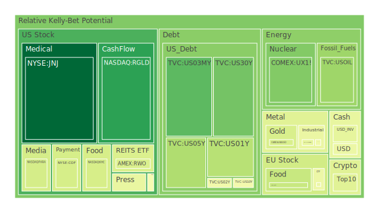
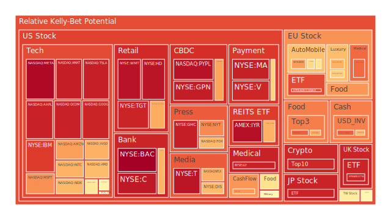
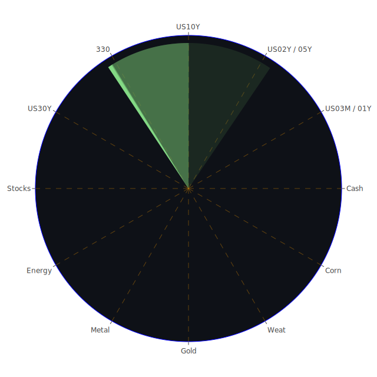

# 投資商品泡沫分析

## 美國國債

近期美國國債收益率出現波動，依據資料顯示，10年期國債收益率從上週的4.25%降至本週的4.16%，較上月的4.28%和去年同期的3.83%有所下降。這反映出市場對未來經濟走勢的不確定性增強，投資者對避險資產的需求增加。

從經濟學角度來看，隨著美國聯邦準備理事會可能的降息預期，國債收益率呈下降趨勢。歷史上，當經濟前景不明朗或預期利率下降時，國債通常成為資金避風港。比如2008年金融危機期間，投資者大量湧入國債市場，推高其價格，壓低收益率。

然而，需注意的是，若過多資金湧入國債市場，可能形成價格泡沫。一旦市場情緒逆轉，資金撤出，國債價格可能面臨下跌風險。

## 美國零售股

近期美國零售業受到消費者信心下降的影響。據新聞報導，亞馬遜因快遞服務問題被消費者起訴，這可能影響其品牌形象和股價表現。歷史上，零售業在經濟衰退或消費者信心低迷時期往往表現不佳，如2001年和2008年經濟衰退期間。

心理學上，消費者行為受情緒影響，若對未來經濟不樂觀，可能削減消費支出，進而影響零售企業的業績。

## 美國科技股

科技股近期表現強勁，然而，Intel缺乏明確計劃導致華爾街對其前景更加悲觀。另一方面，谷歌因支付部門被監管機構監管，正面臨法律挑戰。歷史上，科技股曾在2000年互聯網泡沫破裂時遭受重創。投資者需警惕科技股可能存在的高估值風險。

## 美國房地產指數

房地產市場受利率和經濟前景影響顯著。目前固定抵押貸款30年利率為6.69%，較去年同期的2.67%大幅上升。高利率可能抑制房地產需求，使房價面臨下行壓力。回顧2008年房地產泡沫破裂的教訓，高槓桿和高估值的房地產市場存在風險。

## 加密貨幣

比特幣價格持續上漲，預計突破10萬美元大關。然而，加密貨幣市場歷來波動性高，受市場情緒和監管政策影響巨大。近日，有關比特幣價格將達到10萬美元的新聞引發市場熱議，但投資者需謹慎對待過度樂觀的預期。

## 金/銀/銅

黃金價格穩定在2631美元附近，受到避險需求支撐。金銀銅比率的變化反映出市場對不同金屬的需求變化。歷史上，當經濟不確定性增加時，黃金作為避險資產的需求上升，如2008年和2020年全球經濟動盪期間。

## 黃豆 / 小麥 / 玉米

農產品價格受到供需關係和天氣因素影響。近期，鳥類流感的爆發導致美國農業部要求全國範圍內對牛奶進行檢測，可能影響農產品供應。歷史上，極端天氣事件曾導致農產品價格大幅波動，如2012年美國旱災期間。

## 石油/ 鈾期貨UX!

油價近期下跌至三週低點，原因是沙特阿拉伯下調石油價格，信號顯示未來需求疲軟。歷史上，石油市場受地緣政治和供需影響巨大。例如，2014年油價暴跌是由於供過於求和全球經濟增速放緩。

鈾期貨價格則受到能源政策和核電需求影響。現代社會對清潔能源的需求可能推動核能發展，進而影響鈾的需求和價格。

## 各國外匯市場

美元指數近期上漲，但受到未來美聯儲可能降息的預期影響。歐元因法國和德國的政治不穩定而承壓。日元則受日本央行貨幣政策影響。歷史上，外匯市場受各國經濟政策和全球事件影響，如1997年亞洲金融危機對亞洲貨幣的衝擊。

## 各國大盤指數

全球股市表現分化。歐洲股市受到法國和德國政治動盪的影響，投資者信心受挫。新興市場貨幣如人民幣和歐元下跌，可能導致新興市場股市資金外流。歷史上，政治不穩定往往對股市造成負面影響，如2016年英國脫歐公投導致的市場波動。

## 美國半導體股

半導體行業面臨供應鏈挑戰和市場需求變化。Intel因缺乏明確計劃，市場對其前景持悲觀態度。另一方面，AMD和NVIDIA等企業在人工智慧和高性能運算領域具有優勢。歷史上，半導體行業具有周期性，需關注市場需求和技術革新。

## 美國銀行股

銀行業受到利率變化和經濟環境影響。目前，美國銀行收益率曲線倒掛，可能對銀行盈利能力造成壓力。歷史上，收益率曲線倒掛被視為經濟衰退的前兆，銀行股可能面臨盈利下滑風險。

## 美國軍工股

地緣政治緊張局勢可能推動軍工企業需求增加。如近期美國宣佈向烏克蘭提供9.88億美元的武器裝備。歷史上，軍工股在戰爭或衝突期間表現相對強勢，但也需關注政策和預算變化對行業的影響。

## 美國電子支付股

電子支付行業受科技發展和消費者習慣改變推動。然而，谷歌支付被美國消費者金融保護局納入監管，可能對行業帶來挑戰。歷史上，金融科技行業在監管變化時期經常面臨不確定性，如2008年金融危機後的監管加強。

## 美國藥商股

醫藥行業受政策、研發進展和社會需求影響。近期，有關聯合健康CEO被射殺的新聞，引發市場對醫療行業的關注。歷史上，醫藥股在醫療改革或重大疫情期間受到市場青睞，如2020年新冠疫情期間。

## 美國影視股

影視行業受到消費者娛樂支出和內容供給影響。近期，迪士尼等公司可能受到消費者信心下降的影響。歷史上，經濟衰退時期，影視娛樂支出可能減少，但也有“口紅效應”支撐，如2008年經濟危機期間。

## 美國媒體股

媒體行業受廣告收入和用戶流量影響。近期，Meta（Facebook）推出新模型，可能對市場產生影響。歷史上，媒體公司在技術革命和消費習慣改變時期面臨挑戰和機遇，如互聯網興起對傳統媒體的衝擊。

## 石油防禦股

能源企業受到油價波動影響。近期油價下跌可能對石油企業盈利造成壓力。然而，地緣政治風險和供應中斷可能支撐油價。歷史上，石油股在油價上漲期間表現良好，如1970年代的石油危機。

## 金礦防禦股

金礦企業受金價影響顯著。當市場避險情緒上升時，金價上漲，金礦企業收益增加。歷史上，金礦股在金融動盪時期表現突出，如2008年金融危機及2020年疫情期間。

## 歐洲奢侈品股

歐洲奢侈品行業受到全球消費需求和經濟環境影響。近期，歐洲政治動盪可能影響消費者信心。歷史上，奢侈品需求在經濟繁榮時期增長，而在衰退期間下降。

## 歐洲汽車股

歐洲汽車製造商面臨電動化轉型和市場競爭壓力。近期，德國汽車行業可能受到經濟放緩和政策變化影響。歷史上，汽車行業具有周期性，受全球經濟和技術革新影響。

## 歐美食品股

食品行業相對穩定，但也受供應鏈和原材料價格影響。近期，農業部對牛奶進行檢測的措施可能影響食品行業供應。歷史上，食品股在經濟衰退期間表現相對穩健，但需關注成本壓力。

# 宏觀經濟傳導路徑分析

目前，全球經濟面臨多重挑戰。美國聯邦準備理事會可能的降息預期影響資產價格和全球資金流動。歐洲政治動盪可能削弱投資者信心，導致資金從風險資產轉向避險資產，如黃金和美國國債。

外匯市場的波動反映出投資者對全球經濟前景的擔憂，美元的走強可能對新興市場資產造成壓力。石油價格的下跌反映出對未來需求疲軟的預期，可能進一步影響能源相關產業。

# 微觀經濟傳導路徑分析

企業層面，供應鏈問題和成本上升可能壓縮企業利潤。消費者信心下降可能導致消費支出減少，影響零售、服務和娛樂行業。科技企業面臨監管挑戰，可能影響其增長前景。

銀行業受到利率變化影響，收益率曲線倒掛可能壓縮利差，影響銀行盈利。企業債務水平上升，若金融環境緊縮，可能增加違約風險。

# 資產類別間傳導路徑分析

不同資產類別之間存在相互影響。避險資產如黃金和國債的需求上升，可能反映出投資者對風險資產的警惕。股市與債市之間的資金流動反映出對經濟前景的預期。

外匯市場的波動可能影響進出口企業的盈利能力，進而影響股市表現。原材料價格的變化影響生產成本和企業盈利，傳導至股市和債市。

# 投資建議

面對當前複雜的市場環境，投資者應保持謹慎，根據自身風險承受能力進行資產配置。考慮到市場不確定性，適度增加避險資產的配置比例，關注黃金和高品質債券。

在穩健配置中，可關注防禦性行業，如必需消費品和醫療保健行業。成長性投資可關注具有技術創新和市場領先地位的科技企業，但需警惕高估值風險。

高風險投資應審慎對待，如加密貨幣和高槓桿產品，投資者應充分認識其波動性和風險。

# 風險提示

投資有風險，市場總是充滿不確定性。我們的分析僅供參考，投資者應根據自身的風險承受能力和投資目標，做出獨立的投資決策。
 
Daily Buy Map:

 
Daily Sell Map:

 
Daily Radar Chart:

 
