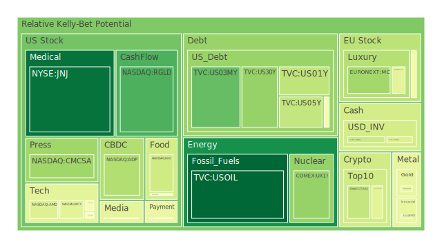
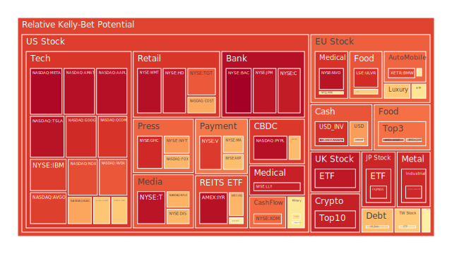
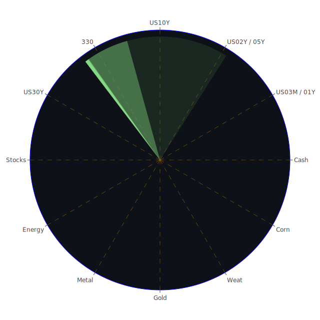

# 投資商品泡沫分析

- **美國國債**

近期美國國債收益率略有波動，10年期國債收益率維持在4.20%左右。聯準會（FED）關鍵數據顯示，聯邦準備資產處於相對低位，但逆回購協議（RRP）降低，顯示市場流動性充裕。歷史上，當美國國債收益率上升時，對股市可能產生壓力。當前宏觀經濟環境和地緣政治風險增加，投資者對避險資產的需求可能提升美國國債的吸引力。

- **美國零售股**

近期美國消費者支出有所放緩，迪士尼CFO對主題公園提價表示「舒適」，但警告環球影城的競爭可能帶來「負面」影響。歷史上，零售股在經濟不確定時表現不佳。投資者應關注消費者信心和就業數據對零售業的影響。

- **美國科技股**

科技股近期出現回調，甲骨文（Oracle）收益不及預期，股價下跌。晶片製造商如超微（AMD）因競爭風險被下調評級。歷史上，高估值的科技股在市場波動時易受衝擊。投資者應警惕科技股的泡沫風險。

- **美國房地產指數**

美國30年期固定抵押貸款利率維持在6.69%，較此前有所上升。高利率可能抑制房地產市場需求。歷史上，高利率環境下房地產市場增長放緩。投資者需關注利率走勢對房地產市場的影響。

- **加密貨幣**

比特幣價格接近97,605美元，近期MicroStrategy增持比特幣，顯示機構對加密貨幣的興趣。然而，年輕勞動力希望以加密貨幣支付薪資，可能加劇市場波動。加密貨幣市場波動性高，投資者需謹慎考慮風險。

- **金/銀/銅**

黃金價格上漲，中國恢復購買且敘利亞局勢提升避險需求。黃金/銅比例達到624.68，顯示市場對避險資產需求增加。歷史上，地緣政治不穩定時，貴金屬價格往往上升。

- **黃豆 / 小麥 / 玉米**

農產品價格波動，玉米和小麥的泡沫指數較高。需關注全球氣候變化和供需狀況對農產品價格的影響。

- **石油/鈾期貨**

油價近期持續下跌，因沙特阿拉伯下調油價，顯示市場需求疲軟。鈾期貨價格受地緣政治影響，可能出現波動。

- **各國外匯市場**

美元指數波動，受美國經濟數據和政策影響。英鎊和歐元兌美元走勢需關注英國和歐洲經濟狀況。

- **各國大盤指數**

全球股市受到地緣政治和經濟數據影響。投資者應密切關注主要經濟體的政策變化和市場情緒。

# 宏觀經濟傳導路徑分析

全球經濟環境受到地緣政治事件、市場流動性和央行政策影響。聯準會可能的利率決策、通脹數據、公債收益率等因素共同影響資產價格。地緣政治風險如敘利亞局勢可能提高避險資產需求，影響黃金和美國國債。

# 微觀經濟傳導路徑分析

企業盈利預期、行業競爭態勢和市場情緒直接影響個股表現。科技行業競爭加劇，影響公司業績和股價。消費者行為變化對零售和服務業產生直接影響。

# 資產類別間傳導路徑分析

資產之間存在聯動關係。如股市下跌可能推動資金流向債券和黃金等避險資產。貨幣市場變動影響進出口和大宗商品價格。投資者應考慮資產之間的相關性進行配置。

# 投資建議

在當前市場環境下，建議投資者採取多元化配置：

- **穩健型（50%）**：配置美國國債、黃金、優質藍籌股。

- **成長型（30%）**：關注具有成長潛力的科技股、新興市場指數基金。

- **高風險型（20%）**：適度投資於加密貨幣、特殊主題基金或高收益債券。

# 風險提示

投資有風險，市場總是充滿不確定性。我們的建議僅供參考，投資者應根據自身的風險承受能力和投資目標，做出獨立的投資決策。
 
Daily Buy Map:

 
Daily Sell Map:

 
Daily Radar Chart:

 
