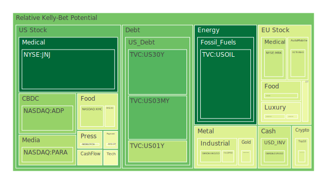
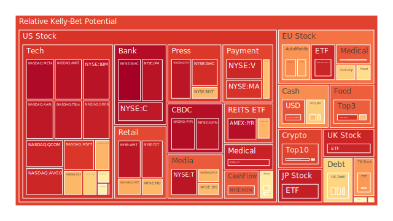
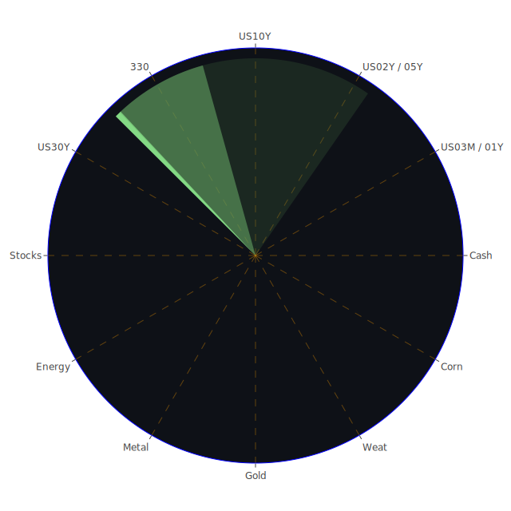

# 投資商品泡沫分析

## 美國國債

近期美國國債收益率呈現波動，特別是短期與長期收益率之間的利差有所變化。根據資料顯示，美國政府債券在不同期限的收益率有明顯差異。例如，1年期國債收益率為4.22%，而30年期國債收益率為4.42%。這種收益率曲線的趨勢可能預示著市場對未來經濟的不確定性增加。歷史上，當短期利率接近或超過長期利率時，通常被視為經濟衰退的前兆。

## 美國零售股

美國零售業近期受到多方面因素的影響，例如消費者信心指數的變化、通貨膨脹壓力以及供應鏈問題。沃爾瑪（NYSE:WMT）和科爾士（NYSE:KSS）等大型零售商的股價漲跌不一。儘管一些零售商報告了強勁的銷售數據，但整體行業仍面臨挑戰。歷史上，零售業在經濟衰退期間往往受到較大衝擊，因此投資者應謹慎評估風險。

## 美國科技股

科技股一直是推動美國股市的重要力量。近期，微軟（NASDAQ:MSFT）、蘋果（NASDAQ:AAPL）等科技巨頭的股價保持堅挺。然而，隨著市場對高估值的擔憂，以及對未來利率上升的預期，科技股可能面臨回調風險。回顧2000年的科技泡沫破裂，投資者應警惕高估值帶來的潛在風險。

## 美國房地產指數

美國房地產市場近期有所降溫，主要受益於抵押貸款利率的上升。資料顯示，30年期固定抵押貸款利率已達到6.69%，較去年同期的2.67%明顯上升。高利率可能抑制購房需求，進而影響房地產價格。回顧2008年的次貸危機，房地產市場的波動對整體經濟有深遠影響。

## 加密貨幣

比特幣（BTCUSD）近期價格波動較大，目前在97,000美元左右。以太坊（ETHUSD）價格則在3,600美元附近。加密貨幣市場受到多重因素影響，包括監管政策、技術發展以及市場情緒。歷史上，加密貨幣市場曾多次經歷大幅波動，投資者應警惕市場泡沫風險。

## 金/銀/銅

黃金價格近期持穩，在2,600美元/盎司以上。金銀比和金銅比等指標顯示，金屬市場可能存在估值過高的情況。歷史上，黃金被視為避險資產，但在市場情緒轉變時，價格可能出現劇烈波動。

## 黃豆 / 小麥 / 玉米

農產品價格近期受到氣候條件、供需關係等影響。黃豆（AMEX:SOYB）價格穩定在21美元左右。玉米（AMEX:CORN）價格則有上升趨勢。歷史上，農產品價格易受天災人禍影響，投資者需關注相關風險。

## 石油/ 鈾期貨UX!

油價近期有所反彈，布倫特原油（TVC:USOIL）價格在68美元/桶附近。這可能與產油國調整供給，以及地緣政治緊張有關。鈾期貨（COMEX:UX1!）價格也呈現上升趨勢，反映市場對核能需求的預期。

## 各國外匯市場

美元指數近期走弱，歐元、英鎊等主要貨幣兌美元匯率上升。這可能與美國經濟數據不及預期，以及市場對美聯儲貨幣政策的預期有關。外匯市場波動性增加，投資者需謹慎應對。

## 各國大盤指數

全球股市近期漲跌互現。美國納斯達克指數（NASDAQ:NDX）在21,000點以上徘徊，歐洲斯托克50指數（EURONEXT:MC）有所下滑。亞洲市場方面，日經225指數（FX:JPN225）表現穩健。地緣政治風險、經濟數據等因素共同影響市場走勢。

## 美國半導體股

半導體行業近期受到供應鏈壓力和市場需求變化的挑戰。英特爾（NASDAQ:INTC）、台積電（NYSE:TSM）等主要公司股價波動較大。歷史上，半導體行業具有周期性，市場需求的變化可能引發價格波動。

## 美國銀行股

銀行股近期受利率變化影響較大。摩根大通（NYSE:JPM）、花旗集團（NYSE:C）等大型銀行的股價受到市場情緒和經濟前景的影響。回顧金融危機期間，銀行股曾經出現大幅下跌，投資者需謹慎評估風險。

## 美國軍工股

軍工股如洛克希德馬丁（NYSE:LMT）、雷神科技（NYSE:RTX）等，近期表現穩定。地緣政治緊張局勢可能提升軍工企業的業績。然而，政策變化和預算調整可能對行業造成影響。

## 美國電子支付股

電子支付行業持續增長，Visa（NYSE:V）、PayPal（NASDAQ:PYPL）等公司持續拓展業務。然而，競爭加劇和監管政策可能對行業前景造成挑戰。

## 美國藥商股

製藥行業近期受到研發進展和政策影響。默克公司（NYSE:MRK）、禮來公司（NYSE:LLY）等企業的股價受到新藥研發成果的推動。疫情後的醫療需求變化也影響行業前景。

## 美國影視股

娛樂產業逐步恢復生機。迪士尼（NYSE:DIS）、奈飛（NASDAQ:NFLX）等公司的股價受到內容產出和用戶增長的影響。流媒體競爭加劇，市場份額之爭愈發激烈。

## 美國媒體股

媒體行業在數位化轉型中進行調整。康卡斯特（NASDAQ:CMCSA）、紐約時報（NYSE:NYT）等公司的業務模式受到挑戰。廣告收入和訂閱模式的變化是行業關注的焦點。

## 石油防禦股

能源行業的防禦性股票，如埃克森美孚（NYSE:XOM），在油價波動中表現相對穩定。能源需求的恢復和投資策略的調整影響公司業績。

## 金礦防禦股

隨著金價的波動，金礦企業如皇家黃金公司（NASDAQ:RGLD）的股價也受到影響。黃金作為避險資產，其價格走勢對相關公司有直接影響。

## 歐洲奢侈品股

歐洲奢侈品企業如路威酩軒（EURONEXT:MC）、開雲集團（EURONEXT:KER）近期股價波動加劇。全球經濟放緩和消費者信心下降可能影響奢侈品需求。

## 歐洲汽車股

德國汽車製造商如寶馬（XETR:BMW）、戴姆勒（XETR:MBG）面臨電動化轉型的壓力。市場競爭加劇、供應鏈挑戰以及環保政策推動行業變革。

## 歐美食品股

食品行業的龍頭企業如雀巢（SIX:NESN）、聯合利華（LSE:ULVR）在市場波動中展現出一定的防禦性。然而，原材料價格上漲和供應鏈問題可能對業績造成影響。

# 宏觀經濟傳導路徑分析

全球經濟正處於複雜的轉型期。美國聯邦儲備系統的貨幣政策調整，以及各國央行的利率決策，對全球資產價格產生深遠影響。高通脹壓力、供應鏈瓶頸、地緣政治風險等因素交織，導致市場波動性增加。從經濟學角度，資產價格的變動反映出資金在全球範圍內的配置和風險偏好轉變。

# 微觀經濟傳導路徑分析

企業層面，供應鏈管理、成本控制、技術創新等因素直接影響競爭力和盈利能力。企業間的博弈關係，市場佔有率的爭奪，反映在股價波動和市值變化中。從心理學角度，投資者的預期和情緒對市場走勢具有放大作用。

# 資產類別間傳導路徑分析

不同資產之間存在著複雜的關聯性。例如，當避險情緒上升時，資金可能從股市流向黃金等避險資產。同時，匯率變動也會影響跨國投資和資本流動。博弈論中的協調博弈和對策分析可以用來解釋市場參與者之間的動態互動。

# 投資建議

基於上述分析，建議投資者進行多元化的資產配置，以對沖風險。

**穩健型投資組合（50%）**

1. **美國國債（20%）**：作為低風險資產，美國國債可提供穩定的收益，同時對沖經濟下行風險。
2. **黃金（15%）**：黃金作為傳統避險資產，可在市場動盪時提供保值功能。
3. **高品質債券基金（15%）**：選擇投資級別的企業債券，獲取較穩定的收益。

**成長型投資組合（30%）**

1. **科技股（15%）**：關注具有增長潛力的科技企業，如微軟、蘋果，參與行業長期增長。
2. **半導體股（10%）**：受益於科技發展和數位化轉型，半導體行業具備長期成長潛力。
3. **新能源相關企業（5%）**：投資於清潔能源和電動汽車產業，布局未來發展。

**高風險投資組合（20%）**

1. **加密貨幣（10%）**：適度配置比特幣、以太坊等主流加密貨幣，捕捉高收益機會，但需警惕高波動風險。
2. **新興市場股票（5%）**：投資於經濟快速增長的新興市場，但需關注政治與經濟風險。
3. **初創科技企業（5%）**：參與具備創新能力的初創企業，尋求高回報，但風險較高。

# 風險提示

投資有風險，市場總是充滿不確定性。我們的建議僅供參考，投資者應根據自身的風險承受能力和投資目標，做出獨立的投資決策。
 
Daily Buy Map:

 
Daily Sell Map:

 
Daily Radar Chart:

 
