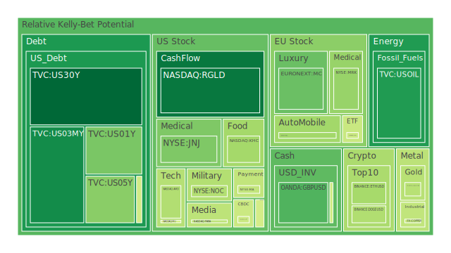
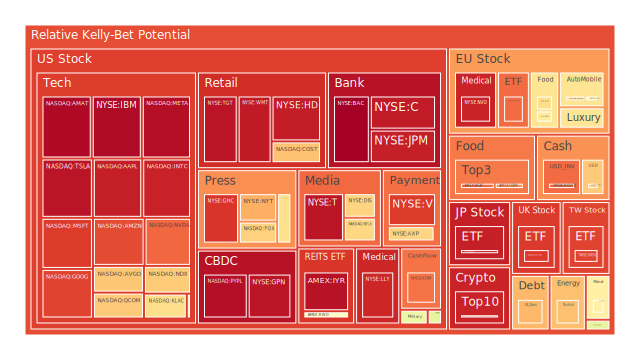
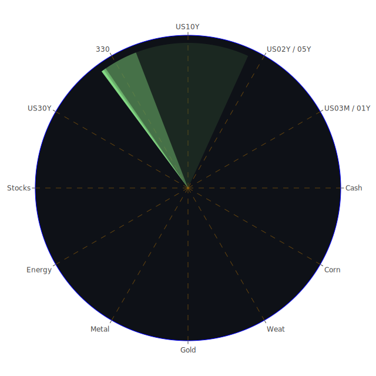

# 投資商品泡沫分析

## 美國國債

美國國債一直以來被視為全球最安全的投資之一。然而，近期的數據顯示，美國國債的泡沫風險正在逐漸增加。根據資料，2024年12月12日，美國10年期國債收益率（US10Y）為4.28%，而泡沫分數D1達到0.481763，較前一日的0.632356有所上升。這顯示市場對美國國債的需求可能正在減弱，收益率上升，價格下降。

在宏觀經濟層面，美國聯邦儲備銀行的資產負債表縮減，以及EFFR（有效聯邦基金利率）交易量的下降，可能對國債市場產生壓力。此外，聯邦公開市場委員會（FOMC）成員近期的鷹派言論增加了市場對利率上升的預期，進一步影響國債價格。

歷史上，在經濟不確定性增強時，投資者通常會轉向國債等避險資產。然而，目前的情況顯示，市場對國債的避險功能有所懷疑，可能是由於對未來通脹和利率上升的擔憂。

## 美國零售股

美國零售股近期表現波動。以沃爾瑪（NYSE:WMT）為例，2024年12月12日的價格為94.96美元，泡沫分數D1高達0.951320。這可能反映了市場對消費者支出的擔憂。近期的經濟數據顯示，消費者信心指數有所下降，可能影響零售業的盈利。

此外，新聞報導提到沃爾格林（Walgreens）正考慮被私募股權公司收購，這表明零售業正在經歷整合和轉型。歷史上，零售股在經濟放緩時期表現不佳，這需要投資者謹慎對待。

## 美國科技股

科技股一直是市場的焦點。近期，微軟（NASDAQ:MSFT）的價格達到448.99美元，泡沫分數D1為0.898729，顯示其估值可能偏高。新聞報導提到谷歌（Alphabet）推出新的量子計算芯片，引起市場關注。同時，特斯拉（NASDAQ:TSLA）計劃推出更便宜的車型，這可能刺激市場需求。

然而，科技股的高估值也伴隨著高風險。歷史上，科技股在市場調整時往往受到較大衝擊。投資者需要關注科技股的盈利能力和市場競爭格局。

## 美國房地產指數

美國房地產市場近期面臨挑戰。房地產指數ETF（AMEX:VNQ）價格為94.27美元，泡沫分數D1達到0.487054。隨著抵押貸款利率的上升，房屋需求可能下降。新聞報導顯示，美國固定抵押貸款30年期利率達到6.69%，較去年大幅上升。

歷史上，利率上升往往對房地產市場產生負面影響。投資者需要關注房價的變化和房地產市場的供需情況。

## 加密貨幣

比特幣（BTCUSD）價格達到100,848美元，泡沫分數D1為0.935484，顯示市場對加密貨幣的興趣依然高昂。新聞報導提到MicroStrategy再次購買比特幣，顯示企業對加密貨幣的信心。

然而，加密貨幣市場的波動性極高，受市場情緒影響巨大。歷史上，加密貨幣經歷多次大幅調整，投資者需要警惕市場風險。

## 金/銀/銅

黃金價格持續上升，XAUUSD價格達到2,721.64美元，泡沫分數D1為0.440876。市場對避險資產的需求可能上升。同時，銀和銅的價格也有增長。然而，黃金與石油價格比（GOLD OIL RATIO）達到38.68，顯示黃金相對於石油的價格較高，可能存在高估風險。

歷史上，貴金屬在經濟不確定性時期表現較好，但也需關注供需基本面。

## 黃豆 / 小麥 / 玉米

農產品價格近期波動較大。玉米ETF（AMEX:CORN）價格為18.48美元，泡沫分數D1為0.784924。新聞報導提到巴西農民游說取消亞馬遜雨林的大豆禁令，可能影響大豆供應。同時，全球氣候變化可能對農產品產量產生影響。

歷史上，農產品價格受天氣、供需等因素影響較大，風險不可忽視。

## 石油/ 鈾期貨UX!

石油價格持續上升，USOIL價格為70.33美元，泡沫分數D1為0.252238。中東地區的地緣政治風險可能推高油價。新聞報導提到以色列在敘利亞展開空襲，可能影響原油供應。

鈾期貨（COMEX:UX1!）價格為76.55美元，泡沫分數D1為0.716608。隨著全球對清潔能源的需求增加，鈾的需求可能上升。

歷史上，能源價格波動性大，受地緣政治和供需影響，需謹慎對待。

## 各國外匯市場

美元指數近期波動，美元兌日元（USDJPY）匯率為152.28，泡沫分數D1為0.699406。美聯儲的利率政策可能影響美元走勢。新聞報導提到美國債務水平上升，可能對美元產生壓力。

歷史上，外匯市場受國際貿易、利率差異等因素影響，波動性較大。

## 各國大盤指數

全球股市表現分化。納斯達克指數（NASDAQ:NDX）達到21,763.98點，泡沫分數D1為0.697868。市場對科技股的熱情推動指數上漲。

然而，歐洲股市受經濟放緩影響，表現相對疲軟。德國DAX指數（SPREADEX:GDAXI）泡沫分數D1為0.831858。

歷史上，全球市場聯動性強，投資者需關注宏觀經濟趨勢。

## 美國半導體股

半導體股近期備受關注。英偉達（NASDAQ:NVDA）價格為139.31美元，泡沫分數D1為0.838095。新聞報導顯示，中國對英偉達進行反壟斷調查，可能影響其業務。

同時，美國對中國的芯片限制政策可能影響半導體行業的供應鏈。

歷史上，半導體行業受政策、技術和市場需求影響，風險與機遇並存。

## 美國銀行股

美國銀行股表現穩定。摩根大通（NYSE:JPM）價格為243.53美元，泡沫分數D1為0.943261。美聯儲的利率政策可能影響銀行業的盈利能力。

新聞報導提到美國銀行業總存款量達到較高水平，顯示流動性充足。

歷史上，銀行業在經濟週期中表現敏感，需關注經濟指標和政策變化。

## 美國軍工股

軍工股近期表現良好。洛克希德·馬丁（NYSE:LMT）價格為504.24美元，泡沫分數D1為0.544683。全球地緣政治緊張局勢可能推動軍工行業需求。

新聞報導顯示，美國增強對烏克蘭的軍事支持，可能帶動軍工股上漲。

## 美國電子支付股

電子支付行業競爭激烈。Visa（NYSE:V）價格為313.79美元，泡沫分數D1為0.898070。新聞報導提到PayPal（NASDAQ:PYPL）價格為90.75美元，泡沫分數D1為0.970863，顯示市場對電子支付行業的信心。

然而，科技巨頭進入支付領域可能增加競爭壓力。

## 美國藥商股

醫藥股近期受到市場關注。默克（NYSE:MRK）價格為99.75美元，泡沫分數D1為0.394489。隨著全球衛生事件的發展，醫藥行業可能面臨新的挑戰和機遇。

新聞報導提到禮來公司（NYSE:LLY）批准150億美元的股票回購計劃，顯示公司對未來發展的信心。

## 美國影視股

奈飛（NASDAQ:NFLX）價格為936.56美元，泡沫分數D1為0.677112。串流媒體市場競爭激烈，但奈飛在內容和技術方面具有優勢。

新聞報導顯示，亞馬遜（NASDAQ:AMZN）簽署協議製作《戰鎚》宇宙，可能對影視行業產生影響。

## 美國媒體股

媒體股表現分化。新聞集團（NASDAQ:NWS）價格波動，市場對傳統媒體的關注度下降。但數字媒體的崛起為行業帶來新的機遇。

新聞報導提到Facebook母公司Meta（NASDAQ:META）股價上升，泡沫分數D1為0.970135，顯示市場對數字廣告業務的期待。

## 石油防禦股

隨著油價上升，石油防禦股可能受益。埃克森美孚（NYSE:XOM）價格為111.92美元，泡沫分數D1為0.821688。地緣政治風險和供需變化可能影響石油行業。

## 金礦防禦股

金礦股可能受益於金價上漲。投資者對避險資產的需求可能推動金礦公司的表現。

## 歐洲奢侈品股

歐洲奢侈品股近期表現良好。路易威登（EURONEXT:MC）價格為643.8歐元，泡沫分數D1為0.335142。中國市場的復甦可能帶動奢侈品需求。

## 歐洲汽車股

歐洲汽車股面臨挑戰。寶馬（XETR:BMW）價格為78.48歐元，泡沫分數D1為0.672846。新聞報導提到寶馬在墨西哥的銷售受到匯率和關稅的影響。

## 歐美食品股

食品股表現穩定。聯合利華（LSE:ULVR）價格為4,621英鎊，泡沫分數D1為0.663558。消費者對必需品的需求可能支撐食品行業。

# 宏觀經濟傳導路徑分析

全球經濟正處於複雜的轉型期。美國的貨幣政策、通脹預期和利率變化對全球資本流動產生重要影響。美聯儲的鷹派言論和資產負債表縮減可能導致流動性收緊。

新興市場可能面臨資本外流和貨幣貶值的壓力。中國經濟的刺激政策可能對大宗商品需求產生影響。

地緣政治風險增加，如中東局勢升級，可能影響能源供應，推動油價上升，進而影響全球通脹。

# 微觀經濟傳導路徑分析

企業層面，供應鏈中斷和成本上升可能影響盈利。科技企業面臨反壟斷調查和市場競爭壓力。

消費者需求的變化可能影響零售和汽車等行業。消費信心的下降可能導致支出減少。

# 資產類別間傳導路徑分析

避險資產如黃金和國債的需求可能上升，影響其價格和收益率。股票市場的波動性增加可能導致資金從高風險資產轉向穩健資產。

外匯市場的波動可能對跨國企業的盈利產生影響。大宗商品價格上升可能推高生產成本，影響消費者價格。

# 投資建議

根據當前的市場情況，建議投資者採取多元化的投資策略，以對沖風險。

## 穩健型（40%）

1. **美國國債**（15%）：作為避險資產，可抵禦市場波動。
2. **黃金**（15%）：對沖通脹和貨幣貶值風險。
3. **高級投資級別公司債券**（10%）：穩定的收益來源。

## 成長型（35%）

1. **科技股**（15%）：選擇具有創新能力和穩定盈利的公司。
2. **醫藥股**（10%）：受益於市場需求和研發突破。
3. **新能源板塊**（10%）：長期看好政策支持和市場需求。

## 高風險型（25%）

1. **加密貨幣**（10%）：高收益潛力，需控制倉位。
2. **新興市場股票**（10%）：可能受益於經濟復甦和資本流入。
3. **原油相關投資**（5%）：受供需和地緣政治影響，可謹慎介入。

# 風險提示

投資有風險，市場總是充滿不確定性。我們的建議僅供參考，投資者應根據自身的風險承受能力和投資目標，做出獨立的投資決策。

# 總結

當前市場充滿挑戰和機遇。全球經濟的不確定性增強，投資者需要保持警惕，關注宏觀和微觀經濟指標。多元化投資和風險對沖是當前環境下的適宜策略。建議投資者持續關注市場動態，調整投資組合，以實現最佳收益。
 
Daily Buy Map:

 
Daily Sell Map:

 
Daily Radar Chart:

 
