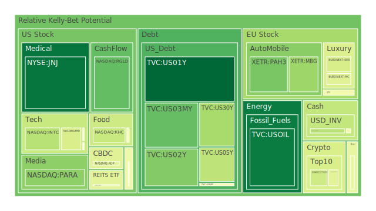
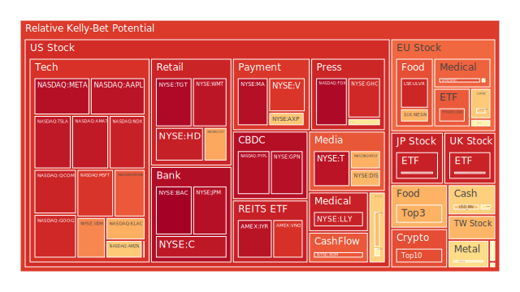
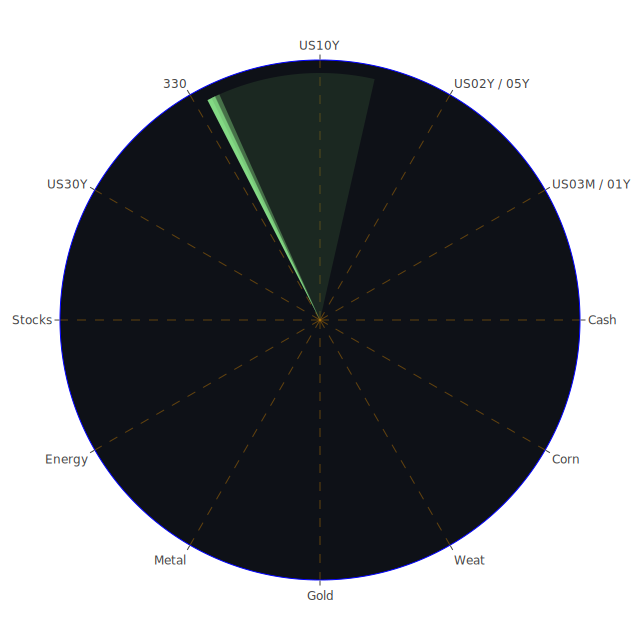

# 投資商品泡沫分析

## 美國國債

近期，美國國債收益率的波動引起市場廣泛關注。根據最新資料顯示，10年期國債收益率在日前達到4.34%，較上週有所上升。這種走勢反映了市場對未來利率走向的不確定性。

歷史上，美國國債一直被視為全球避險資產的風向標。當市場出現動盪時，投資者傾向於購買美國國債以尋求安全。然而，隨著聯邦儲備局（FED）持續縮減資產負債表，以及對未來加息的預期，美國國債的收益率可能持續上升。博弈論角度來看，投資者需在風險收益之間尋求平衡。

## 美國零售股

美國零售業近期面臨諸多挑戰。從新聞報導中可以看到，某些大型零售商的併購案被法院阻止，這對整個行業的整合產生影響。此外，消費者信心指數的波動，以及通貨膨脹對購買力的侵蝕，都對零售股的表現產生壓力。

歷史上，零售業受到經濟周期的影響顯著。經濟學上，當經濟繁榮時，消費者支出增加，零售業受益；反之亦然。因此，投資者需密切關注宏觀經濟指標，以及消費者行為的變化。

## 美國科技股

科技股一直是市場焦點。近期，有報導指出某些科技巨頭在人工智慧領域取得突破，這推動了股價上升。然而，也有科技公司的業績預期未達市場期望，導致股價下跌。

心理學角度來看，投資者對科技股的情緒波動較大，容易受到市場消息的影響。博弈論提示，在市場過度樂觀或悲觀時，逆向思維可能帶來機會。

## 美國房地產指數

美國房地產市場近來呈現出複雜的走勢。雖然固定利率30年期房貸利率有所下降，但整體房價仍處於高位。經濟學上，低利率通常推動房地產需求，但高房價可能抑制首次購房者的需求。

歷史上，房地產市場的泡沫破裂對經濟造成重大影響。因此，投資者需警惕可能的泡沫風險，並關注市場供需的基本面。

## 加密貨幣

加密貨幣市場波動劇烈。比特幣價格近期接近歷史高點，但市場對其未來走勢存在分歧。一方面，有報導稱特斯拉等大型企業持續關注加密貨幣；另一方面，監管風險始終存在。

從社會學角度，加密貨幣的接受度在提升，但仍未成為主流支付手段。投資者需謹慎評估風險，避免盲目追高。

## 金/銀/銅

貴金屬市場近期受到多重因素影響。黃金價格保持堅挺，主要受避險需求推動。銀和銅的需求則與工業生產密切相關。

經濟學上，當通脹預期上升時，黃金往往成為避險資產。此外，全球供應鏈的變動也影響了工業金屬的價格。投資者應關注全球經濟復甦進程，以及供需基本面的變化。

## 黃豆 / 小麥 / 玉米

農產品市場近期出現震盪。有報導稱，巴西農民遊說解除亞馬遜雨林的農業限制，可能增加農產品供應。然而，極端天氣和地緣政治風險可能對供應造成影響。

歷史上，農產品價格易受自然災害和政策變動的影響。博弈論提示，投資者應多元化投資，對沖單一風險。

## 石油/ 鈾期貨

石油價格近期受地緣政治因素影響，呈現波動。產油國的政策變化，以及全球經濟的增長預期，都對油價產生影響。鈾期貨則受核能需求和政策監管的影響。

投資者需關注國際能源市場的動態，以及可能的供需失衡。此外，新能源的興起也可能對傳統能源市場造成衝擊。

## 各國外匯市場

外匯市場波動加劇。美元指數有所回落，歐元和日元的走勢受到各自國內政策的影響。近期，日元製造業者的情緒轉為負面，可能對日元匯率造成壓力。

心理學角度，市場情緒對匯率的短期波動有重要影響。投資者應關注各國央行的政策導向，以及經濟數據的公佈。

## 各國大盤指數

全球股市呈現分化態勢。美國股市中的科技股推動了指數上升，而歐洲和亞洲市場表現相對平淡。新聞報導中的地緣政治風險和經濟政策可能對市場產生影響。

投資者需關注全球經濟的協同效應，以及市場間的相關性，尋找跨市場的投資機會。

## 美國半導體股

半導體行業持續受到關注。隨著人工智慧和5G的發展，對芯片的需求增長。然而，供應鏈瓶頸和地緣政治風險可能對行業造成挑戰。

歷史上，半導體行業具有周期性波動。投資者應關注行業龍頭企業的研發進展，以及市場需求的變化。

## 美國銀行股

銀行業近期面臨兩極化走勢。利率上升可能提升銀行的淨利息收入，但經濟前景的不確定性可能增加壞帳風險。

經濟學上，銀行業的健康與宏觀經濟密切相關。投資者需關注資產質量和資本充足率等關鍵指標。

## 美國軍工股

地緣政治動盪提升了對軍工企業的預期。新聞報導中的衝突事件可能推動國防支出增加。

社會學角度，軍工行業的發展與國家安全政策密不可分。投資者需關注政府預算和國際關係的走向。

## 美國電子支付股

電子支付行業競爭激烈。大型科技公司進入金融領域，傳統支付企業面臨挑戰。

歷史上，科技創新對支付行業有深遠影響。投資者應關注行業整合和新技術的應用。

## 美國藥商股

醫藥行業持續受到市場關注。新藥研發的進展，以及政策對藥價的影響，都是關鍵因素。

心理學上，市場對醫藥股的預期常受到個別事件的影響。投資者應評估企業的研發管線和市場佔有率。

## 美國影視股

影視行業在疫情後逐步恢復。但數位化轉型和串流媒體的興起對傳統影視企業構成挑戰。

投資者需關注行業的商業模式轉變，以及內容創作的競爭力。

## 美國媒體股

媒體行業面臨廣告收入下滑和觀眾分化的問題。新聞報導顯示，一些媒體公司的併購計劃受阻，增加了市場的不確定性。

博弈論角度，企業間的競爭與合作策略將影響行業格局。投資者應密切關注政策風險和市場動態。

## 石油防禦股

石油價格的波動對能源企業產生直接影響。防禦性石油股可能受益於市場不確定性。

投資者需評估企業的財務穩健性，以及對油價變動的敏感程度。

## 金礦防禦股

在市場動盪時，金礦股往往被視為避險資產。近期黃金價格的堅挺為金礦企業帶來機會。

歷史上，金礦股的表現與金價高度相關。投資者應關注生產成本和儲量等因素。

## 歐洲奢侈品股

歐洲奢侈品行業受全球消費者需求推動。新聞報導顯示，一些奢侈品企業在亞太地區業績亮眼。

社會學角度，消費觀念的轉變和新興市場的崛起對行業有深遠影響。投資者應關注品牌價值和市場拓展策略。

## 歐洲汽車股

汽車行業正經歷電動化和自動駕駛的轉型。政策支持和技術突破是行業發展的關鍵。

投資者需評估企業的研發投入，以及在全球市場的競爭力。

## 歐美食品股

食品行業具備防禦性。在經濟不確定時期，基本消費需求穩定。

歷史上，食品企業的股價波動相對較小。投資者可考慮其穩定的現金流和股息收益。

# 宏觀經濟傳導路徑分析

全球經濟正面臨多重挑戰。美聯儲的貨幣政策走向、地緣政治風險、供應鏈瓶頸以及通脹壓力，都對市場造成影響。貨幣政策的收緊可能導致資產價格下調，而地緣政治風險可能引發市場避險情緒。

經濟學上，宏觀政策的變化通過利率、匯率和資本流動等渠道影響市場。投資者需關注政策制定者的言行，預測可能的市場反應。

# 微觀經濟傳導路徑分析

企業的經營狀況受到市場供需、成本以及競爭環境的影響。近期，原材料價格的波動、勞動力成本的上升以及科技進步，都對企業利潤產生影響。

博弈論角度，企業需在競爭中尋求優勢地位，採取最優策略。投資者應關注企業的財務報表和經營策略。

# 資產類別間傳導路徑分析

不同資產之間存在著相關性。當股票市場波動時，避險資產如黃金可能受益。貨幣市場的變化也會影響國際資產的配置。投資組合的多元化有助於降低風險。

歷史經驗表明，資產之間的相關性在市場動盪時可能增強。投資者需動態調整資產配置，應對市場變化。

# 投資建議

根據以上分析，建議投資者考慮以下配置：

## 穩健型投資（50%）

- **美國國債**：作為避險資產，可穩定收益。
- **貴金屬（黃金）**：對沖通脹和市場風險。
- **食品行業股票**：具備防禦性，收益穩定。

## 成長型投資（30%）

- **美國科技股**：關注具備創新能力的企業，受益於技術進步。
- **半導體行業**：受人工智慧和5G推動，具有成長潛力。
- **新能源相關股票**：符合全球綠色發展趨勢。

## 高風險投資（20%）

- **加密貨幣**：市場波動大，可能帶來高收益，但風險高。
- **新興市場股票**：經濟增長迅速，但受政策和匯率風險影響。
- **農產品期貨**：受天氣和政策影響波動大，適合高風險承受者。

# 風險提示

投資有風險，市場總是充滿不確定性。我們的建議僅供參考，投資者應根據自身的風險承受能力和投資目標，做出獨立的投資決策。特別是在當前全球經濟形勢複雜多變的情況下，警惕市場可能存在的泡沫風險和黑天鵝事件。建議定期檢視投資組合，靈活應對市場變化。
 
Daily Buy Map:

 
Daily Sell Map:

 
Daily Radar Chart:

 
