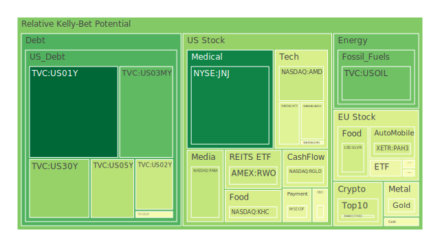
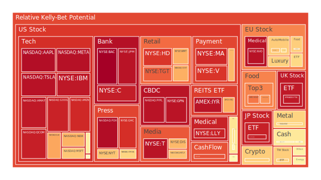
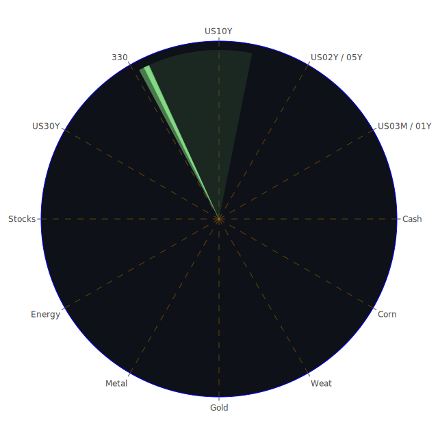

# 投資商品泡沫分析

## 美國國債

近期美國國債市場出現了一些值得關注的現象。根據資料，2024年12月14日，美國1年期國債（TVC:US01Y）的收益率為4.25%，較前一週的4.24%略有上升。短期國債收益率的上升，通常反映市場對於聯邦基金利率的預期變化。聯邦基金利率走勢的不確定性，使得投資者對於短期債券的需求發生變化。

從泡沫風險指數來看，1年期國債的當日風險分數（D1）為0.017996，七日平均（D7）為0.257573，顯示短期內風險有所增加。然而，14日和30日的平均風險分數分別為0.306447和0.375756，說明中長期風險仍處於可控範圍。

歷史上，美國國債市場曾多次受聯邦公開市場委員會（FOMC）決策影響。例如，2008年金融危機期間，為了刺激經濟，美聯儲大幅降低利率，導致國債收益率大幅下降。當前，市場對於未來利率走勢的不確定性，使得國債市場波動加劇。

## 美國零售股

美國零售業近期面臨多重挑戰。亞馬遜（NASDAQ:AMZN）股價在2024年12月14日報收於227.4600美元，泡沫風險分數D1達到0.915258，顯示出較高的風險水平。沃爾瑪（NYSE:WMT）則報收於94.2500美元，D1為0.700245，風險水平相對較低。

從消費者行為的角度，隨著通貨膨脹和利率上升，消費者可支配收入減少，可能導致零售業營收下滑。歷史上，經濟衰退時期零售業通常受到較大衝擊，例如2008年金融危機期間，多家零售商業績下滑。

近期新聞顯示，消費者信心指數有所下降，這可能進一步影響零售業的表現。此外，電子商務的競爭加劇，傳統零售商面臨轉型壓力。

## 美國科技股

科技股在2024年呈現出強勁的上升勢頭。納斯達克指數（NASDAQ:NDX）在12月14日達到21780.2500點。然而，泡沫風險分數D1達到0.694471，顯示市場對科技股可能存在過熱的擔憂。

蘋果（NASDAQ:AAPL）股價達到248.1300美元，D1為0.969738，風險極高。這可能反映了投資者對於科技巨頭過度樂觀的預期。歷史上，科技股在2000年網絡泡沫期間曾經出現過類似情況。

近期，人工智慧和雲計算等領域的快速發展推動了科技股的上漲。然而，高風險指數提示投資者需要謹慎，可能存在估值過高的風險。

## 美國房地產指數

美國房地產市場在近期顯示出一定的穩定性。AMEX房地產ETF（AMEX:VNQ）股價為93.8500美元，D1為0.701173，風險指數中等。然而，固定房貸30年利率達到6.60%，較去年2.66%有大幅上升，可能對房地產市場造成壓力。

歷史上，高利率通常會抑制房地產市場的活躍度。例如，1980年代高利率期間，房地產市場成交量明顯下降。當前，高房貸利率可能導致購房者觀望，進而影響房地產開發商的業績。

## 加密貨幣

比特幣（BITSTAMP:BTCUSD）價格在12月14日為101431.0000美元，D1風險分數為0.672646，風險處於較高水平。以太坊（BINANCE:ETHUSD）價格為3908.5200美元，D1為0.406608。

近期，加密貨幣市場受到全球監管趨嚴的影響。歷史上，加密貨幣市場波動性極高，例如2017年比特幣價格飆升後的暴跌。

新聞顯示，部分國家開始對加密貨幣交易進行限制，這可能抑制市場需求。同時，投資者對於加密貨幣的避險功能也存在爭議。

## 金/銀/銅

黃金（OANDA:XAUUSD）價格為2648.6800美元，D1風險分數為0.447027，風險相對溫和。白銀（OANDA:XAGUSD）價格為30.5600美元，D1為0.578766。銅（FX:COPPER）價格為4.1900美元，D1為0.655498。

黃金與石油的比率（GOLD OIL RATIO）為37.30，較上月的39.75有所下降。這可能反映出市場對於大宗商品價格的預期發生變化。

歷史上，貴金屬在市場動盪時期通常被視為避險資產。然而，目前風險分數顯示市場對於貴金屬的需求並未極度高漲。

## 黃豆 / 小麥 / 玉米

黃豆（AMEX:SOYB）價格為21.0800美元，D1風險分數為0.502229。小麥（AMEX:WEAT）價格為4.8200美元，D1為0.788882，風險較高。玉米（AMEX:CORN）價格為18.2600美元，D1為0.747394。

近期，全球農產品市場受到氣候變化和地緣政治因素的影響。巴西農民協會要求解除對亞馬遜雨林砍伐的黃豆禁令，可能引發環保團體的反對，進而影響市場供應。

歷史上，農產品價格受天氣、種植面積和政策等多重因素影響，波動性較大。高風險指數提示投資者需關注市場供需變化。

## 石油/ 鈾期貨UX!

石油（TVC:USOIL）價格為71.0200美元，D1風險分數為0.228481，風險相對較低。鈾期貨（COMEX:UX1!）價格為76.4000美元，D1為0.548457。

近期，國際油價受到供需因素和地緣政治緊張的影響。歷史上，石油價格受中東局勢、歐佩克決策等影響較大。

新聞報導稱，以色列與哈馬斯衝突加劇，可能對中東地區的石油供應產生影響。此外，新能源的興起也對傳統能源市場造成衝擊。

## 各國外匯市場

美元指數近期有所走強，美元對日元（OANDA:USDJPY）匯率為152.7200，D1風險分數為0.567774。歐元對美元（OANDA:EURUSD）匯率為1.0500，D1為0.588295。

美元走強可能與美聯儲的利率政策預期有關。高利率吸引資本流入美元資產，推動美元升值。

歷史上，美元升值對新興市場可能產生資本外流的壓力，投資者需關注匯率變動對全球資產配置的影響。

## 各國大盤指數

德國DAX指數（SPREADEX:GDAXI）報收於20412.9000點，D1風險分數為0.617086。法國CAC指數（FXOPEN:FCHI）為7405.3000點，D1為0.461682。

歐洲股市受到全球經濟放緩和能源危機的影響。近期，德國食品銀行削減援助，反映出經濟壓力。

歷史上，歐洲股市在經濟不確定性時期表現相對疲弱，投資者需關注宏觀經濟數據和政策走向。

## 美國半導體股

半導體產業近期表現強勁。台積電（NYSE:TSM）股價為200.9900美元，D1風險分數為0.515993。微軟（NASDAQ:MSFT）股價為447.2700美元，D1為0.654544。

全球對於芯片的需求持續增長，特別是在人工智慧和物聯網領域。歷史上，半導體周期具有波動性，供需失衡時價格可能大幅波動。

近期新聞顯示，芯片短缺問題有所緩解，但地緣政治風險可能影響供應鏈穩定。

## 美國銀行股

摩根大通（NYSE:JPM）股價為239.9400美元，D1風險分數為0.958264，高風險。美國銀行（NYSE:BAC）股價為45.6700美元，D1為0.997670，風險極高。

銀行業面臨利率風險和經濟衰退風險。高利率可能縮小淨利息差，經濟放緩則可能導致不良貸款增加。

歷史上，金融危機期間銀行股承受巨大壓力。近期需要關注貸款質量和資本充足率等指標。

## 美國軍工股

洛克希德·馬丁（NYSE:LMT）股價為494.6500美元，D1風險分數為0.544683。諾斯洛普·格拉曼（NYSE:NOC）股價為480.0000美元，D1為0.608026。

全球地緣政治緊張局勢提升了軍工股的關注度。歷史上，軍事衝突期間軍工股表現相對穩健。

近期新聞報導以色列與哈馬斯衝突升級，可能帶動軍工企業訂單增加。

## 美國電子支付股

維薩（NYSE:V）股價為314.7400美元，D1風險分數為0.893995。萬事達卡（NYSE:MA）股價為529.0000美元，D1為0.915793。

電子支付行業受益於數字化轉型，但也面臨競爭加劇和監管風險。歷史上，支付行業的技術變革可能導致市場格局重塑。

近期新聞顯示，有關區塊鏈和加密貨幣的應用可能對傳統支付系統產生影響。

## 美國藥商股

強生（NYSE:JNJ）股價為146.6200美元，D1風險分數為0.075006，風險較低。默克（NYSE:MRK）股價為102.0000美元，D1為0.493110。

醫藥行業相對防禦性較強，尤其在經濟不確定性時期。歷史上，醫藥股在金融危機期間表現相對穩定。

近期，美國食品藥品監督管理局（FDA）批准了一些新藥，有助於提升企業業績。

## 美國影視股

迪士尼（NYSE:DIS）股價為113.3400美元，D1風險分數為0.683070。Netflix（NASDAQ:NFLX）股價為918.8700美元，D1為0.662351。

影視行業受到消費者娛樂需求和競爭格局影響。流媒體平台之間的競爭加劇，可能影響市場份額。

歷史上，經濟衰退期間消費者娛樂支出可能減少，需要關注行業的變化。

## 美國媒體股

康卡斯特（NASDAQ:CMCSA）股價為39.9200美元，D1風險分數為0.626951。紐約時報公司（NYSE:NYT）股價為55.0700美元，D1為0.661177。

媒體行業正面臨數字化轉型的挑戰。廣告收入和訂閱模式的轉變，對傳統媒體造成壓力。

近期新聞顯示，媒體企業正在探索新的盈利模式，以適應市場變化。

## 石油防禦股

艾克森美孚（NYSE:XOM）股價為110.8400美元，D1風險分數為0.846377。石油價格的波動對於石油企業盈利具有直接影響。

歷史上，油價下跌時石油企業利潤受到擠壓。近期需要關注油價走勢和企業成本控制。

## 金礦防禦股

皇家黃金公司（NASDAQ:RGLD）股價為146.9300美元，D1風險分數為0.413234。金礦企業受金價影響明顯。

在市場動盪時期，黃金被視為避險資產，金礦企業可能受益。然而，需關注生產成本和政策風險。

## 歐洲奢侈品股

路易威登（EURONEXT:MC）股價為639.0000歐元，D1風險分數為0.491662。開雲集團（EURONEXT:KER）股價為244.0500歐元，D1為0.514223。

奢侈品行業受經濟景氣度和消費者信心影響。近期，全球經濟不確定性可能影響高端消費。

歷史上，經濟衰退期間奢侈品銷售可能減少，但品牌價值和市場定位使其具備一定抗風險能力。

## 歐洲汽車股

戴姆勒（XETR:MBG）股價為56.5300歐元，D1風險分數為0.665587。寶馬（XETR:BMW）股價為80.1600歐元，D1為0.613899。

汽車行業面臨電動化和自動駕駛的轉型壓力。近期，芯片短缺問題有所緩解，但需求不確定性仍然存在。

歷史上，汽車行業對經濟周期敏感，需關注全球經濟走勢和政策支持。

## 歐美食品股

雀巢（SIX:NESN）股價為75.1800瑞士法郎，D1風險分數為0.640115。聯合利華（LSE:ULVR）股價為4663.0000英鎊，D1為0.396097。

食品行業具備防禦性，在經濟下行時期消費需求相對穩定。近期，食品價格受到通貨膨脹影響，企業成本增加。

歷史上，食品企業通常具備較強的價格轉嫁能力，但也需關注消費者價格敏感度。

# 宏觀經濟傳導路徑分析

近期全球宏觀經濟形勢複雜。美國聯邦基金利率的不確定性影響國債收益率，進而影響全球資金流向。美元升值對新興市場資本外流產生壓力，可能引發金融市場波動。

商品價格的變動，如石油和農產品，受到供需和地緣政治因素影響，對通貨膨脹和經濟增長產生作用。

全球央行的貨幣政策取向，以及地緣政治風險，如中東衝突，對全球經濟產生深遠影響。

# 微觀經濟傳導路徑分析

企業的業績和風險指數受到行業競爭、成本結構和市場需求的影響。科技企業可能受益於技術創新，但高估值可能隱藏風險。傳統行業需要適應數字化轉型和市場變化。

消費者信心和行為直接影響零售、食品和奢侈品行業的表現。企業需要關注市場動態，調整策略以保持競爭力。

# 資產類別間傳導路徑分析

股市、債市和商品市場之間存在相互影響。例如，當股市風險上升時，資金可能流入債市和黃金等避險資產。

外匯市場的變動對跨國企業的盈利能力產生影響，匯率風險需要有效管理。

# 投資建議

基於上述分析，為投資者提供以下建議：

## 穩健型投資組合（50%）

1. **美國國債**（20%）：在市場不確定性時期，國債作為避險資產，有助於降低投資組合風險。

2. **黃金**（15%）：黃金具有避險功能，能夠在市場波動時提供保值作用。

3. **大型醫藥股**（15%）：如強生和默克，業務穩定，適合作為防禦性配置。

## 成長型投資組合（30%）

1. **美國科技股**（15%）：選擇估值合理、業績增長穩健的科技企業，如微軟。

2. **半導體股**（10%）：受益於科技發展，但需關注行業周期。

3. **新能源相關股**（5%）：新能源產業有長期成長潛力。

## 高風險型投資組合（20%）

1. **加密貨幣**（10%）：波動性高，適合風險承受能力強的投資者。

2. **新興市場股票**（5%）：高回報潛力，但需警惕匯率和政策風險。

3. **小型科技創新企業**（5%）：有潛在高增長可能，但風險較大。

# 風險提示

投資有風險，市場總是充滿不確定性。我們的建議僅供參考，投資者應根據自身的風險承受能力和投資目標，做出獨立的投資決策。
 
Daily Buy Map:

 
Daily Sell Map:

 
Daily Radar Chart:

 
