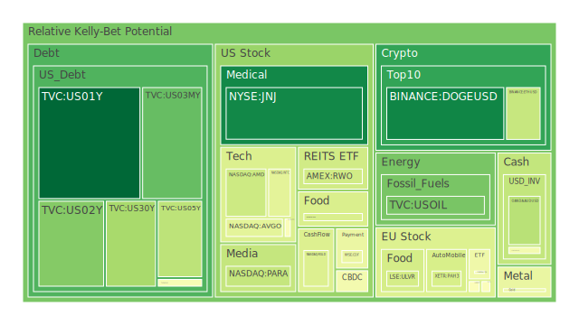
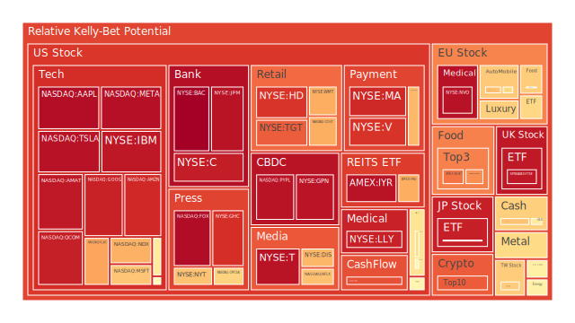
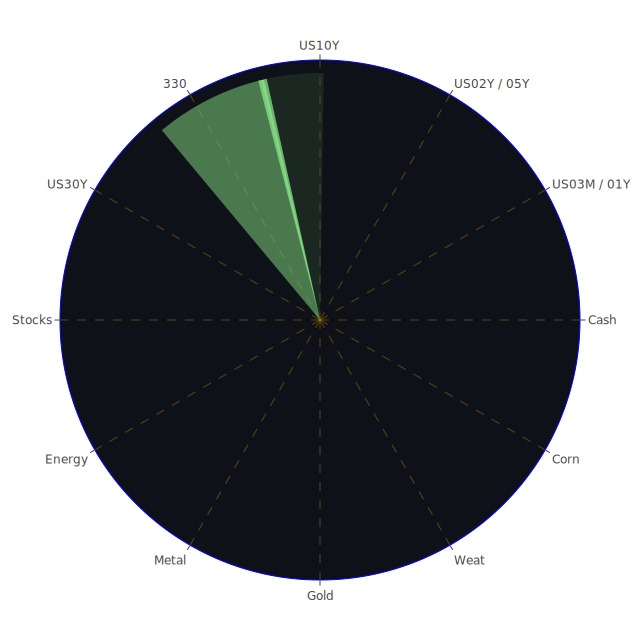

# 投資商品泡沫分析

## **美國國債**

近期美國國債收益率呈現穩定走勢，特別是短期國債，如1年期國債（符號：US01Y），其泡沫指數D1僅為0.008412，風險極低。這反映出市場對於美國經濟的信心，以及投資者對安全避風港的需求增加。歷史上，在市場不確定性增加時，國債常成為資金湧入的對象。如2008年金融危機期間，投資者大舉購買美國國債以避險。

## **美國零售股**

美國零售股如沃爾瑪（符號：WMT）等，近期泡沫指數D1達到0.952778，風險較高。然而，近期的新聞顯示消費者行為出現了意外轉變，可能對零售業產生影響。消費心理學告訴我們，經濟不確定性會抑制消費者支出。結合歷史，如2001年經濟衰退期間，零售業也曾面臨挑戰。

## **美國科技股**

科技巨頭如蘋果（符號：AAPL）和Meta（符號：META），泡沫指數D1分別為0.957521和0.966420，處於較高風險區域。近期市場對人工智慧的預期推動了科技股的上漲，但也帶來了高估值的風險。回顧2000年科技泡沫的經驗，過度的市場熱情可能導致股價脫離基本面。

## **美國房地產指數**

房地產相關ETF（符號：VNQ）泡沫指數D1為0.900189，風險偏高。儘管美國30年固定房貸利率有所下降，但仍處於6.60%的高位。經濟學理論指出，高利率會抑制房地產市場需求。歷史上，高利率時期常導致房地產市場降溫，如1980年代初期。

## **加密貨幣**

比特幣（符號：BTCUSD）價格持續攀升，泡沫指數D1達到0.852187。以太幣（符號：ETHUSD）亦有類似趨勢。近期新聞提到MicroStrategy因持有大量比特幣而被納入納斯達克100指數，這提升了市場熱情。然而，加密貨幣市場波動性高，風險不可忽視。歷史上，比特幣曾在2017年和2021年出現大幅波動。

## **金/銀/銅**

黃金（符號：XAUUSD）泡沫指數D1為0.447160，風險適中。銀（符號：XAGUSD）和銅（符號：COPPER）則風險較高。近期地緣政治不穩定，如俄烏衝突，再加上通貨膨脹預期，可能推動貴金屬需求增長。歷史上，在經濟不確定性時期，黃金常被視為保值工具。

## **黃豆 / 小麥 / 玉米**

農產品如黃豆（符號：SOYB）和玉米（符號：CORN）泡沫指數D1接近0.5至0.7，風險適中。近期全球氣候變化和供應鏈挑戰可能影響農產品價格。歷史上，如2010年俄羅斯小麥禁運事件，曾導致農產品價格飆升。

## **石油/ 鈾期貨UX!**

石油（符號：USOIL）泡沫指數D1為0.047553，風險較低。然而，石油市場受地緣政治影響較大，近期中東局勢緊張可能導致供應中斷。鈾期貨（符號：UX1!）風險指數適中，全球對清潔能源的需求增加，可能推動鈾需求。

## **各國外匯市場**

美元指數走強，美元對其他主要貨幣如歐元（EURUSD）和英鎊（GBPUSD）呈現上升趨勢。這可能反映出市場對美國經濟的信心增強，以及其他經濟體的不確定性增加。

## **各國大盤指數**

全球主要股指如納斯達克指數（符號：NDX）和德國DAX指數（符號：GDAXI），泡沫指數D1較高，投資者需謹慎。市場可能對經濟前景過於樂觀，忽視了潛在的風險。

## **美國半導體股**

半導體巨頭如英特爾（符號：INTC）和NVIDIA（符號：NVDA），泡沫指數分別為0.431583和0.565960。近期AI和科技需求推動了半導體需求增長。然而，供應鏈問題和地緣政治風險可能影響該行業。

## **美國銀行股**

大型銀行如摩根大通（符號：JPM），泡沫指數D1為0.958264，風險較高。利率走勢和經濟不確定性可能影響銀行業表現。心理學上，投資者對經濟衰退的恐懼可能導致銀行股承壓。

## **美國軍工股**

洛克希德馬丁（符號：LMT）等軍工股，泡沫指數D1為0.544683，風險適中。地緣政治緊張局勢可能提振軍工行業需求。然而，預算削減和國際關係變化也可能帶來風險。

## **美國電子支付股**

電子支付公司如Visa（符號：V）和PayPal（符號：PYPL），泡沫指數分別為0.893995和0.966846。市場對數字支付的需求持續增長，但競爭加劇和監管風險需關注。

## **美國藥商股**

強生（符號：JNJ）泡沫指數D1為0.075006，風險較低。新藥研發進展和健康需求增長可能推動藥商股上漲。歷史上，醫藥股在經濟低迷時期具有防禦性。

## **美國影視股**

迪士尼（符號：DIS）泡沫指數D1為0.683070，風險適中。疫情後的娛樂需求回升，但市場競爭和內容成本上升可能影響盈利。

## **美國媒體股**

新聞集團（符號：FOX）泡沫指數D1為0.980259，風險較高。媒體行業面臨數位化轉型和廣告收入下降的挑戰。

## **石油防禦股**

埃克森美孚（符號：XOM）泡沫指數D1為0.846377。石油價格波動和能源轉型趨勢可能影響該類股表現。

## **金礦防禦股**

皇家黃金公司（符號：RGLD）泡沫指數D1為0.413234，風險適中。市場對黃金的需求增長可能提升金礦股價值。

## **歐洲奢侈品股**

路威酩軒（符號：MC）和開云集團（符號：KER），泡沫指數分別為0.491662和0.514223。中國市場需求和全球經濟狀況將影響奢侈品行業。

## **歐洲汽車股**

德國汽車製造商如賓士（符號：MBG）和寶馬（符號：BMW），泡沫指數分別為0.665587和0.613899。電動化趨勢和供應鏈問題是關鍵影響因素。

## **歐美食品股**

雀巢（符號：NESN）泡沫指數D1為0.640115，風險適中。消費者行為變化和成本上升可能影響盈利能力。

# 宏觀經濟傳導路徑分析

當前全球經濟面臨多重挑戰，包括地緣政治緊張、通貨膨脹壓力和供應鏈中斷。高企的利率環境可能抑制投資和消費需求。央行政策走向和政府財政刺激措施將深刻影響資產價格。歷史上，政策轉向往往導致市場調整，如2008年全球金融危機期間，各國央行的寬鬆政策曾穩定市場。

# 微觀經濟傳導路徑分析

企業盈利能力、行業競爭和消費者行為是微觀層面的關鍵因素。科技進步和商業模式創新可能帶來機遇和挑戰。博弈論指出，企業間的競爭和合作策略將影響市場份額。心理學層面，消費者信心和投資者情緒也將左右市場走向。

# 資產類別間傳導路徑分析

資產價格之間存在相互影響。如美元指數上升可能壓低黃金價格，但也可能導致新興市場資本外流。股市和債市之間存在替代關係，當股市風險加劇時，資金可能流向債市。商品價格波動可能影響相關企業的盈利，如石油價格上漲利好能源企業，但可能加重製造業成本。

# 投資建議

在當前環境下，建議投資組合應平衡風險與收益，進行多元化配置。

## **穩健型（50%）**

1. **美國國債（20%）**：低風險的避險資產。
2. **強生（15%）**：穩定的醫藥行業龍頭。
3. **黃金（15%）**：對抗通脹和市場波動的保值資產。

## **成長型（30%）**

1. **美國科技股（10%）**：如微軟，具有長期增長潛力。
2. **半導體股（10%）**：如NVIDIA，受益於AI和科技需求。
3. **新能源相關股（10%）**：符合全球能源轉型趨勢。

## **高風險型（20%）**

1. **加密貨幣（10%）**：如比特幣，波動性高但回報潛力大。
2. **新興市場股（5%）**：可能受全球經濟復蘇帶動。
3. **小型科技創新股（5%）**：具有爆發性增長潛力。

# 風險提示

投資有風險，市場總是充滿不確定性。我們的建議僅供參考，投資者應根據自身的風險承受能力和投資目標，做出獨立的投資決策。特別是在高泡沫風險的市場中，更需謹慎行事，避免盲目跟風。
 
Daily Buy Map:

 
Daily Sell Map:

 
Daily Radar Chart:

 
