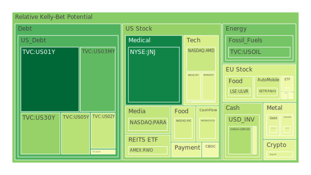
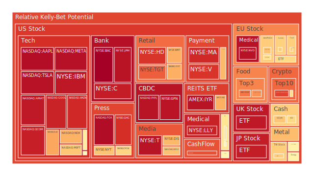
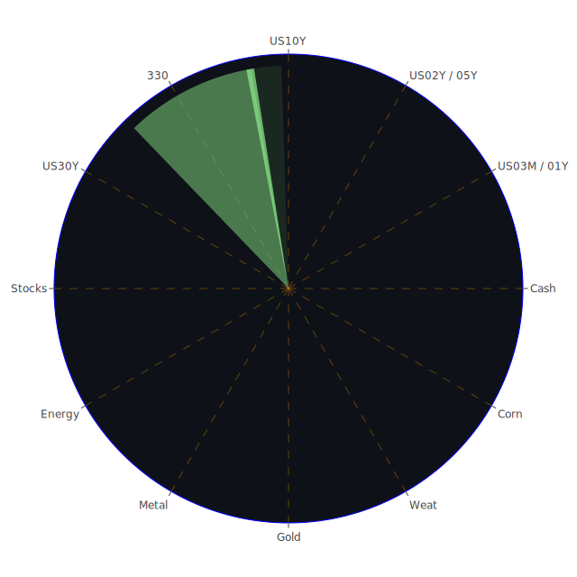

# 投資商品泡沫分析

## 美國國債

近期，美國國債收益率呈現波動，短期（一年期）國債收益率維持在4.25%左右，而長期（30年期）國債收益率則約為4.60%。這種收益率曲線的形狀顯示出市場對未來經濟的不確定性。從經濟學角度來看，收益率曲線倒掛可能預示著經濟衰退的風險。歷史上，這種現象常與經濟下行相伴。

社會學角度而言，投資者對於未來政策的不確定性，如聯儲局的貨幣政策走向，影響了對國債的需求。心理學上，市場對避險資產的偏好增加，導致長期國債需求上升。

然而，需警惕國債市場可能存在的泡沫風險。過度的避險情緒可能導致國債價格過高，一旦市場情緒反轉，可能會引發拋售壓力。

## 美國零售股

美國零售股近期表現平穩，但面臨消費者信心下降的挑戰。經濟學上，通貨膨脹對消費者購買力的侵蝕，以及網絡購物的興起，對傳統零售業造成壓力。

從社會學角度觀察，消費習慣的改變和年輕一代對線上購物的偏好，對零售股的未來增長構成挑戰。心理學上，消費者對於經濟前景的不確定性，可能減少非必要消費。

歷史上，零售業曾多次經歷轉型期，過度投資於傳統零售可能存在風險，需要關注泡沫的可能性。

## 美國科技股

美國科技股持續攀升，尤其是大型科技企業的股價屢創新高。經濟學上，科技行業的高增長和高盈利能力吸引大量資金流入。

然而，心理學上，市場對科技股的過度樂觀可能導致估值過高，形成泡沫。博弈論角度，投資者可能陷入「追高」的行為，以免錯過機會。

歷史上，2000年的科技泡沫破裂就是前車之鑑，投資者應謹慎評估風險。

## 美國房地產指數

房地產市場一直是經濟的風向標。近期，美國房地產指數顯示出增長放緩的跡象。利率的上升導致抵押貸款成本增加，抑制了購房需求。

從社會學角度，人口結構的變化和遠程工作的普及，影響了住房需求的地理分布。心理學上，購房者可能對未來房價走勢持觀望態度。

需要注意的是，過去房地產市場的過熱曾導致金融危機，泡沫風險不可忽視。

## 加密貨幣

加密貨幣市場波動劇烈，比特幣和以太幣等主要幣種價格近期上漲。經濟學上，供需的不平衡和對加密貨幣作為價值儲存手段的認可度提高推動了價格。

然而，心理學上，高波動性和投機行為使得市場風險加大。博弈論角度，投資者可能參與博傻遊戲，希望在價格更高時賣出。

歷史上，加密貨幣市場多次經歷大幅度的價格調整，投資者需警惕潛在的泡沫破裂風險。

## 金/銀/銅

貴金屬和工業金屬價格近期呈現不同走勢。黃金作為避險資產，價格穩步上升，銀和銅則受制於工業需求的波動。

經濟學上，通貨膨脹預期和貨幣政策影響金屬價格。心理學上，投資者對全球經濟前景的擔憂提升了對黃金的需求。

需關注金屬市場可能存在的泡沫，特別是在投機需求過高的情況下。

## 黃豆 / 小麥 / 玉米

農產品價格受到氣候變化和供需關係的影響。近期，供應鏈問題和極端天氣導致價格波動。

經濟學角度，供應減少和需求持續推高價格。社會學上，全球人口增長和飲食習慣改變影響需求。

需注意投資農產品的風險，包括價格波動和政策變化可能帶來的影響。

## 石油/ 鈾期貨

石油價格受地緣政治和供需關係影響。近期，主要產油國的政策和全球經濟復甦推動了價格。

鈾期貨受到能源政策和對核能需求的影響。經濟學上，新能源的興起可能壓制傳統能源價格。

投資者需關注市場的波動和潛在的泡沫風險。

## 各國外匯市場

匯率波動反映了各國經濟的強弱。近期，美元指數走強，歐元和日元走弱。

經濟學上，利率差異和經濟增長預期影響匯率。心理學上，市場情緒和避險需求也起到重要作用。

需警惕外匯市場的風險，包括政策干預和市場突發性波動。

## 各國大盤指數

全球股市表現分化。美股持續創新高，歐洲和亞太市場則表現平平。

經濟學上，各國的經濟基本面和貨幣政策影響股市表現。社會學上，投資者情緒和資金流動對市場有重大影響。

需注意高估值所帶來的泡沫風險，特別是在宏觀經濟不確定性增加的情況下。

## 美半導體股

半導體行業受益於科技需求增長，但也面臨供應鏈瓶頸。近期，相關股票表現強勁。

經濟學上，供需失衡推動價格和利潤上升。心理學上，市場對於行業前景的樂觀促進了投資。

然而，過度的樂觀可能導致估值過高，需警惕泡沫風險。

## 美國銀行股

銀行股近期表現穩健，受益於利率上升和經濟復甦。但也面臨貸款質量和監管風險。

經濟學上，利差擴大有利於銀行盈利。社會學上，消費者行為和信貸需求變化影響銀行業務。

需注意經濟下行可能對銀行資產質量的影響，避免高風險投資。

## 美國軍工股

地緣政治緊張局勢提高了軍工股的關注度。經濟學上，政府軍費開支是主要推動力。

歷史上，軍工股在動蕩時期表現突出。但也需關注政策變化和國際關係緩和可能帶來的風險。

## 美電子支付股

電子支付行業持續增長，受益於數字經濟和網絡購物的普及。

經濟學上，交易量和用戶增長是關鍵。心理學上，消費者習慣改變推動行業發展。

競爭加劇和監管風險可能對行業造成影響，需要警惕估值過高的風險。

## 美國藥商股

醫藥行業在疫情背景下呈現穩定增長。研發投入和新藥上市是主要驅動力。

經濟學上，人口老齡化和健康意識提升提升了醫藥需求。政策變化和專利風險需謹慎對待。

## 美國影視股

影視行業受到數字媒體和流媒體平台的挑戰。傳統電影公司面臨轉型壓力。

經濟學上，內容製作和版權收入是主要收入來源。社會學上，觀眾觀看習慣的改變影響行業。

投資者需關注行業整合和新技術帶來的機會與風險。

## 美國媒體股

媒體行業在數字化浪潮下重塑。廣告收入和訂閱模式的轉變對公司業績影響重大。

經濟學上，內容質量和用戶體驗是競爭關鍵。需警惕傳統媒體可能的衰退風險。

## 石油防禦股

能源行業存在不確定性。石油防禦股可能在市場動盪時期提供穩定回報。

經濟學上，能源價格和供需關係是關鍵因素。政策和環境趨勢可能影響長期前景。

## 金礦防禦股

金礦股與黃金價格密切相關，通常被視為避險投資。

經濟學上，通脹預期和貨幣政策影響黃金價格。需關注生產成本和地緣風險。

## 歐洲奢侈品股

歐洲奢侈品公司受益於全球高淨值人群的消費需求。但也面臨經濟波動和政策風險。

社會學上，文化和潮流對奢侈品需求有重要影響。需注意市場飽和和競爭加劇的風險。

## 歐洲汽車股

汽車行業正經歷電動化和智能化轉型。歐洲汽車股需要適應新趨勢。

經濟學上，研發投入和市場需求是關鍵。政策支持和環境法規對行業影響重大。

需警惕轉型中的不確定性和市場競爭。

## 歐美食品股

食品行業相對穩定，但面臨消費者健康意識提升和競爭壓力。

經濟學上，原材料成本和供應鏈管理是關鍵。社會學上，品牌形象和產品創新影響市場份額。

需注意市場飽和和消費者喜好變化帶來的挑戰。

# 宏觀經濟傳導路徑分析

全球經濟正處於復甦階段，但面臨通脹壓力和政策不確定性。聯儲局的貨幣政策走向影響全球資金流動。利率上升可能導致資本從新興市場流出，對全球股市和債市造成壓力。

地緣政治風險，如中美關係和地區衝突，可能影響能源價格和供應鏈安全。

# 微觀經濟傳導路徑分析

企業層面，供應鏈中斷和原材料成本上升影響盈利能力。科技企業可能受益於數字化需求，但也面臨競爭加劇和監管風險。

消費者層面，通脹侵蝕購買力，可能影響非必需品的消費。房地產市場可能受抵押貸款成本上升影響，購房需求下降。

# 資產類別間傳導路徑分析

債券收益率上升可能導致股票市場資金外流。黃金等避險資產需求增加，影響貴金屬價格。

能源價格上升可能提高通脹預期，進一步影響貨幣政策和資產價格。

# 投資建議

基於當前市場環境，建議投資組合如下：

## 穩健配置（40%）

- **美國國債**：20%
- **黃金相關資產**：10%
- **高質量藍籌股**：10%

## 成長配置（35%）

- **科技股**：15%
- **醫藥股**：10%
- **電子支付相關股票**：10%

## 高風險配置（25%）

- **加密貨幣**：10%
- **新興市場股票**：10%
- **農產品期貨**：5%

# 風險提示

投資有風險，市場總是充滿不確定性。我們的建議僅供參考，投資者應根據自身的風險承受能力和投資目標，做出獨立的投資決策。

在當前環境下，需特別關注市場泡沫風險，避免過度集中投資。建議保持多元化投資，定期檢視投資組合，及時調整策略。
 
Daily Buy Map:

 
Daily Sell Map:

 
Daily Radar Chart:

 
